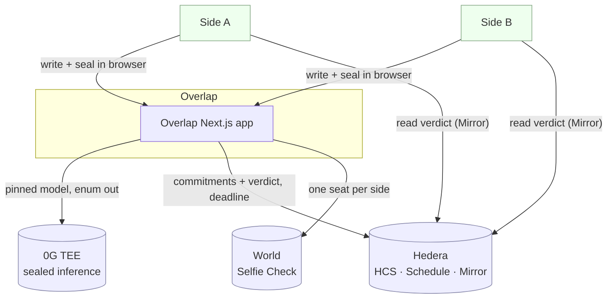
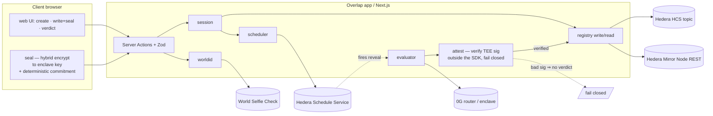
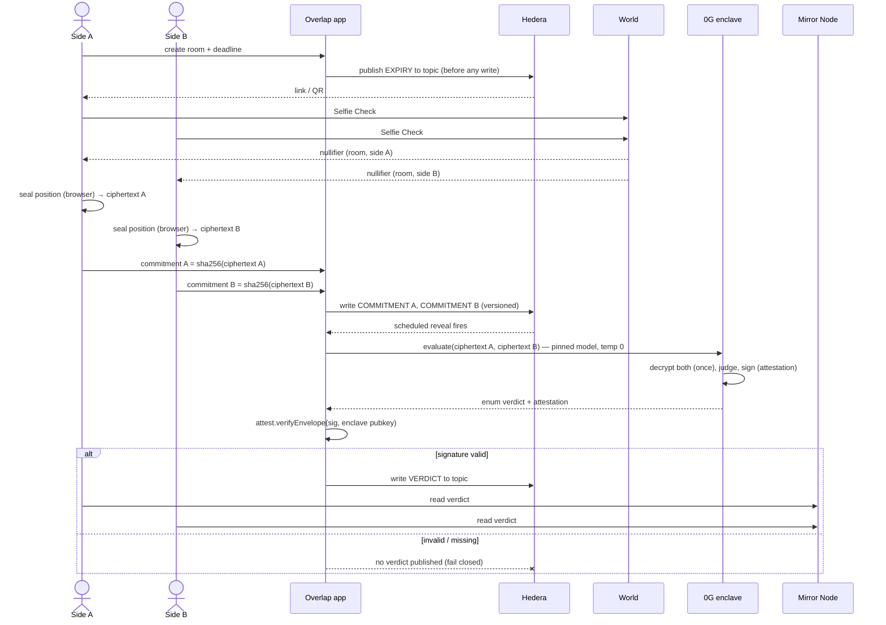

# 01 · Architecture

Status: 🟧 draft · Last updated: 2026-07-24

Layered architecture. **No database** (storage is the HCS topic, D4), **no smart contract**, **no
Solidity** (D3). The client browser does the sealing; the server never holds a decryptable copy of
either position (D5/D8). The verdict is published only after the TEE attestation is verified
**independently** — the gate **fails closed** (D10).

## Layers (single direction)

```
web (React/Next.js UI)
  → Server Actions (Zod at the boundary)         src/app + src/lib/actions
    → module libs                                src/{session,seal,worldid,registry,scheduler,evaluator,attest}
      → external SDKs / services                 0G router · Hedera SDK + Mirror Node · World
```

The UI **never** calls an external SDK directly; business logic never lives in the transport layer.
Every external response is validated with **Zod** (D11).

## C1 — Context



There is **no database node** and **no smart-contract node**: the Hedera topic *is* the store.

## C2 — Containers



**Trust boundaries:**
- **Sealed-evaluation boundary** — plaintext exists **only** inside the 0G enclave, decrypted once,
  then gone ("the papers burn"). Neither the server nor the operator can look in.
- **Attestation gate** — the verdict reaches the HCS topic only if `attest` verifies the enclave
  signature independently of the 0G SDK. Any failure ⇒ no verdict (D10).

## Full-session sequence



## Where things live

| Concern | Home | Notes |
|---------|------|-------|
| Sealing | `src/seal` (runs in the browser) | ciphertext + deterministic commitment (D12) |
| Storage | Hedera HCS topic | three versioned message types (D4) — see `02-data-model.md` |
| The clock | Hedera Schedule Service | armed **before** the work (M5) |
| Read path | Hedera Mirror Node REST | both clients read the verdict (M4) |
| Inference | 0G enclave via OpenAI-compatible router | pinned model, enum output (M6) |
| Trust gate | `src/attest` | `verifyEnvelope` outside the SDK, fail closed (M7) |
| One seat per side | World Selfie Check | nullifier per room per side (M3) |
