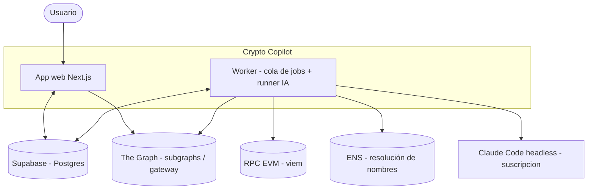
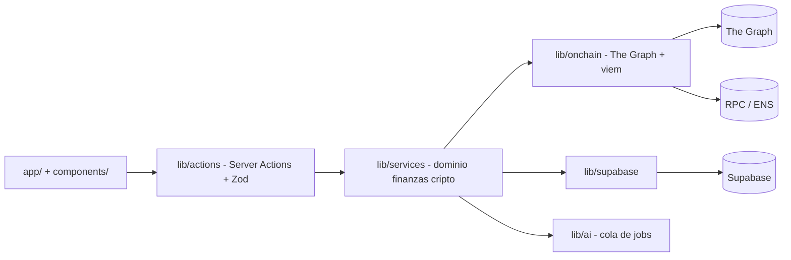

# 01 · Arquitectura (C4)

> **🟦 TENTATIVO — sujeto a decisión de idea.** Las capas y el desacople (app / worker / cola de jobs)
> son estables (reutilizados de `home-os`); qué se lee on-chain depende de la idea final.

## Contexto (C1)

> **No hay flechas de escritura on-chain.** Todo lo que sale del sistema hacia la blockchain es **lectura**
> (queries a subgraphs, `eth_call`/`view`, resolución ENS). No se firman ni envían transacciones (D4).

## Contenedores (C2)
| Contenedor | Tecnología | Responsabilidad |
|------------|-----------|-----------------|
| **App web** | Next.js 16 (App Router, RSC, Server Actions) | UI, lectura desde Supabase, disparar acciones del usuario |
| **Worker** | Node + tsx + node-cron | Ingesta on-chain, cálculo de PnL, **runner IA** (drenar `ai_jobs`) |
| **Supabase** | Postgres + Auth + RLS | Espejo de lecturas on-chain, snapshots, reportes, `ai_jobs`, auth |
| **Runner IA** | Claude Code headless (`claude -p`) | Ejecuta tareas IA con la **suscripción** (sin API key) |
| **The Graph** | Subgraphs / gateway (GraphQL) + Subgraph MCP | Fuente principal de datos DeFi/on-chain (histórico, posiciones) |
| **viem** | Cliente público EVM (RPC) | ENS (nombre↔dirección), balances, lectura de contratos ERC-20 (`view`) |

## Componentes de la app (C3)

## Decisiones clave
- **Separación estricta de capas**: `app` → `actions` → `services` → `lib/*`. La lógica de dominio
  (PnL, base de costo, reglas contables) vive en `services`; el acceso a datos on-chain en `lib/onchain`.
  La UI **nunca** ve el shape crudo de un subgraph ni de una respuesta RPC.
- **La app web no llama a la IA directamente**: encola en `ai_jobs`; el worker la procesa (desacople).
- **La UI lee de Supabase** (rápido, sin rate limits de gateway); las lecturas on-chain las hace el worker
  y las espeja. Las respuestas de The Graph/RPC se **validan con Zod** antes de persistir (no se confía en
  el shape). Ver `04-convenciones.md` y `transversal/integracion-thegraph.md`.
- **Sin capa de escritura on-chain** (D4): `lib/onchain` expone **solo lectura**. No existe un `sign`/`send`;
  no se importa ninguna private key. Esto es lo que mantiene el riesgo web3 en 🟢 bajo.

## Nota de dependencias externas
- **The Graph** requiere `THE_GRAPH_API_KEY` (gateway) y, en dev, el **Subgraph MCP** configurado en `.mcp.json`
  para que Claude Code consulte subgraphs. El nombre exacto del paquete/endpoint del MCP **debe confirmarse**
  en la doc/booth de The Graph.
- **viem** usa un RPC público (o un provider tipo Alchemy/Infura si hace falta throughput); solo lecturas.
- **Claude Code** debe estar autenticado donde corra el worker (o correr el runner en local). Ver
  `transversal/infra-devops.md`.
