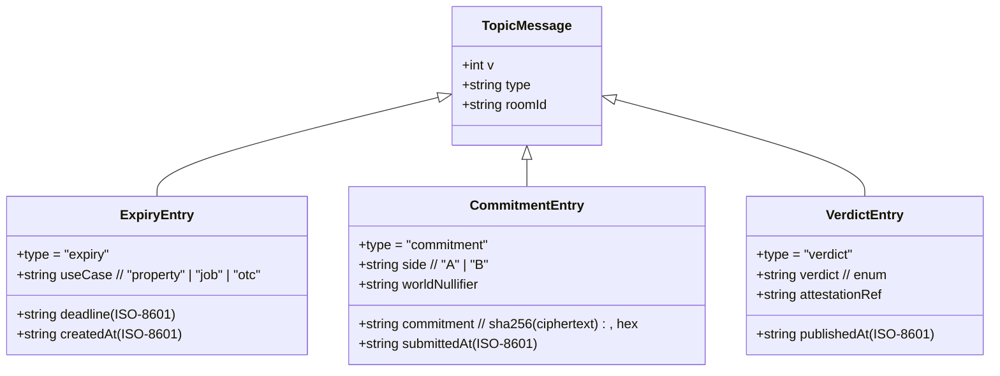

# 02 · Data model — there is no database

Status: 🟧 draft · Last updated: 2026-07-25

Seam has **no relational database, no ORM, no server-side store of terms** (D4). The source of truth is
a single **Hedera Consensus Service (HCS) topic**: an append-only, consensus-ordered log. Each message
gets a sequence number and a consensus timestamp and is never edited or deleted; a **gap in the sequence
betrays tampering**. This document specifies the **message schemas** that live on that topic, plus the
client-side sealed payload.

> **Version every message from commit 1.** Each message carries a `v` field. The topic mixes three
> message types over a session; consumers must switch on `type` and validate with **Zod** (D11).

## Message types on the topic



### 1. Expiry entry — written **before anyone writes a word**
```json
{ "v": 1, "type": "expiry", "roomId": "r_9f3a…", "useCase": "property", "deadline": "2026-07-26T08:00:00Z", "createdAt": "2026-07-26T06:00:00Z" }
```
The clock is public before any position exists, so the opener can't use the deadline as leverage.

`useCase` (`"property" | "job" | "otc"`, D16) is **public metadata**: both parties obviously know what
*kind* of deal they are negotiating — only their positions are sealed. It selects the guidance preset
(side labels, placeholder, checklist) and the evaluator's prompt hint (M6). It never carries terms.

### 2. Commitment entry — one per side, **before the reveal**
```json
{ "v": 1, "type": "commitment", "roomId": "r_9f3a…", "side": "A", "commitment": "3b1f…c7", "worldNullifier": "0x8a…", "submittedAt": "2026-07-26T06:12:04Z" }
```
`commitment` is `sha256(ciphertext)`. `worldNullifier` proves one seat for `(room, side)` (M3). The
plaintext and the ciphertext never touch the topic — only the hash.

### 3. Verdict entry — written only after `attest` passes
```json
{ "v": 1, "type": "verdict", "roomId": "r_9f3a…", "verdict": "workable", "attestationRef": "att_…", "publishedAt": "2026-07-26T08:00:03Z" }
```

**Verdict enum** (the only permitted values, D9):

| Value | When |
|-------|------|
| `workable` | always available |
| `not_workable` | always available |
| `gap:compensation` | only if **both** sides opted in |
| `gap:timing` | only if **both** sides opted in |
| `gap:scope` | only if **both** sides opted in |

## Client-side sealed payload (never leaves the browser un-sealed)

The browser produces a hybrid-encrypted payload to the enclave's public key. Only the `commitment`
derived from `ciphertext` ever leaves the client on the public path; the ciphertext itself is sent
straight to the evaluation, and the server holds no decryptable copy (D5/D8).

```json
{
  "alg": "AES-256-GCM + RSA-OAEP(enclavePubKey)",
  "wrappedKey": "base64…",     // ephemeral AES key, wrapped to the enclave public key
  "iv": "base64…",
  "ciphertext": "base64…",     // AES-GCM(position plaintext)
  "authTag": "base64…"
}
```

## The commitment must be reproducible (D12)

`commitment = sha256(ciphertext)`. For an independent verifier to recompute the **same** hash:

- **Canonical serialisation** of the sealed payload before hashing: keys sorted recursively, binary
  fields base64 with a fixed alphabet, **no clock timestamp inside the committed bytes**.
- The consensus timestamp lives on the **HCS message envelope**, not in the hashed bytes — otherwise the
  hash would depend on wall-clock time and never reproduce.
- Two traps that break reproducibility: **key ordering** and **decimal/float formatting**. Numbers, if
  any, are fixed-precision strings.

This is what lets the demo's verifier ignore our service, go to the topic, and re-derive every hash on
its own.
