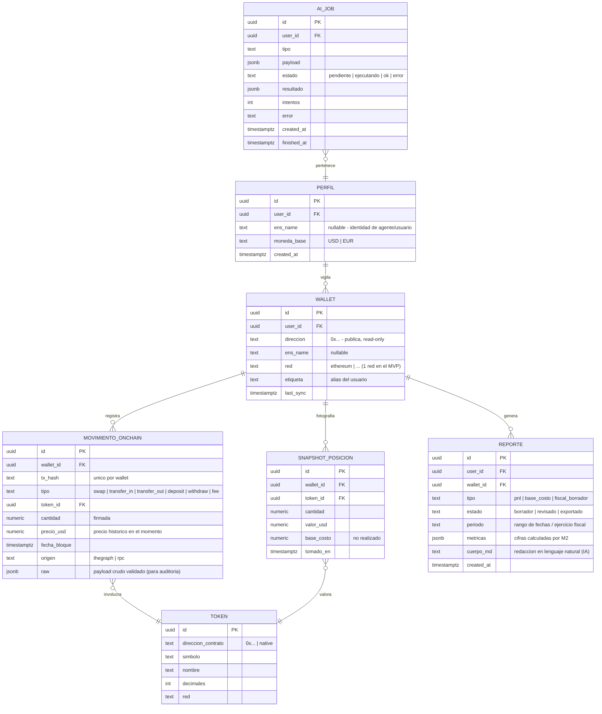

# 02 · Modelo de datos global (ER canónico)

> **🟦 TENTATIVO — sujeto a decisión de idea.** Entidades **candidatas**. El shape final depende de qué
> reporte sea el "wow" (ver `05-decisiones-abiertas.md`) y de qué expongan los subgraphs elegidos.

Fuente **única de verdad** del modelo (cuando se cierre). Los módulos referencian estas entidades; no las
redefinen. Vive en **Supabase (Postgres)**. Todas las tablas llevan `user_id` para RLS. Las direcciones de
wallet son **públicas** (no son secretos): se guardan en claro. **Nunca** se guardan private keys ni seed
phrases (D4, ver `04-convenciones.md`).

## Notas de diseño (todas tentativas)
- **Read-only on-chain**: `MOVIMIENTO_ONCHAIN` y `SNAPSHOT_POSICION` son **espejo** de lo leído vía The Graph
  / viem. Nada de esto se escribe a la blockchain. `raw` guarda el payload crudo (ya validado con Zod) por
  trazabilidad/auditoría del cálculo.
- **Idempotencia**: único `(wallet_id, tx_hash)` en `MOVIMIENTO_ONCHAIN` → re-sincronizar no duplica.
- **Precios históricos**: `precio_usd` en cada movimiento es el precio **en el momento del bloque** (clave
  para PnL/base de costo). De dónde sale ese precio (subgraph, oráculo, API de precios) es **decisión abierta**.
- **PnL (M2)**: se deriva de `MOVIMIENTO_ONCHAIN` + `SNAPSHOT_POSICION`; la fórmula de base de costo
  (FIFO/LIFO/promedio) la define el **socio contador** (ver `modules/M2-motor-pnl.md`).
- **Reportes (M3)**: `REPORTE.metricas` = cifras de M2; `REPORTE.cuerpo_md` = redacción de la IA. El usuario
  **revisa** antes de exportar (la IA propone, no publica).
- **IA**: `AI_JOB` desacopla la app del runner; `resultado` **validado con Zod** antes de persistir.
- **ENS**: `PERFIL.ens_name`/`WALLET.ens_name` para identidad de agente y para aceptar un nombre ENS como
  entrada en vez de una dirección `0x` (resuelto con viem).
- **RLS**: todas las tablas con `user_id` filtran por el usuario autenticado.
