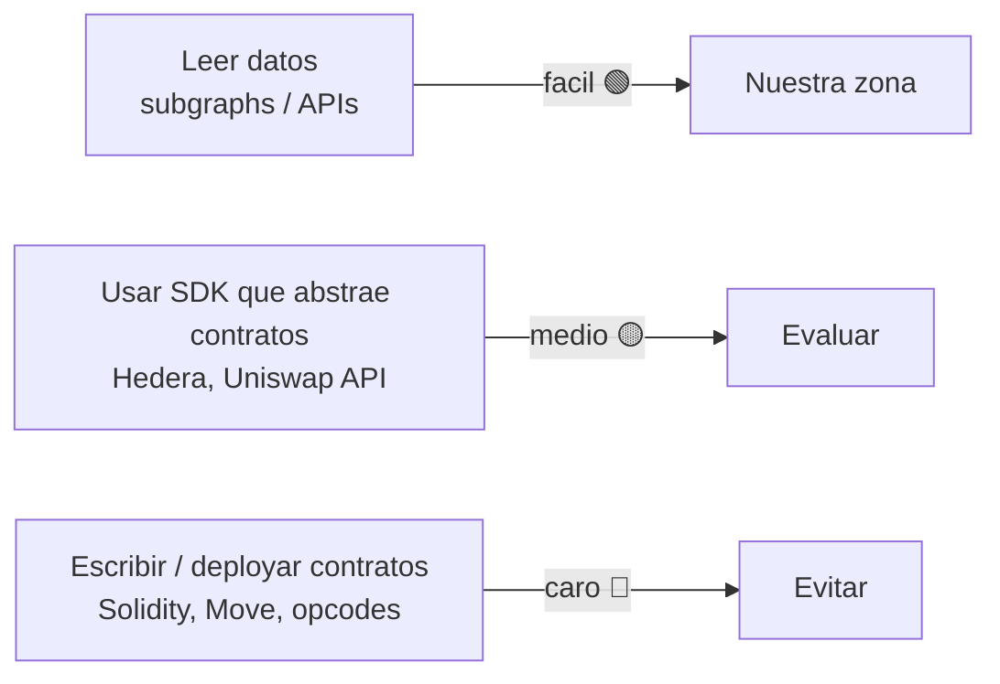
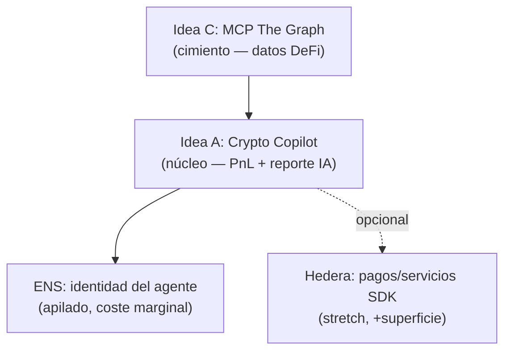

# 03 · Mapa de premios y estrategia de sponsors

Documento **estrella** de la hackathon: convierte el mapa de premios de la `MEMORIA.md` en estrategia
accionable. **Cagnotte total ~$83,000 · 8 sponsors.** Cifras **aproximadas** (extraídas del sitio) —
**confirmar montos y requisitos exactos en el booth** de cada sponsor.

> **Restricción autoimpuesta (D3/D4):** evitar Solidity / smart contracts. El equipo tiene **cero
> experiencia en web3 de contratos**. Se compite donde ganamos: **leyendo datos**, no desplegando código
> on-chain.

## Regla de oro (dificultad web3)

**Leer datos = fácil · SDK que abstrae contratos = medio · escribir/deployar contratos = caro.**

## Los 8 sponsors
| Sponsor | Pista que nos sirve | Premio (aprox) | Riesgo web3 | Encaje con nosotros |
|---------|--------------------|:--------------:|:-----------:|---------------------|
| **The Graph** | AI Tooling (MCP/SKILL) + AI Use Case (agente lee on-chain) | ~$15k · *confirmar* | 🟢 Bajo | ⭐ **Núcleo.** Leemos subgraphs; encaja con AI Use Case **y** AI Tooling (nuestro MCP). |
| **ENS** | Identidad para agentes IA (ideal para *apilar*) | ~$5k · *confirmar* | 🟢 Bajo | ⭐ **Apilable.** Nombre↔dirección con viem; identidad del agente. Coste marginal casi nulo. |
| **Hedera** | "No Solidity Allowed" + pagos con agentes IA (solo SDK) | ~$15k · *confirmar* | 🟢 Bajo | ➕ **Opcional.** Apila premio pero suma superficie (testnet + SDK). Decisión abierta. |
| **Uniswap** | Best API Integration (API normal, no hooks) | ~$10k · *confirmar* | 🟡 Medio | Posible fuente de datos de swaps/precios (API), sin tocar hooks. |
| **World** | AgentKit / verificación humano-vs-bot | ~$15k · *confirmar* | 🟡 Medio | Fuera de foco salvo pivote hacia identidad/verificación. |
| **0G** | AI Product con cómputo verificable (más nuevo) | ~$15k · *confirmar* | 🟡 Medio | Interesante pero más nuevo/incierto; stretch. |
| **1inch** | Aqua/SwapVM opcodes | ~$7k · *confirmar* | 🔴 Alto | Evitar (opcodes = escribir on-chain). |
| **Sui** | Apps en lenguaje Move | ~$6k · *confirmar* | 🔴 Alto | Evitar (Move = aprender lenguaje de contratos). |

## Estrategia: apilar premios con un solo producto
La jugada recomendada (a debatir, ver `05-decisiones-abiertas.md`):

> **Idea A (Crypto Copilot / Contador On-Chain) como núcleo, construida sobre la idea C (MCP de datos
> DeFi con The Graph), apilando ENS** (+ Hedera opcional como stretch).

Por qué gana una primera hackathon:
- **Reuso de stack ~90%** (home-os) → MVP terminado y **demo funcional**, que es lo que puntúa.
- **Riesgo web3 mínimo**: núcleo 100% lectura, cero deploy, cero private keys.
- **Diferenciación**: casi nadie hackea un "contador cripto"; el socio **es contador con 5 años de mercado**.
- **Un producto toca 2–3 sponsors**: The Graph (AI Use Case + AI Tooling/MCP) + ENS (+ Hedera).

## Checklist para el booth (confirmar in situ)
- [ ] **The Graph** — ¿monto exacto de "AI Use Case" y de "AI Tooling"? ¿Se pueden ganar ambos? ¿Requisitos
      del Subgraph MCP (nombre/paquete/endpoint exacto)? ¿Subgraphs recomendados para posiciones/swaps?
- [ ] **ENS** — ¿qué exige el premio de "identidad de agente"? ¿Basta resolver/usar un nombre ENS?
- [ ] **Hedera** — ¿requisito mínimo de "No Solidity" (nº de servicios SDK)? ¿vale la pena la superficie extra?
- [ ] **Uniswap** — ¿la "Best API Integration" cubre solo lectura de datos (swaps/precios)?
- [ ] **General** — ¿es obligatorio el **video demo**? ¿deadline de submission? ¿repo público requerido?
- [ ] Reconfirmar **todos los montos** (las cifras de este doc son aproximadas).
