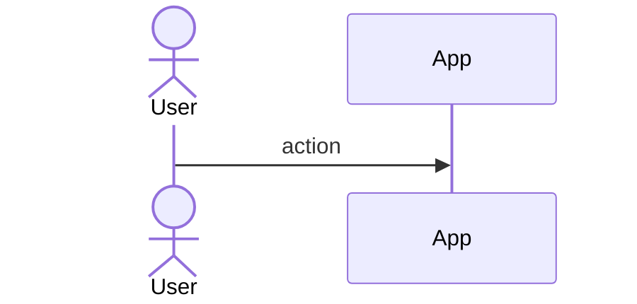
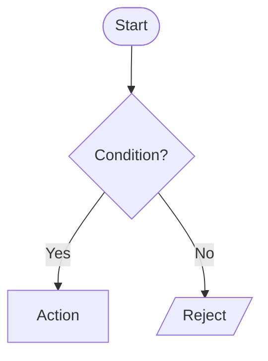

### F-Mx-N · [Feature name]

| Field | Value |
|-------|-------|
| **ID** | F-Mx-N · **Status** 🟧 |

**Description / goal:** _what it does and why._
**Actors & preconditions:** _who, what must hold beforehand._

**Use case (main path):**
1. …

**Sequence:**

**Flow / activity:**

**Data (reads / writes):** _which HCS messages or client payloads._
**Rules / validations:** _Zod + invariants._
**Endpoints / Server Actions / Jobs:** _…_
**Acceptance criteria:**
- [ ] Given … when … then …
**DoD (mandatory):** Story + RTL test of the component · unit tests of library logic/mappers · Mobile DoD (mobile-first) · `typecheck`+`lint`+`test` green.
**Dependencies:** _…_
