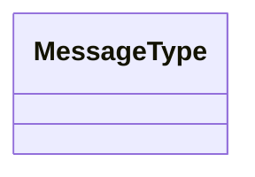

# Mx · [Module name]

> **Module** template. Copy to `modules/Mx-name.md` and fill in. Delete the italic notes.

| Field | Value |
|-------|-------|
| **ID** | Mx |
| **Status** | 🟧 draft |
| **Backlog** | _Sx.y_ |
| **Sponsor** | _0G / Hedera / World / web / —_ |
| **Depends on** | _Mx, My…_ |
| **Used by** | _Mx, My…_ |

## 1. Purpose & scope
_What it solves and what is explicitly out of scope._

## 2. Actors
_Side A / Side B, the enclave (0G), Hedera (HCS · Schedule · Mirror), World, our server, the client browser._

## 3. Functional requirements (RF)
| ID | Requirement | Priority |
|----|-------------|:--------:|
| RF-Mx-001 | … | Must / Should / Could |

## 4. Non-functional requirements (RNF)
| ID | Requirement | Metric / criterion |
|----|-------------|--------------------|
| RNF-Mx-001 | … | … |

## 5. Data touched (HCS messages / client payloads)
_There is no relational DB (D4). Reference the message schemas in `00-overview/02-data-model.md`; do not redefine them._

## 6. Architecture / layer fit
_How it sits in the layers (`web` UI → Server Actions (Zod) → module libs `src/<module>/` → external SDK). The UI never calls an external SDK directly._

## 7. Functionalities
_Each one with the `_templates/feature.md` template._

## 8. Endpoints / Server Actions / Integrations / Jobs
| Type | Name | Input | Output | Auth | Notes |
|------|------|-------|--------|------|-------|

## 9. UI components (Definition of Done)
| Component | Story | RTL test | Status |
|-----------|:-----:|:--------:|--------|

## 10. Module acceptance criteria
- [ ] …

## 11. Module closure DoD (mandatory before marking "done")
_See `transversal/quality-and-testing.md` and `transversal/mobile-first.md`._
- [ ] Each UI component has a **Story** (Storybook) **and** a co-located **RTL test**.
- [ ] Library logic (`src/<module>/`) and every mapper/validator have **unit tests**.
- [ ] **Mobile DoD** met (mobile-first: reflow, touch targets, no horizontal scroll, light+dark).
- [ ] Critical flows covered by **E2E** (if applicable).
- [ ] Every external response validated with **Zod** (no `as any`).
- [ ] `typecheck` + `lint` + `test` + `build` green.
- [ ] Module doc and **status in the README** updated.

## 12. Risks & open decisions
- …
