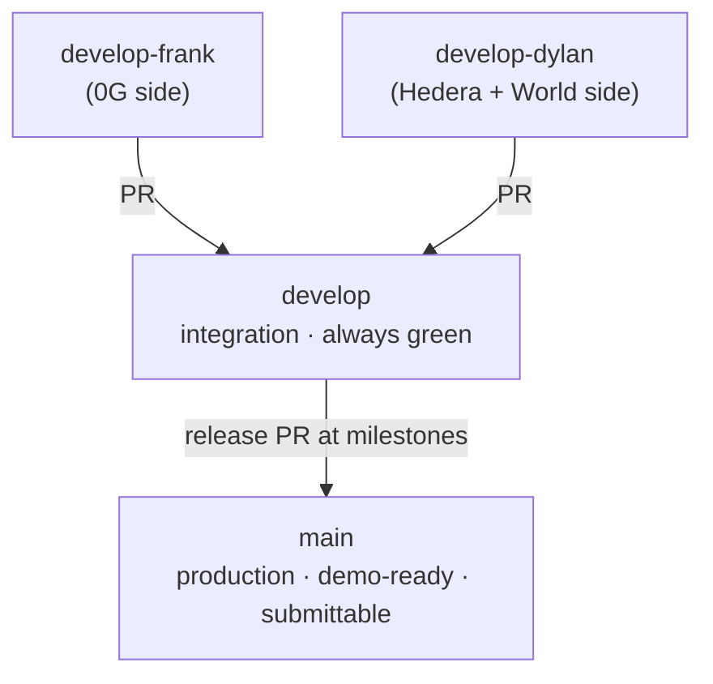

# Branching Strategy — Seam

> How we use Git during ETHGlobal Lisbon 2026. Two AI-assisted workstreams, one
> integrator, a public repo that will be judged. Optimised for **clean history**,
> **no merge conflicts**, and the event's rules (granular commits, AI attribution,
> spec-driven artifacts committed).

Status: 🟩 active · Language of the repo: **English** (code, docs, commits, PRs).

---

## 1. Context (why this model)

Two parallel workstreams, each a Claude directed by a human:

| Workstream | Branch | Human director | Initial lean |
|---|---|---|---|
| **Frank** | `develop-frank` | repo owner | 0G side: `seal`, `evaluator`, `attest` |
| **Dylan** | `develop-dylan` | partner | Hedera + World side: `session`, `registry`, `scheduler`, `worldid` |

Work is **pull-based**: pick the next item from `docs/backlog.md`, not a fixed lane.
The "initial lean" above is only to reduce context-switching; anyone can pull anything.
One **integrator** (the repo owner) reviews and merges everything. What keeps two agents
from colliding is the **claim rule**: an item is yours only once you commit the claim in
the backlog (see §3).

## 2. Branch model



- **`main`** — production. Always demo-ready and submittable. Updated **only** via a
  release PR from `develop` at build milestones. **Never commit directly to `main`.**
- **`develop`** — integration. Where both workstreams converge. Must stay **green**
  (`typecheck` + `lint` + `test` pass) at all times.
- **`develop-frank`** / **`develop-dylan`** — the two workstreams. Commit here
  frequently; open PRs into `develop` when a module is stable.

Feature branches are optional: only spin one off `develop-<name>` for a risky spike
(e.g. `spike/attest`). Otherwise commit straight to your workstream branch.

## 3. Ownership = conflict avoidance (the #1 rule)

Ownership is **per claimed backlog item**, not a fixed map:

1. Claim an item in `docs/backlog.md` (Status → 🟡 wip, Owner → your name) and **commit the
   claim first** (`chore(backlog): claim S2.2`). The commit is what reserves it.
2. While an item is `🟡 wip`, **only its owner edits that module's files.** The other branch
   does not touch them until it's `🟩 done` (merged).
3. **WIP limit = 1 item per person.** Finish and merge before claiming the next.
4. **Shared files** (`package.json`, `src/config/env.ts`, `globals.css`, CI) are edited by the
   **integrator only** — request the change, don't edit them in parallel on two branches.

If two people must touch the same file, coordinate in chat first. Never two edits to the same
file on two branches at once.

## 4. The loop — always do this before pushing

```bash
# 1. See what you have
git status

# 2. Save your own remote branch state (rebase to keep history linear)
git pull --rebase origin develop-<name>

# 3. Pull the latest integrated work so you don't drift
git fetch origin
git rebase origin/develop          # replay your commits on top of develop

# 4. Resolve conflicts if any (rare if ownership is respected), then:
npm run typecheck && npm run lint && npm run test   # must be GREEN

# 5. Stage logically and commit (see §5)
git add -p
git commit

# 6. Push your workstream branch
git push origin develop-<name>
```

**Never push red.** If checks fail, fix or `git stash` before pushing.

## 5. Commit rules

- **Conventional Commits**, in **English**, scoped by module:
  `feat(evaluator): pin model + parse enum verdict`.
  Types: `feat` · `fix` · `docs` · `refactor` · `test` · `chore`.
- **Commit every ~30 minutes from hour one**, even if ugly (event rule: single giant
  commits or missing history can disqualify). WIP is fine: `chore(seal): wip encrypt scaffold`.
- **AI attribution (mandatory).** Every AI-assisted commit ends with a trailer:
  ```
  Co-Authored-By: Claude <noreply@anthropic.com>
  ```
  and the file is logged in `docs/ai-usage.md`. Judges must see how we directed the AI.
- **Spec-driven:** commit the spec (`docs/spec-*.md`) **before** the code it describes.
- **No secrets.** `.env*` is ignored; never commit keys or `HEDERA_PRIVATE_KEY`.

## 6. Pull Request rules

- PRs target **`develop`** (never `main` directly, except the release PR).
- **Small and focused** — one module or sub-feature per PR.
- PR body states: **what / why**, **which files were AI-assisted**, and the checks you ran.
- The **integrator reviews and merges**.
- **Merge method: rebase-and-merge or a merge commit — NEVER squash.** We want the
  granular history preserved (the rules reward visible progress; squash hides it).
- After merge, delete nothing on the workstream branch; keep working on it and rebase
  from `develop` again next session.

## 7. Release to `main`

- `develop` → `main` only when it's demo-ready, via a **release PR**, at each build-order
  milestone (Sat AM, Sat PM, Sat eve…). `main` must always be something we could submit.
- **Feature freeze Sat 22:00** → everything merged; after that, only bug-fix PRs.
- Optional: tag milestones (`git tag m-sat-pm`) for easy rollback during the demo.

## 8. One-time setup checklist

```bash
# From a clean main:
git checkout main
git checkout -b develop && git push -u origin develop
git checkout -b develop-frank && git push -u origin develop-frank
git checkout develop
git checkout -b develop-dylan && git push -u origin develop-dylan
```

- Add the partner as a **collaborator** so Dylan can push `develop-dylan`:
  `gh repo edit --add-collaborator <partner-github-username>` (or via GitHub Settings → Collaborators).
- (Optional) Protect `main`: Settings → Branches → require PR before merging.

## 9. Golden rules (TL;DR)

1. `main` is sacred: PR-only, always demo-ready.
2. Rebase from `develop` **before** every push. Never push red.
3. Stay in your module lane. Shared files go through the integrator.
4. Small commits every ~30 min, Conventional + `Co-Authored-By: Claude`.
5. Never squash — keep the history the judges will read.
6. Specs before code; secrets never.
