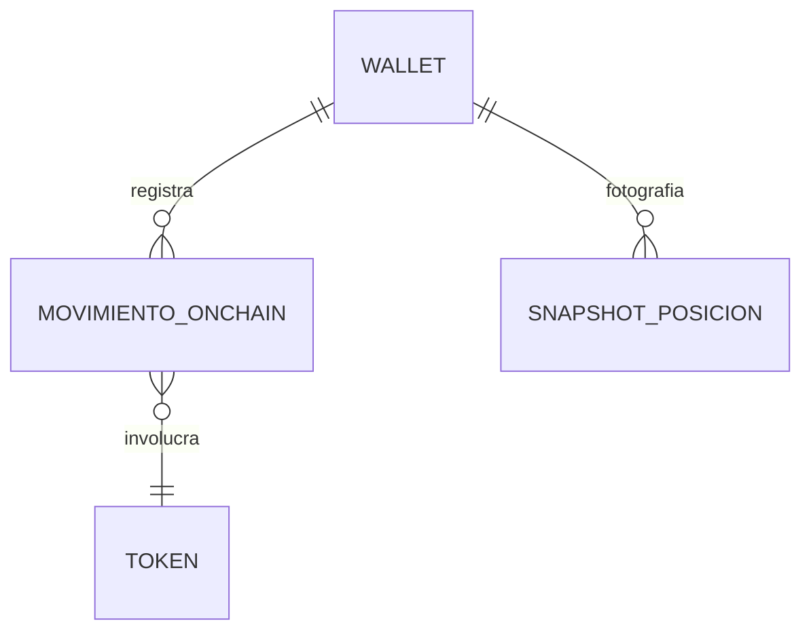

# M1 · Ingesta on-chain

> **🟦 TENTATIVO — sujeto a decisión de idea.** Esbozo. Tablas en blanco / con 1-2 ejemplos; no desarrollado
> a fondo. Depende de DA3 (cadenas) y DA6 (precios) de `00-overview/05-decisiones-abiertas.md`.

| Campo | Valor |
|-------|-------|
| **ID** | M1 |
| **Estado** | 🟦 tentativo |
| **Depende de** | M5 (MCP The Graph), transversales The Graph / on-chain |
| **Lo usan** | M2 (PnL), M3 (reportes), M4 (asistente) |

## 1. Propósito y alcance
Leer las **wallets/posiciones/movimientos on-chain** de una dirección (o nombre ENS) en modo **solo lectura**,
vía **The Graph** (subgraphs) y **viem** (RPC), y espejarlos en Supabase como `movimiento_onchain` /
`snapshot_posicion`. **Fuera de alcance:** escribir on-chain, firmar transacciones, manejar private keys (D4).

## 2. Actores
Usuario (conecta una wallet/ENS read-only) · Worker (ingesta periódica) · The Graph / RPC (fuentes).

## 3. Requisitos funcionales (RF)
| ID | Requisito | Prioridad |
|----|-----------|:---------:|
| RF-M1-001 | Aceptar una dirección `0x…` **o** un nombre ENS y resolverlo (viem) | Must |
| RF-M1-002 | Leer movimientos históricos (swaps/transfers) vía subgraph, **paginado** | Must |
| RF-M1-003 | Validar con Zod toda respuesta de subgraph/RPC antes de persistir | Must |
| RF-M1-004 | Espejar en Supabase de forma **idempotente** (`(wallet, tx_hash)`) | Should |

## 4. Requisitos no funcionales (RNF)
| ID | Requisito | Métrica / criterio |
|----|-----------|--------------------|
| RNF-M1-001 | Read-only estricto | `lib/onchain` no expone `sign`/`send`; sin private keys |
| RNF-M1-002 | Resiliencia | rate-limit + retry ante límites de gateway/RPC |

## 5. Modelo de datos (fragmento del ER global)

Referencia el ER global (`00-overview/02-modelo-datos-global.md`); no lo redefine.

## 6. Arquitectura / componentes
`app` → `lib/actions` (conectar wallet, Zod) → `lib/services/ingesta` → `lib/onchain` (The Graph + viem) →
Supabase. La ingesta pesada corre en el **worker** (no bloquea la UI).

## 7. Funcionalidades
_A rellenar con `_templates/funcionalidad.md`: F-M1-1 Conectar wallet/ENS · F-M1-2 Sync de movimientos ·
F-M1-3 Snapshot de posiciones._

## 8. Endpoints / Server Actions / Integraciones / Jobs
| Tipo | Nombre | Entrada | Salida | Auth | Notas |
|------|--------|---------|--------|------|-------|
| Action | `conectarWallet` | `{ direccionOEns }` | `wallet` | sesión | resuelve ENS con viem |
| Job | `sync_onchain` | `{ walletId }` | filas espejadas | worker | paginado + Zod |

## 9. Componentes UI (Definition of Done)
| Componente | Story | Test RTL | Estado |
|------------|:-----:|:--------:|--------|
| `wallet-connect-form` | ⬜ | ⬜ | 🟦 |

## 10. Criterios de aceptación del módulo
- [ ] Dada una wallet real, se listan sus movimientos sin truncar (paginación completa).
- [ ] Ninguna ruta de código firma o envía transacciones.

## 11. DoD de cierre del módulo
_Ver plantilla `_templates/modulo.md` §11 y `transversal/calidad-y-pruebas.md`._

## 12. Riesgos y decisiones abiertas
- Qué subgraph(s) cubren mejor swaps/posiciones de la red elegida (confirmar en booth The Graph).
- Fuente de precios históricos (DA6).
