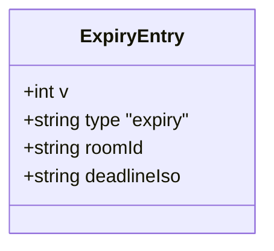
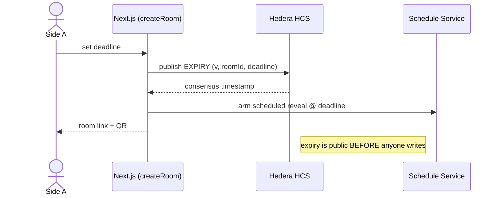

# M1 · `session`

> Create a room, publish the deadline to the HCS topic **before anyone writes a word**, and
> issue a join link + QR. This is the module that makes the clock public before leverage exists.

| Field | Value |
|-------|-------|
| **ID** | M1 |
| **Status** | 🟧 draft |
| **Backlog** | S1.2 |
| **Sponsor** | Hedera |
| **Depends on** | M4 (`registry.write` — writes the expiry message), M5 (`scheduler` — arms the reveal) |
| **Used by** | M2 (seal needs the room + enclave pubkey), M3 (worldid scopes the nullifier per room), M8 (web `create` screen) |

## 1. Purpose & scope
Open a negotiation **room**: a shared session that two sides join. The opener (Side A) sets a
deadline; the **expiry is published to the HCS topic before any commitment is written** (D4, D6),
so Side B can read the terms of the clock before committing a single word. The room issues a join
**link + QR**. **Out of scope:** writing terms (M2), the clock firing (M5), reading the verdict (M4/M8).

## 2. Actors
Side A (opener) · our Next.js server (creates the topic session, signs the expiry write with **our**
Hedera testnet account, D8) · Hedera HCS (append-only log) · Hedera Schedule Service (via M5).

## 3. Functional requirements (RF)
| ID | Requirement | Priority |
|----|-------------|:--------:|
| RF-M1-001 | Create a room bound to a single HCS topic session and a single pair (one room = one pair) | Must |
| RF-M1-002 | Accept a deadline and validate it is in the future (Zod) | Must |
| RF-M1-003 | Publish a **versioned expiry message** to the HCS topic **before** any commitment can be written | Must |
| RF-M1-004 | Arm the scheduled reveal for that deadline (delegates to M5) | Must |
| RF-M1-005 | Issue a join **link** and a **QR** encoding the room id | Must |
| RF-M1-006 | Expose the enclave public key (`OG_ENCLAVE_PUBKEY`) to joining clients so M2 can seal | Should |

## 4. Non-functional requirements (RNF)
| ID | Requirement | Metric / criterion |
|----|-------------|--------------------|
| RNF-M1-001 | **Ordering invariant** | No commitment write is accepted until the expiry message has consensus on the topic |
| RNF-M1-002 | No user keys (D8) | Only our Hedera testnet account signs; users never sign |
| RNF-M1-003 | Mobile-first | The `create` screen (M8) meets the mobile DoD; QR scannable on a phone |

## 5. Data touched (HCS messages)
Writes the **expiry entry** (message type 1 of 3, versioned). See `00-overview/02-data-model.md`.

## 6. Architecture / layer fit
`web` create screen (M8) → Server Action `createRoom` (Zod) → `src/session/` → `src/registry/write`
(M4) + `src/scheduler` (M5) → Hedera SDK. The UI never touches the Hedera SDK directly (D-conventions).

## 7. Functionalities

### F-M1-1 · Open a room and publish the deadline
| Field | Value |
|-------|-------|
| **ID** | F-M1-1 · **Status** 🟧 |

**Description / goal:** create the session, publish the expiry to HCS before any write, return link/QR.
**Actors & preconditions:** Side A; our Hedera account funded on testnet; topic exists.

**Sequence:**

**Rules / validations:** deadline in the future; one room = one pair; expiry write must reach
consensus before commitments open.
**Acceptance criteria:**
- [ ] Given a valid deadline, when the room is created, then the expiry message appears on the topic before any commitment message.
- [ ] Given the room link/QR, when Side B scans it, then they join the same topic session.

## 8. Endpoints / Server Actions / Integrations / Jobs
| Type | Name | Input | Output | Auth | Notes |
|------|------|-------|--------|------|-------|
| Action | `createRoom` | `{ deadlineIso }` | `{ roomId, joinUrl, qr }` | none (public opener) | writes expiry via M4, arms M5 |
| Integration | HCS `TopicMessageSubmit` | expiry entry | consensus ts | our key | versioned message |

## 9. UI components (Definition of Done)
| Component | Story | RTL test | Status |
|-----------|:-----:|:--------:|--------|
| `create-room-form` | ⬜ | ⬜ | 🟧 |
| `room-qr` | ⬜ | ⬜ | 🟧 |

## 10. Module acceptance criteria
- [ ] The expiry message is provably on the topic before any commitment (RNF-M1-001).
- [ ] A second browser can join the room from the link/QR.
- [ ] No user private key is ever requested or held (D8).

## 11. Module closure DoD
_See `_templates/module.md` §11 and `transversal/quality-and-testing.md`._

## 12. Risks & open decisions
- Scheduled-tx behaviour if a required signature never arrives (Hedera workshop — see `00-overview/05-open-decisions.md`).
- QR/link should not leak anything about the terms — it only encodes the room id.
