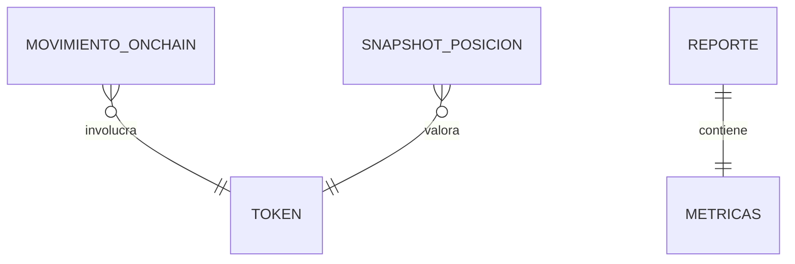

# M2 · Motor de PnL

> **🟦 TENTATIVO — sujeto a decisión de idea.** Esbozo. **Aquí manda el socio contador**: las reglas de
> base de costo y realizado/no realizado son su dominio. Depende de DA2 (qué reporte es el "wow").

| Campo | Valor |
|-------|-------|
| **ID** | M2 |
| **Estado** | 🟦 tentativo |
| **Depende de** | M1 (movimientos/posiciones espejados) |
| **Lo usan** | M3 (reportes), M4 (asistente) |

## 1. Propósito y alcance
Calcular **PnL** (profit & loss), **base de costo** y **ganancias realizadas / no realizadas** a partir de los
`movimiento_onchain` y `snapshot_posicion` de una wallet. Produce cifras estructuradas (`metricas`) que M3
convierte en reporte. **Fuera de alcance:** asesoría fiscal vinculante, ejecución de operaciones.

## 2. Actores
Socio contador (define las reglas) · Servicio de dominio (calcula) · Agente IA (consume las cifras).

## 3. Requisitos funcionales (RF)
| ID | Requisito | Prioridad |
|----|-----------|:---------:|
| RF-M2-001 | Calcular base de costo por token con método configurable (FIFO / promedio / …) | Must |
| RF-M2-002 | Separar realizado (ventas/swaps) de no realizado (posiciones abiertas) | Must |
| RF-M2-003 | Reportar PnL por periodo / ejercicio fiscal | Should |

## 4. Requisitos no funcionales (RNF)
| ID | Requisito | Métrica / criterio |
|----|-----------|--------------------|
| RNF-M2-001 | Números defendibles | resultados verificables a mano por el socio contador |
| RNF-M2-002 | Determinismo | mismos inputs → mismas cifras (sin llamadas a IA en el cálculo) |

## 5. Modelo de datos (fragmento del ER global)

`REPORTE.metricas` (jsonb) guarda las cifras. Ver ER global.

## 6. Arquitectura / componentes
`lib/services/pnl` **puro** (sin I/O ni IA): recibe movimientos + precios, devuelve métricas. Fácil de
testear unitariamente (clave para validar los números). El cálculo **no** usa la IA (determinista).

## 7. Funcionalidades
_A rellenar: F-M2-1 Base de costo · F-M2-2 Realizado/no realizado · F-M2-3 PnL por periodo._

## 8. Endpoints / Server Actions / Integraciones / Jobs
| Tipo | Nombre | Entrada | Salida | Auth | Notas |
|------|--------|---------|--------|------|-------|
| Servicio | `calcularPnL` | movimientos + método | `metricas` | — | función pura, testeable |

## 9. Componentes UI (Definition of Done)
| Componente | Story | Test RTL | Estado |
|------------|:-----:|:--------:|--------|
| `pnl-summary-card` | ⬜ | ⬜ | 🟦 |

## 10. Criterios de aceptación del módulo
- [ ] Un caso de prueba diseñado por el socio contador da el PnL esperado exacto.

## 11. DoD de cierre del módulo
_Ver plantilla `_templates/modulo.md` §11. Prioridad: **tests unitarios** de la lógica de cálculo._

## 12. Riesgos y decisiones abiertas
- Método de base de costo (FIFO/LIFO/promedio) y jurisdicción fiscal (DA2).
- Fuente y precisión de precios históricos (DA6, viene de M1).
