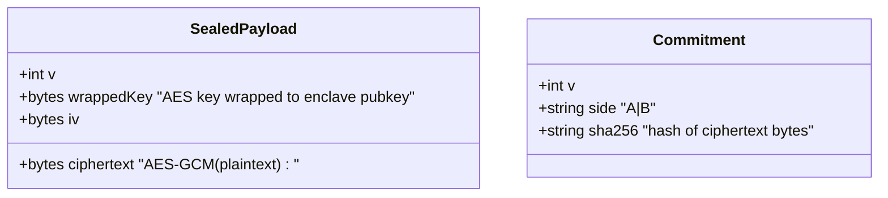
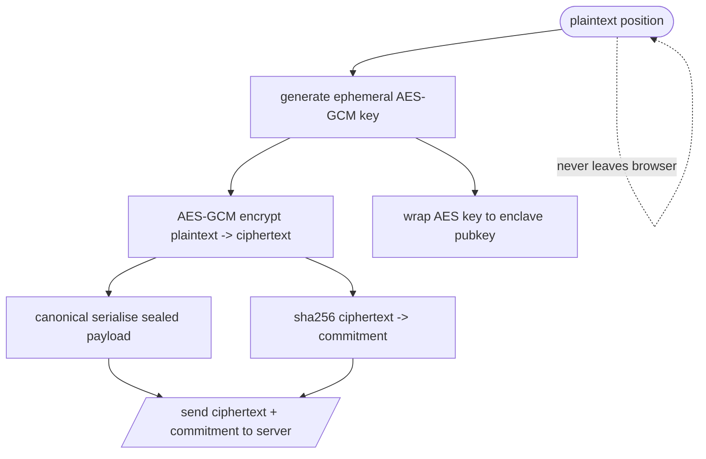

# M2 · `seal` (client)

> **One of the two hard parts.** Encrypt a plain-language position in the browser to the enclave
> key, and produce a commitment the verifier can recompute. If the commitment doesn't match, the
> whole attestation claim collapses.

| Field | Value |
|-------|-------|
| **ID** | M2 |
| **Status** | 🟩 S1.4 done — enclave key format pending booth |
| **Backlog** | S1.4 |
| **Sponsor** | 0G |
| **Depends on** | S0.3 spike (`attest`, M7) — confirms sealing round-trips through the enclave |
| **Used by** | M4 (`registry.write` commits `sha256(ciphertext)`), M6 (`evaluator` decrypts in-enclave), M7 (`attest` recomputes the commitment), M8 (`write+seal` screen) |

## 1. Purpose & scope
In the **browser**, hybrid-encrypt the user's plaintext position to the enclave public key and
produce a deterministic **commitment** = `sha256(ciphertext)`. The server never holds a decryptable
copy (D5). **Out of scope:** writing the commitment to HCS (M4), decrypting (only inside 0G, M6),
verifying (M7).

## 2. Actors
Side A / Side B (write a position) · the client browser (WebCrypto) · the 0G enclave (holds the
private half of `OG_ENCLAVE_PUBKEY`, decrypts once inside the TEE).

## 3. Functional requirements (RF)
| ID | Requirement | Priority |
|----|-------------|:--------:|
| RF-M2-001 | Encrypt the plaintext position **in-browser** using hybrid encryption to `OG_ENCLAVE_PUBKEY` | Must |
| RF-M2-002 | Wrap an ephemeral AES-GCM content key to the enclave public key; AES-GCM the plaintext | Must |
| RF-M2-003 | Serialise the sealed payload **canonically** (sorted keys, fixed encodings) | Must |
| RF-M2-004 | Produce the commitment `sha256(ciphertext)` with **no clock timestamp inside the committed bytes** (D12) | Must |
| RF-M2-005 | Never transmit plaintext (or the content key) to the server | Must |

## 4. Non-functional requirements (RNF)
| ID | Requirement | Metric / criterion |
|----|-------------|--------------------|
| RNF-M2-001 | **Determinism** — ⚠️ **amended by spec-04 §1** | Reproducible **given the ephemeral secret**, NOT across runs. The original wording ("same plaintext ⇒ byte-identical ciphertext") is a confidentiality bug: commitments are public on the topic, so deterministic sealing leaks that two sides wrote the same thing and lets an attacker confirm a guessed position offline by comparing commitments. What must be reproducible is the **commitment from the committed ciphertext**, which it is. |
| RNF-M2-002 | Browser-only plaintext | Plaintext exists only in the tab's memory; nothing decryptable leaves the browser |
| RNF-M2-003 | Reproducible serialisation | No `Date.now()`, no map-iteration-order dependence, numbers as fixed strings |

## 5. Data touched (client payload)
Produces the **sealed payload** and the **commitment** consumed by M4/M6/M7. See `00-overview/02-data-model.md`.

## 6. Architecture / layer fit
Runs entirely client-side in the `web` write+seal screen (M8): `src/seal/` (WebCrypto helpers) →
returns `{ sealedPayload, commitment }`. The Server Action only ever receives the **ciphertext +
commitment**, never plaintext.

## 7. Functionalities

### F-M2-1 · Seal a position and commit the ciphertext
| Field | Value |
|-------|-------|
| **ID** | F-M2-1 · **Status** 🟧 |

**Flow / activity:**

**Rules / validations:** commitment hashes the **ciphertext bytes only**; no timestamp in committed
bytes (D12); Zod-validate the payload shape before returning.
**Acceptance criteria:**
- [x] Given the same plaintext **and the same ephemeral secret**, the output is byte-identical.
      *(Amended — see RNF-M2-001 above and spec-04 §1. Across runs it MUST differ, and a test
      enforces that.)*
- [ ] Plaintext never appears in any network request (verify in devtools during E2E) — pending S3.4.
- [x] M7 recomputes the identical `sha256` from the committed ciphertext (`commitmentOf`).
- [x] Output satisfies `commitmentMessageSchema` (interop with M1/M4) — asserted in tests.

## 8. Endpoints / Server Actions / Integrations / Jobs
| Type | Name | Input | Output | Auth | Notes |
|------|------|-------|--------|------|-------|
| Client fn | `seal(position, enclavePubkey)` | plaintext + pubkey | `{ sealedPayload, commitment }` | n/a (browser) | WebCrypto; no server call |
| Action | `submitCommitment` | `{ roomId, side, ciphertext, sha256 }` | ack | World-gated (M3) | forwards to M4 |

## 9. UI components (Definition of Done)
| Component | Story | RTL test | Status |
|-----------|:-----:|:--------:|--------|
| `seal-position-form` | ⬜ | ⬜ | 🟧 |

## 10. Module acceptance criteria
- [ ] The commitment recomputed by M7 equals the one written to HCS by M4.
- [ ] No plaintext or content key is ever sent to the server (D5).
- [ ] Sealing is deterministic (RNF-M2-001).

## 11. Module closure DoD
_See `_templates/module.md` §11._ Priority tests: determinism of `seal`, canonical serialisation, commitment recomputation parity with M7.

## 12. Risks & open decisions

### Resolved by S1.4
- **D-M2-1 · sealing is randomized** (spec-04 §1). RNF-M2-001's literal reading was a leak; see the
  amended row in §4. A unit test enforces that two seals of the same text differ.
- **D-M2-2 · the encryption key is not the attestation key** (spec-04 §2). `OG_ENCLAVE_PUBKEY` is a
  20-byte *address* for secp256k1 — you cannot encrypt to it. `seal()` takes the recipient key as an
  argument; the error message names this mistake explicitly if someone passes an address.
- **Suite is tagged, not inferred** — `x25519` (default) and `secp256k1`, both implemented and tested,
  so whichever the enclave uses is a config change.
- Canonical serialisation reuses `evaluator/canonical.ts` rather than adding a third implementation.

### Still open
- **Which key does the enclave decrypt with, and in what format?** Blocks the live path (spec-04 §8).
  Also: is it the same key as the attestation signing key?
- **Does the enclave expect a specific envelope format** (HPKE? a 0G wrapper?) or is ours fine?
- **Integrator request:** S3.2 will need a new env var `OG_ENCLAVE_SEAL_PUBKEY` (distinct from
  `OG_ENCLAVE_PUBKEY`). `src/config/env.ts` is integrator-only.
- The commitment does not bind `epk`/`suite` — a DoS, not a confidentiality break (spec-04 §5). Left
  as-is because M4 already writes this contract; flagged for the integrator.
