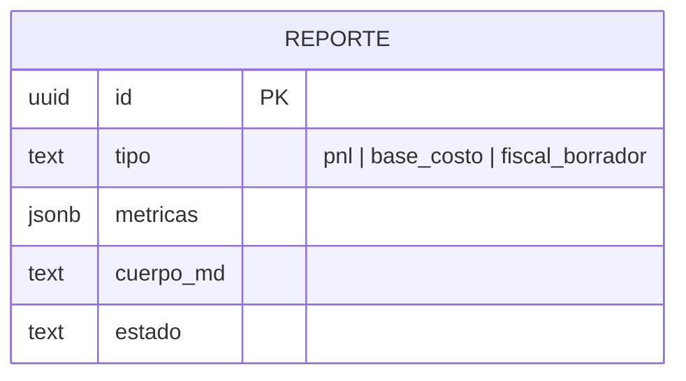

# M3 · Reportes IA

> **🟦 TENTATIVO — sujeto a decisión de idea.** Esbozo. Depende de DA2 (qué reporte es el "wow": PnL,
> fiscal por jurisdicción, o riesgo de cartera).

| Campo | Valor |
|-------|-------|
| **ID** | M3 |
| **Estado** | 🟦 tentativo |
| **Depende de** | M2 (métricas), M4 (asistente/runner IA) |
| **Lo usan** | Usuario (revisa y exporta) |

## 1. Propósito y alcance
Convertir las **métricas** de M2 en **borradores de reporte en lenguaje natural** (PnL, base de costo,
esbozo fiscal), redactados por la **IA headless**. El usuario **revisa** antes de exportar. **Fuera de
alcance:** presentar el reporte como asesoría fiscal definitiva; la IA **propone**, el usuario decide.

## 2. Actores
Usuario (revisa/exporta) · Agente IA headless (redacta) · Socio contador (define el formato del reporte).

## 3. Requisitos funcionales (RF)
| ID | Requisito | Prioridad |
|----|-----------|:---------:|
| RF-M3-001 | Generar un borrador de reporte a partir de `metricas` de M2 | Must |
| RF-M3-002 | Estado del reporte: `borrador → revisado → exportado` | Should |
| RF-M3-003 | Exportar (Markdown / PDF) | Could |

## 4. Requisitos no funcionales (RNF)
| ID | Requisito | Métrica / criterio |
|----|-----------|--------------------|
| RNF-M3-001 | La IA no inventa cifras | el cuerpo cita solo números de `metricas`; salida validada con Zod |
| RNF-M3-002 | Human-in-the-loop | ningún reporte se "publica" sin revisión del usuario |

## 5. Modelo de datos (fragmento del ER global)

## 6. Arquitectura / componentes
`lib/services/reportes` arma el prompt con las `metricas` (cifras deterministas de M2) y encola un `ai_job`
tipo `redactar_reporte`. El runner (M4) devuelve el `cuerpo_md`, **validado con Zod**. La UI muestra el
borrador para revisión.

## 7. Funcionalidades
_A rellenar: F-M3-1 Redactar borrador · F-M3-2 Revisar y exportar._

## 8. Endpoints / Server Actions / Integraciones / Jobs
| Tipo | Nombre | Entrada | Salida | Auth | Notas |
|------|--------|---------|--------|------|-------|
| Job | `redactar_reporte` | `{ metricas, tipo }` | `cuerpo_md` | worker | IA propone; no exporta sola |

## 9. Componentes UI (Definition of Done)
| Componente | Story | Test RTL | Estado |
|------------|:-----:|:--------:|--------|
| `reporte-viewer` | ⬜ | ⬜ | 🟦 |

## 10. Criterios de aceptación del módulo
- [ ] El borrador solo contiene cifras presentes en `metricas` (no alucina números).

## 11. DoD de cierre del módulo
_Ver plantilla `_templates/modulo.md` §11._

## 12. Riesgos y decisiones abiertas
- Formato exacto del reporte "wow" (DA2) — input del socio contador.
- Descargo de responsabilidad: es un **borrador**, no asesoría fiscal.
