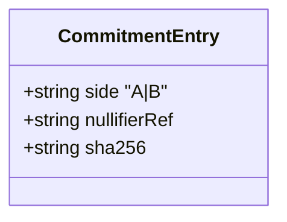
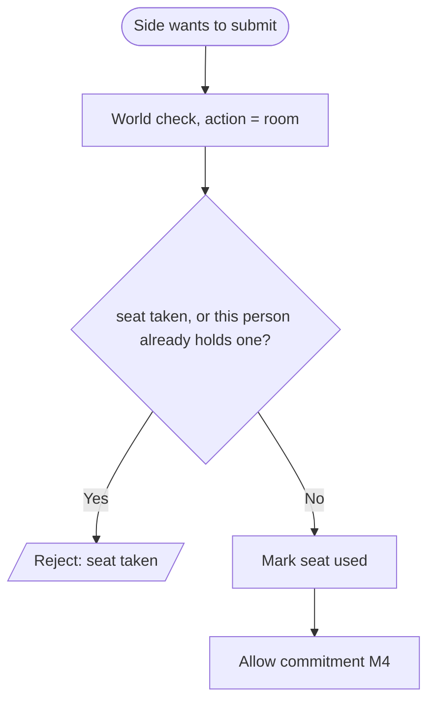

# M3 · `worldid`

> One seat per **person**, per room. World ID as an **abuse signal, not a login** — the thing that
> stops a probing attack from reconstructing the other side's number.

| Field | Value |
|-------|-------|
| **ID** | M3 |
| **Status** | 🟡 wip (S1.5 — verify + seat logic landed) |
| **Backlog** | S1.5 |
| **Sponsor** | World |
| **Depends on** | S0.1 repo setup |
| **Used by** | M4 (`registry.write` gates a commitment on a valid, unused nullifier), M8 (write+seal screen runs Selfie Check) |

## 1. Purpose & scope
Issue **one nullifier per person per room** via World (D7, D17), so each side submits exactly once and
the two seats belong to two different humans. This closes the probing/Sybil attack: without it, one
person re-submits slightly varied positions against a counterparty's committed position and
reconstructs their number — or simply plays both sides. The check is an **anti-abuse signal, not
authentication**. **Out of scope:** identity, login, KYC.

## 2. Actors
Side A / Side B (each complete a World check) · World (issues a nullifier scoped to the room action,
built at runtime) · our server (records which nullifier holds which seat).

## 3. Functional requirements (RF)
| ID | Requirement | Priority |
|----|-------------|:--------:|
| RF-M3-001 | Run the World check with an action **scoped per room** (`overlap-<roomId>`), never per side and never app-wide | Must |
| RF-M3-002 | Derive/receive a **nullifier** and treat it as one seat in that room | Must |
| RF-M3-003 | Reject a **second** commitment for the same `(room, side)` | Must |
| RF-M3-004 | Never expose or store user identity — only the opaque nullifier | Must |
| **RF-M3-005** | **Reject the same person taking BOTH seats of a room** (D17) | Must |

> **D17 — the action is scoped per ROOM, not per side (26 Jul, owner-found).** The nullifier is
> `f(app_id, action, person)`. With a per-*side* action (`overlap-<roomId>-<side>`) the same human
> got a **different, valid nullifier for each side**, so one phone could take both seats — verified
> live by the owner. Per-side scoping was chosen to avoid an app-wide "one use of Overlap ever"
> nullifier; scoping per **room** achieves that just as well and closes the hole:
>
> - **World itself enforces it.** `max_verifications: 1` on `overlap-<roomId>` means one
>   verification per person per room, checked at World's servers — a stronger guarantee than our
>   in-process seat registry, which a restart would forget.
> - **Anyone can audit it.** Both commitments now carry nullifiers from the *same* action, so a
>   reader of the topic can compare them: equal ⇒ one human played both sides. Under per-side
>   scoping the two were incomparable by construction.
> - **No cross-room linkage.** Each room is still its own action, so a person negotiating many
>   rooms is unlinkable across them, which is what the original per-side design was protecting.
>
> Cost, stated plainly: a room now needs **two distinct World identities**, so a solo demo is no
> longer possible.

## 4. Non-functional requirements (RNF)
| ID | Requirement | Metric / criterion |
|----|-------------|--------------------|
| RNF-M3-001 | **Scope correctness** | Nullifier scoped **per room** — not app-wide (a person can negotiate many rooms) and not per side (one person must not hold both seats, D17) |
| RNF-M3-002 | Privacy | No identity revealed; only the opaque nullifier is handled |
| RNF-M3-003 | Track compliance | A **testing doc** (developer + user friction) exists — see `transversal/integration-worldid.md` |

## 5. Data touched
The nullifier is referenced by the **commitment entry** written to HCS (M4). It is not itself a
separate stored table (D4 — no DB). See `00-overview/02-data-model.md`.

## 6. Architecture / layer fit
`web` write+seal screen (M8) triggers the World widget → verification passes through a Server Action
→ `src/worldid/` verifies the proof and marks the seat → M4 accepts the commitment only if the seat
is valid and unused.

## 7. Functionalities

### F-M3-1 · Claim one seat per side
| Field | Value |
|-------|-------|
| **ID** | F-M3-1 · **Status** 🟧 |

**Flow / activity:**

**Rules / validations:** verify the World proof server-side; one nullifier ⇒ one commitment per
`(room, side)`.
**Acceptance criteria:**
- [x] Given a valid Selfie Check, when a side submits, then exactly one commitment is accepted. _(claimSeat → reserveSeat, unit-tested)_
- [x] Given a second attempt with the same seat, then it is rejected. _(reserveSeat throws on taken seat, unit-tested)_

### Implementation notes (S1.5 — verify + seat logic)
Landed in `src/worldid/` with co-located Vitest tests:
- `action.ts` — `roomActionId(roomId)` = `overlap-<roomId>`: the action scoped **per room**
  (RF-M3-001, RNF-M3-001, D17) — not app-wide, and not per side.
- `verify.ts` — `WorldProof` (+ Zod) and the `WorldVerifier` port. Only the opaque
  `nullifier_hash` is handled — never identity (RNF-M3-002).
- `seats.ts` — pure seat registry, two rules: **one seat per `(room, side)`** (RF-M3-003) and
  **one seat per person per room** (`holdsSeatInRoom`, RF-M3-005/D17). `reserveSeat` throws on
  either.
- `claim.ts` — `claimSeat` orchestrator: verifies server-side and **fails closed** (a failed proof
  throws, no seat reserved), then reserves the seat; returns the `nullifierRef` M4 stamps on the
  commitment.
- `cloud-verifier.ts` — the only file importing `@worldcoin/idkit` (`verifyCloudProof`), isolated
  like the Hedera SDK boundary so the logic/tests never pull the widget bundle.

**Deferred:** the `selfie-check-gate` React widget (`IDKitWidget`) + its Storybook story/RTL test
mount in the web write+seal screen (M8 / S3.2); the **World testing doc** is its own item
(**S4.3**, RNF-M3-003). The real `cloudWorldVerifier` is covered by E2E/manual (no live calls in units).

## 8. Endpoints / Server Actions / Integrations / Jobs
| Type | Name | Input | Output | Auth | Notes |
|------|------|-------|--------|------|-------|
| Action | `claimSeat` | `{ roomId, side, worldProof }` | `{ nullifierRef }` | World proof | scopes the action per room (D17) |
| Integration | World Selfie Check | in-browser widget | proof | `WORLD_APP_ID` | `WORLD_ACTION` per room |

## 9. UI components (Definition of Done)
| Component | Story | RTL test | Status |
|-----------|:-----:|:--------:|--------|
| `selfie-check-gate` | ✅ | ✅ | 🟢 (S3.2 — `src/components/web/selfie-check-gate.tsx`; widget mocked in RTL, live path E2E/manual) |

## 10. Module acceptance criteria
- [ ] A single side can submit only once per room (RF-M3-003).
- [ ] The nullifier is scoped per room — never app-wide, never per side (RNF-M3-001).
- [ ] The World testing doc exists and covers developer + user friction (RNF-M3-003).

## 11. Module closure DoD
_See `_templates/module.md` §11._ Plus: the track's testing doc is a real deliverable (start Saturday morning).

## 12. Risks & open decisions
- Can a nullifier be scoped per session rather than per app? **Confirm at the World booth** (16:30).
- Exact contents required in the testing doc — confirm at the booth; outline in `integration-worldid.md`.
