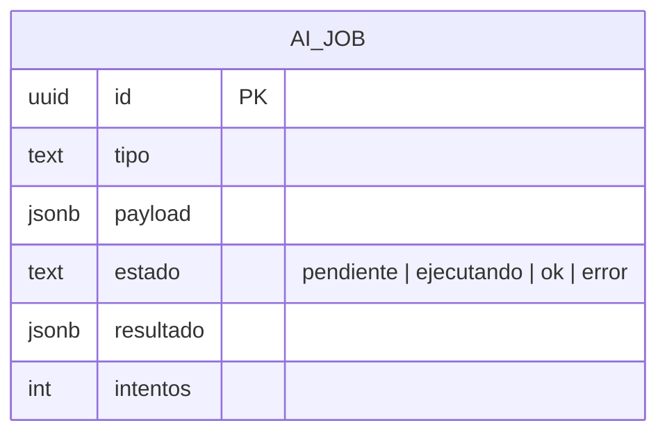

# M4 · Asistente IA (cola de jobs + runner headless)

> **🟦 TENTATIVO — sujeto a decisión de idea.** Esbozo. Calca el M6 de `home-os` (cola `ai_jobs` + runner
> Claude Code headless + contratos Zod). Ver `transversal/ia-runtime-headless.md`.

| Campo | Valor |
|-------|-------|
| **ID** | M4 |
| **Estado** | 🟦 tentativo |
| **Depende de** | M1 (datos on-chain), M2 (métricas), M5 (MCP The Graph) |
| **Lo usan** | M3 (reportes), Usuario (chat) |

## 1. Propósito y alcance
Orquestar la IA de runtime: una **cola `ai_jobs`** en Supabase que el **worker** drena con un **runner
Claude Code headless** (`claude -p`, con la **suscripción**, sin API key). Ejecuta tareas con **contratos de
entrada/salida tipados (Zod)**: redactar reportes, responder consultas sobre la cartera, clasificar
movimientos. **Fuera de alcance:** que la IA ejecute acciones on-chain (no hay escritura; D4).

## 2. Actores
Usuario (chatea / dispara tareas) · Worker (drena la cola) · Runner Claude Code headless (razona).

## 3. Requisitos funcionales (RF)
| ID | Requisito | Prioridad |
|----|-----------|:---------:|
| RF-M4-001 | Encolar tareas IA (`ai_jobs`) desde la app, procesarlas en el worker | Must |
| RF-M4-002 | Claim atómico de jobs (evitar doble ejecución) | Must |
| RF-M4-003 | **Validar la salida con Zod** antes de persistir; reintentos con backoff | Must |
| RF-M4-004 | Contexto de la tarea: snapshot financiero (M1/M2) + datos DeFi vía MCP (M5) | Should |
| RF-M4-005 | Engine-agnóstico: migrar a `ANTHROPIC_API_KEY` = cambiar solo el runner | Could |

## 4. Requisitos no funcionales (RNF)
| ID | Requisito | Métrica / criterio |
|----|-----------|--------------------|
| RNF-M4-001 | Sin coste de API | corre con la suscripción (Claude Code headless) |
| RNF-M4-002 | Desacople | la app no llama a la IA en el request; encola y el worker procesa |

## 5. Modelo de datos (fragmento del ER global)

## 6. Arquitectura / componentes
`lib/ai` (encolar) en la app · runner en el `worker` (claim `SKIP LOCKED` → `claude -p --output-format json`
→ Zod → persistir). Contratos de tarea en `types/ai-tools.ts`. La IA **propone**, nunca ejecuta escrituras.

## 7. Funcionalidades
_A rellenar: F-M4-1 Cola + claim atómico · F-M4-2 Runner headless · F-M4-3 Chat sobre la cartera._

## 8. Endpoints / Server Actions / Integraciones / Jobs
| Tipo | Nombre | Entrada | Salida | Auth | Notas |
|------|--------|---------|--------|------|-------|
| Action | `encolarJob` | `{ tipo, payload }` | `jobId` | sesión | payload validado con Zod |
| Job | `runner` | job pendiente | `resultado` validado | worker | reintentos con backoff |

## 9. Componentes UI (Definition of Done)
| Componente | Story | Test RTL | Estado |
|------------|:-----:|:--------:|--------|
| `chat-bubble` | ⬜ | ⬜ | 🟦 |

## 10. Criterios de aceptación del módulo
- [ ] Un job con salida no conforme al schema → `error` reintentable (no persiste basura).

## 11. DoD de cierre del módulo
_Ver plantilla `_templates/modulo.md` §11 y `transversal/ia-runtime-headless.md`._

## 12. Riesgos y decisiones abiertas
- Autenticación headless 24/7 en servidor (mitigación: runner en local; ver infra-devops).
- Selector de modelo (Sonnet/Opus) según cuota.
