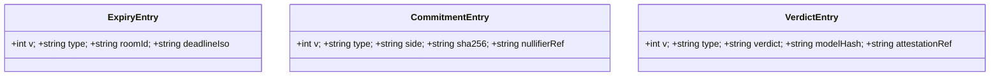
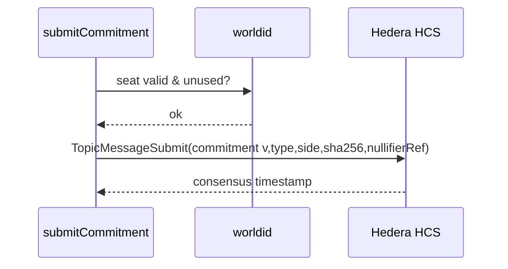

# M4 · `registry`

> The storage layer — because there is **no database** (D4). Write commitments and the verdict to
> the HCS topic; read them back via Mirror Node. Three versioned message types, versioned from the
> first commit.

| Field | Value |
|-------|-------|
| **ID** | M4 |
| **Status** | 🟧 draft |
| **Backlog** | S1.3 (`write`) · S2.5 (`read`) · S2.6 (versioning) |
| **Sponsor** | Hedera |
| **Depends on** | M1 (session/topic), M2 (produces the commitment), M3 (gates the commitment), M6/M7 (produce the verified verdict) |
| **Used by** | M6 (reads commitments to evaluate), M8 (verdict screen reads via Mirror Node) |

## 1. Purpose & scope
Persist the whole session on the **HCS topic** — the topic *is* the store (D4, D6). Three **versioned**
message types per session: **expiry** (written by M1), **commitment** (one per side), **verdict**
(after M7 verifies). Split into `registry.write` (append messages) and `registry.read` (Mirror Node
REST). **Out of scope:** creating the topic (M1), producing the verdict (M6/M7).

## 2. Actors
Our server (signs writes with **our** Hedera testnet account, D8) · Hedera HCS (append-only, consensus
ordering + timestamps) · Hedera Mirror Node (REST read path).

## 3. Functional requirements (RF)
| ID | Requirement | Priority |
|----|-------------|:--------:|
| RF-M4-001 | Write a **commitment** message (`sha256(ciphertext)`, side, nullifier ref) with a `v` version field | Must |
| RF-M4-002 | Write a **verdict** message (enum verdict, model hash, attestation ref) with a `v` version field | Must |
| RF-M4-003 | Every message carries a message `type` and `v` **from the first commit** (S2.6) | Must |
| RF-M4-004 | Read the topic history via **Mirror Node REST** and validate each message with Zod (D11) | Must |
| RF-M4-005 | Reject a commitment write unless the World seat (M3) is valid and unused | Must |
| RF-M4-006 | Never write plaintext or the verdict without a passing attestation (M7, fail closed D10) | Must |

## 4. Non-functional requirements (RNF)
| ID | Requirement | Metric / criterion |
|----|-------------|--------------------|
| RNF-M4-001 | **Append-only correctness** | Messages are never edited/deleted; gaps are visible; consensus timestamp is authoritative |
| RNF-M4-002 | **Versioned from message 1** | Every message on the topic has `v`; readers branch on `v` + `type` |
| RNF-M4-003 | Validated reads | Mirror Node responses parsed through Zod schemas; unexpected shapes rejected |

## 5. Data touched (HCS message schemas)
All three message types live here. Full schemas in `00-overview/02-data-model.md`.

## 6. Architecture / layer fit
Server Actions / jobs → `src/registry/write.ts` (Hedera `TopicMessageSubmit`) and
`src/registry/read.ts` (Mirror Node `fetch` + Zod). The UI reads the verdict only through
`registry.read` (M8), never the Hedera SDK directly.

## 7. Functionalities

### F-M4-1 · Commit a ciphertext to the topic
| Field | Value |
|-------|-------|
| **ID** | F-M4-1 · **Status** 🟧 |

**Sequence:**

**Acceptance criteria:**
- [ ] A commitment appears on the topic with `v`, `type`, side, and `sha256`.
- [ ] A commitment without a valid World seat is rejected.

### F-M4-2 · Read the session via Mirror Node
| Field | Value |
|-------|-------|
| **ID** | F-M4-2 · **Status** 🟧 |

**Rules / validations:** parse each Mirror Node message with a Zod schema keyed on `type`; unknown
`v` handled explicitly.
**Acceptance criteria:**
- [ ] Both clients read the identical verdict from Mirror Node.
- [ ] A malformed message is rejected, not silently coerced.

## 8. Endpoints / Server Actions / Integrations / Jobs
| Type | Name | Input | Output | Auth | Notes |
|------|------|-------|--------|------|-------|
| Action | `submitCommitment` | `{ roomId, side, sha256, nullifierRef }` | consensus ts | World seat (M3) | via `registry.write` |
| Job | `writeVerdict` | `{ roomId, verdict, modelHash, attestationRef }` | consensus ts | attestation OK (M7) | fail closed (D10) |
| Read | `readSession` | `{ roomId }` | parsed messages | none | Mirror Node REST + Zod |

## 9. UI components (Definition of Done)
| Component | Story | RTL test | Status |
|-----------|:-----:|:--------:|--------|
| _(no direct UI — consumed by M8)_ | — | — | 🟧 |

## 10. Module acceptance criteria
- [ ] All three message types are versioned from message 1 (S2.6).
- [ ] The verdict is written only after M7 passes (fail closed, D10).
- [ ] Reads go through Mirror Node and are Zod-validated (D11).

## 11. Module closure DoD
_See `_templates/module.md` §11._ Plus: unit tests for message schema/versioning and Mirror Node parsing (fixtures, no live calls in unit tests).

## 12. Risks & open decisions
- Mirror Node propagation lag between write and read — handle with polling on the verdict screen.
- Confirm HCS + Schedule + Mirror counts as three native services (Hedera booth).
