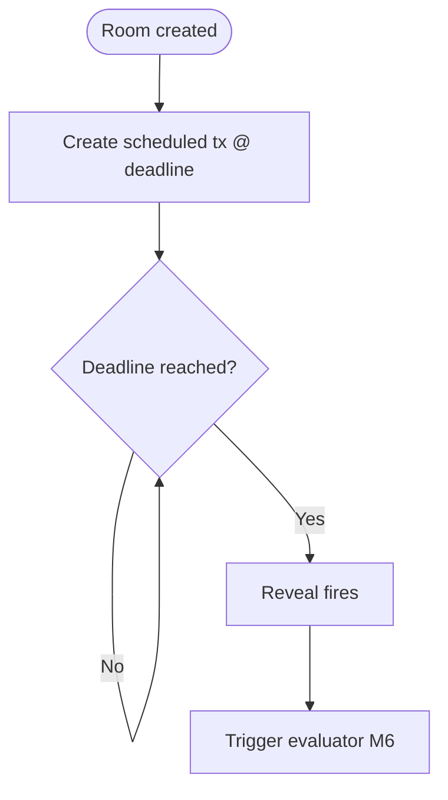

# M5 · `scheduler`

> The deadline clock — a timer neither party owns. Arm the Hedera scheduled reveal before any work,
> then listen for it to fire.

| Field | Value |
|-------|-------|
| **ID** | M5 |
| **Status** | 🟧 draft |
| **Backlog** | S2.4 |
| **Sponsor** | Hedera |
| **Depends on** | M1 (`session` — arms the reveal at room creation) |
| **Used by** | M6 (`evaluator` — the reveal firing triggers sealed evaluation) |

## 1. Purpose & scope
Use Hedera **Schedule Service** to arm a **scheduled reveal** at the room's deadline and to detect
when it fires. The clock is enforced by something **neither party owns** (D6), so the opener can't be
pressured to hold the deadline. **Arm-before-work:** the scheduled transaction is created at room
creation, before any commitment. **Out of scope:** setting the deadline value (M1), running the
evaluation (M6).

## 2. Actors
Our server (creates the scheduled tx with **our** Hedera account, D8) · Hedera Schedule Service ·
Hedera HCS (the reveal drives the verdict write via M4/M6).

## 3. Functional requirements (RF)
| ID | Requirement | Priority |
|----|-------------|:--------:|
| RF-M5-001 | Create a **scheduled transaction** for the reveal at the room deadline (arm-before-work) | Must |
| RF-M5-002 | Detect when the scheduled reveal **fires** | Must |
| RF-M5-003 | On firing, trigger the sealed evaluation (M6) | Must |
| RF-M5-004 | Do not allow the reveal to be brought forward or delayed by either party | Must |

## 4. Non-functional requirements (RNF)
| ID | Requirement | Metric / criterion |
|----|-------------|--------------------|
| RNF-M5-001 | **Clock independence** | Neither side nor the operator can move the reveal time |
| RNF-M5-002 | Arm before work | The scheduled tx exists before any commitment is written |

## 5. Data touched
No new message type of its own; the reveal firing leads to the **verdict entry** (M4). See
`00-overview/02-data-model.md`.

## 6. Architecture / layer fit
`src/scheduler/` wraps Hedera Schedule Service. Called by M1 at room creation to arm; polled/subscribed
to detect firing; on fire, invokes M6 → M7 → M4.

## 7. Functionalities

### F-M5-1 · Arm and listen for the reveal
| Field | Value |
|-------|-------|
| **ID** | F-M5-1 · **Status** 🟧 |

**Flow / activity:**

**Acceptance criteria:**
- [ ] The scheduled tx is armed at room creation, before any commitment.
- [ ] When the deadline is reached, evaluation is triggered exactly once.

## 8. Endpoints / Server Actions / Integrations / Jobs
| Type | Name | Input | Output | Auth | Notes |
|------|------|-------|--------|------|-------|
| Integration | `armReveal` | `{ roomId, deadlineIso }` | scheduleId | our key | Hedera Schedule Service |
| Job | `onRevealFired` | scheduleId | triggers M6 | our key | idempotent trigger |

## 9. UI components (Definition of Done)
| Component | Story | RTL test | Status |
|-----------|:-----:|:--------:|--------|
| _(no direct UI — countdown lives in M8)_ | — | — | 🟧 |

## 10. Module acceptance criteria
- [ ] The reveal cannot be moved by either party (RNF-M5-001).
- [ ] Evaluation triggers once, on time, when the reveal fires.

## 11. Module closure DoD
_See `_templates/module.md` §11._

## 12. Risks & open decisions
- **What happens if a required scheduled-tx signature never arrives?** Open decision — confirm expiry
  semantics at the **Hedera booth** (see `00-overview/05-open-decisions.md`). Fallback: server-side
  timer that still honours the publicly committed deadline.
