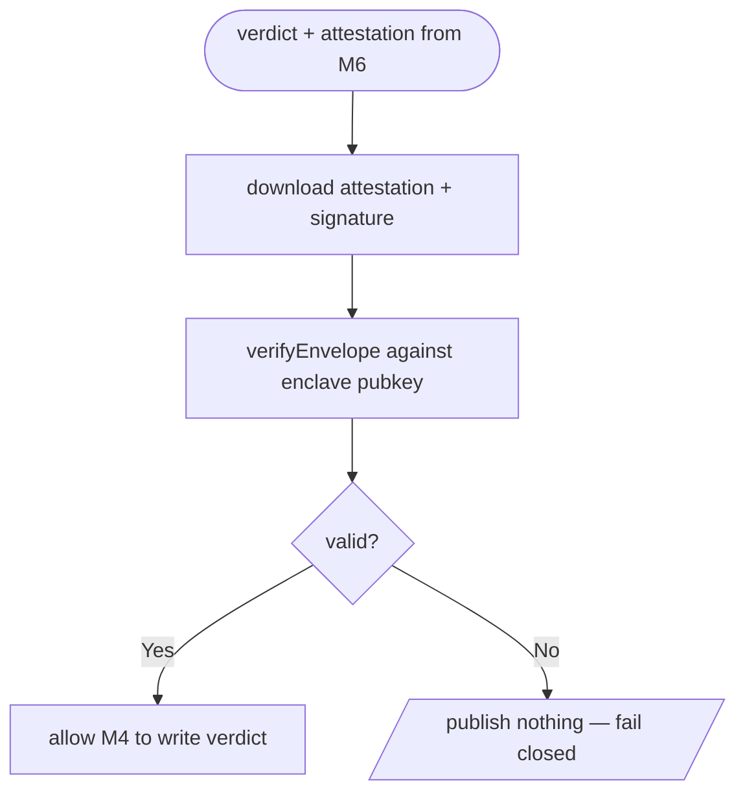

# M7 · `attest`

> **The Friday-night spike and the core claim.** Verify the TEE attestation signature *independently
> of the 0G SDK*. If it doesn't hold, the whole product collapses — and we need to know Friday night.

| Field | Value |
|-------|-------|
| **ID** | M7 |
| **Status** | 🟧 draft |
| **Backlog** | S0.3 (spike script) · S2.3 (per-verdict gate) |
| **Sponsor** | 0G |
| **Depends on** | S0.2 (`spec-03-attest.md`) |
| **Used by** | M6 (its verdict is gated here), M4 (writes the verdict only if this passes) |

## 1. Purpose & scope
Verify that a verdict really came out of the sealed enclave, by checking the TEE **attestation
signature outside the 0G SDK** — not merely receiving it. Providers generate a signing key **inside**
the TEE; the CPU/GPU attestations include that key's public key; every result is signed with it.
We download the attestation + response signature and verify against `OG_ENCLAVE_PUBKEY` using
`verifyEnvelope`. **Fail closed (D10):** a bad or missing signature ⇒ **no verdict published**.
S0.3 is the standalone **spike** (`scripts/spike-attest.ts`) proving it's possible at all; S2.3 is the
module that runs on **every** verdict. **Out of scope:** producing the verdict (M6), writing it (M4).

## 2. Actors
Our server / spike script (verifies) · the 0G enclave (signs with the in-TEE key) · the 0G attestation
download endpoint.

## 3. Functional requirements (RF)
| ID | Requirement | Priority |
|----|-------------|:--------:|
| RF-M7-001 | Download the attestation and the response signature for a verdict | Must |
| RF-M7-002 | Verify the signature against `OG_ENCLAVE_PUBKEY` **outside** the 0G SDK (`verifyEnvelope`) | Must |
| RF-M7-003 | **Fail closed**: on invalid/missing signature, do **not** publish the verdict (D10) | Must |
| RF-M7-004 | Gate M4's verdict write on a passing verification | Must |
| RF-M7-005 | Record the attestation reference alongside the published verdict | Should |

## 4. Non-functional requirements (RNF)
| ID | Requirement | Metric / criterion |
|----|-------------|--------------------|
| RNF-M7-001 | **Independent verification** | Verified without trusting an SDK "isValid" boolean; we check the signature ourselves |
| RNF-M7-002 | **Fail-closed invariant** | No code path publishes a verdict when verification fails or is absent |
| RNF-M7-003 | Precise claim | Documented exactly what the signature covers (does it cover the input? — 0G workshop question) |

## 5. Data touched
Produces the **attestationRef** stored on the **verdict entry** (M4). See `00-overview/02-data-model.md`.

## 6. Architecture / layer fit
`src/evaluator/attest.ts` sits between M6 (produces verdict + attestation) and M4 (writes verdict).
The spike lives at `scripts/spike-attest.ts`. See `transversal/integration-0g.md` and
`transversal/security-and-privacy.md`.

## 7. Functionalities

### F-M7-1 · Independent attestation gate (fail closed)
| Field | Value |
|-------|-------|
| **ID** | F-M7-1 · **Status** 🟧 |

**Flow / activity:**

**Acceptance criteria:**
- [ ] Given a valid attestation, the verdict is written.
- [ ] Given a tampered byte, the signature fails and **no** verdict is written (demo Act 4).
- [ ] Verification does not rely on the SDK's own validity flag (RNF-M7-001).

## 8. Endpoints / Server Actions / Integrations / Jobs
| Type | Name | Input | Output | Auth | Notes |
|------|------|-------|--------|------|-------|
| Lib | `verifyEnvelope(envelope, enclavePubkey)` | verdict envelope | `true` \| `false` | none | package `@foundryprotocol/0gkit-attestation` (confirm at booth) |
| Script | `spike-attest.ts` | one sealed call | pass/fail | `OG_KEY` | Friday-night gamble |

## 9. UI components (Definition of Done)
| Component | Story | RTL test | Status |
|-----------|:-----:|:--------:|--------|
| _(no UI — the demo tampers a byte via the script)_ | — | — | 🟧 |

## 10. Module acceptance criteria
- [ ] The spike verifies a real sealed call's signature Friday night (S0.3).
- [ ] Every verdict is gated on independent verification (S2.3, RNF-M7-002).
- [ ] Tampering one byte ⇒ no verdict (fail closed).

## 11. Module closure DoD
_See `_templates/module.md` §11._ Plus: a fail-closed test (tampered envelope ⇒ no write).

## 12. Risks & open decisions
- **Highest-risk item in the project.** If independent verification can't be done, the core claim
  collapses — that's why the spike runs first.
- Exact package/endpoint for `verifyEnvelope` and **whether the signature covers the input** —
  **confirm at the 0G booth** (see `00-overview/05-open-decisions.md`).
