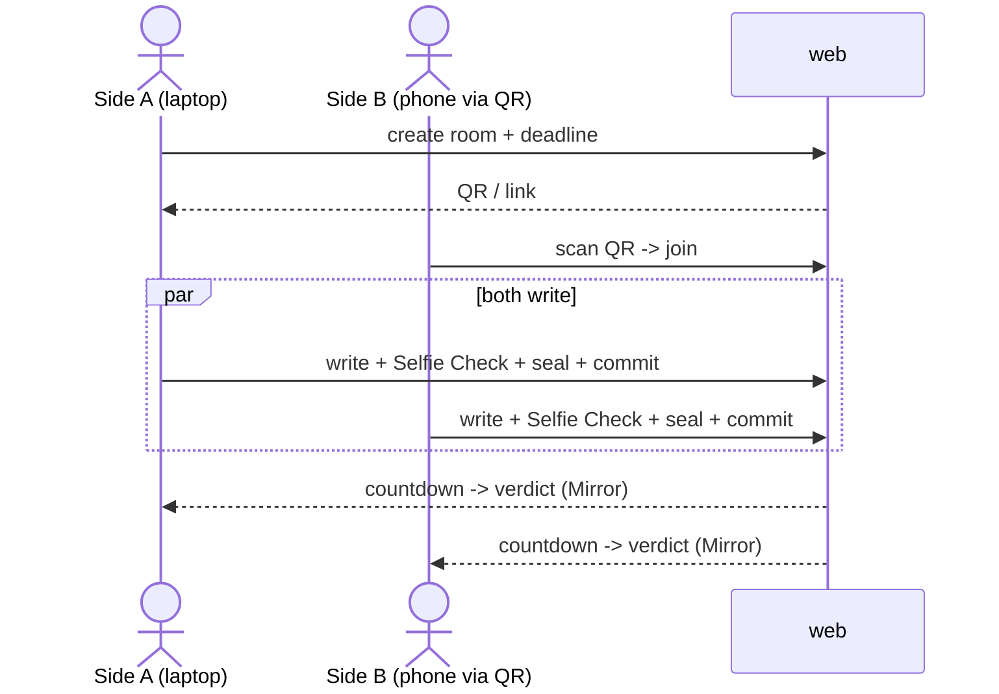

# M8 · `web`

> Three screens and the thing a judge actually touches: create · write+seal · verdict. Two browsers,
> one QR on the table.

| Field | Value |
|-------|-------|
| **ID** | M8 |
| **Status** | 🟧 draft |
| **Backlog** | S3.1 · S3.2 · S3.3 · S3.4 |
| **Sponsor** | web |
| **Depends on** | M1 (create), M2 (seal), M3 (Selfie Check), M4 (Mirror read) |
| **Used by** | the demo (Phase 4) |

## 1. Purpose & scope
The user-facing surface: **three screens** — (1) **create** (open a room, set the deadline, get a
QR/link), (2) **write+seal** (write a position, run Selfie Check, seal in-browser), (3) **verdict**
(countdown, then the one-line verdict read via Mirror Node). Plus a **two-browser end-to-end** flow
with QR to join. Mobile-first — a judge scans on a phone. **Out of scope:** the crypto (M2), the
enclave call (M6), the attestation (M7).

## 2. Actors
Side A / Side B (two browsers) · the module libs behind Server Actions (M1–M4).

## 3. Functional requirements (RF)
| ID | Requirement | Priority |
|----|-------------|:--------:|
| RF-M8-001 | **Create screen:** pick a **use case** (3-card picker, D16 — sets side labels + `useCase`), set a deadline, create the room (M1), show a scannable QR + copyable link | Must |
| RF-M8-002 | **Write+seal screen:** write a free-form position (preset placeholder + **soft, non-blocking checklist**, D16/DA8), run Selfie Check (M3), seal in-browser (M2), submit the commitment (M4) | Must |
| RF-M8-003 | **Verdict screen:** show a live countdown to the deadline, then the one-line verdict from Mirror Node (M4) | Must |
| RF-M8-004 | Plaintext **never** leaves the browser (uses M2's client seal) | Must |
| RF-M8-005 | Show the **identical** verdict to both sides | Must |
| RF-M8-006 | **Two-browser E2E** joinable by QR | Must |
| RF-M8-007 | Offer the opt-in **gap disclosure** toggle before sealing (consent recorded for M6) | Should |

## 4. Non-functional requirements (RNF)
| ID | Requirement | Metric / criterion |
|----|-------------|--------------------|
| RNF-M8-001 | **Mobile-first** | Meets the mobile DoD (`transversal/mobile-first.md`); QR scannable, forms full-width, touch targets ≥44px |
| RNF-M8-002 | No plaintext egress | Verified in the E2E: no network request carries the plaintext position |
| RNF-M8-003 | Verdict parity | Both browsers render the same enum verdict |

## 5. Data touched
Reads/writes only through M1–M4 (no DB, D4). The verdict screen reads via Mirror Node (M4). See
`00-overview/02-data-model.md`.

## 6. Architecture / layer fit
`src/web/` (App Router screens) → Server Actions → module libs (M1–M4). The seal (M2) runs in the
browser; the UI never imports a Hedera/0G SDK directly (D-conventions).

## 7. Functionalities

### F-M8-1 · Two-browser end-to-end (QR to join)
| Field | Value |
|-------|-------|
| **ID** | F-M8-1 · **Status** 🟧 |

**Sequence:**

**Acceptance criteria:**
- [ ] Two browsers complete the full flow; both see the same verdict.
- [ ] No request contains the plaintext position (checked in Playwright).

## 8. Endpoints / Server Actions / Integrations / Jobs
| Type | Name | Input | Output | Auth | Notes |
|------|------|-------|--------|------|-------|
| Action | `createRoom` | `{ deadlineIso }` | `{ roomId, joinUrl, qr }` | none | M1 |
| Action | `submitCommitment` | `{ roomId, side, ciphertext, sha256, worldProof, consent }` | ack | World seat | M2/M3/M4 |
| Read | `readVerdict` | `{ roomId }` | `{ verdict }` \| pending | none | Mirror Node (M4) |

## 9. UI components (Definition of Done)

> **Wireframes, sitemap, room state machine and the full component inventory live in
> [`../ux/screens-and-sitemap.md`](../ux/screens-and-sitemap.md)** (ES mirror:
> `../ux/screens-and-sitemap.es.md`). That document extends this table to 24 components across five
> routes and marks which eight are on the demo critical path. The six below are the core of the three
> screens; anything added there must be reflected here before it is built.
| Component | Story | RTL test | Status |
|-----------|:-----:|:--------:|--------|
| `create-room-form` | ✅ | ✅ | 🟢 (S3.1) |
| `room-qr` | ✅ | ✅ | 🟢 (S3.1 — scannable QR via `react-qr-code` + copy) |
| `seal-position-form` | ⬜ | ⬜ | 🟧 (S3.2 — preset placeholder + checklist, D16) |
| `use-case-picker` | ⬜ | ⬜ | 🟧 (S3.5 — 3 cards, sets labels + `useCase`) |
| `position-checklist` | ⬜ | ⬜ | 🟧 (S3.2 — static guidance, never blocks sealing; heuristics = DA8 stretch) |
| `selfie-check-gate` | ⬜ | ⬜ | 🟧 |
| `countdown` | ✅ | ✅ | 🟢 (S3.3) |
| `verdict-panel` | ✅ | ✅ | 🟢 (S3.3) |

### Implementation notes (S3.1 — create screen)
Landed with co-located Storybook stories (CSF3) + RTL tests, tokenized via `globals.css` + `cn()`,
mobile-first (full-width, ≥44px targets, theme-aware):
- `src/components/web/create-room-form.tsx` — deadline input, future-deadline validation, calls the
  injected `createRoom` action (M1); on success renders `RoomQr`.
- `src/components/web/room-qr.tsx` — **scannable QR** (`react-qr-code`, self-contained SVG, no
  external calls; on a fixed white plate for dark mode) + join link with one-tap copy.
- `src/app/create/page.tsx` + `src/app/create/actions.ts` — the `/create` route wires the real
  `createRoom` Server Action to M1 `session` + M4 `registry.write` (`hederaTopicClient`).

**Deferred:** arming the scheduled reveal in the action (M5 `armReveal` — needs the reveal tx from
M6/M7). Screen S3.2 (write+seal) remains (blocked on M2 seal).

### Implementation notes (S3.3 — verdict screen)
`/room/[roomId]/verdict` reads the room's expiry + verdict from Mirror Node (M4 `registry.read`) at
load, then the client polls for the verdict until it lands:
- `src/components/web/countdown.tsx` — live time-to-reveal (`formatRemaining` pure helper; tick starts
  post-mount so no hydration mismatch; "Reveal due" past the deadline). Story + RTL.
- `src/components/web/verdict-panel.tsx` — pending (sealed) → `workable` / `not_workable` (neutral, not
  alarming) / `gap:*`. Story + RTL. Uses Tailwind emerald/amber/neutral until the semantic verdict
  tokens (`--workable`/`--not-workable`/`--pending`) are added to `globals.css`.
- `src/components/web/verdict-view.tsx` — composes them and polls `readVerdict` while pending.
- `src/app/room/[roomId]/verdict/{page,actions}.ts` — server read + `readVerdict` Server Action.

Works end-to-end **now** with a live countdown + pending state; real verdicts render once M6/M7 write
them to the topic. RF-M8-003 (countdown → verdict via Mirror) satisfied for the read side.

**Navigation:** `/room/[roomId]/share` is a stable QR/share view (reuses `room-qr`, rebuilds the join
URL from the id) so the QR — which otherwise only lives in the create page's state — has a permanent
URL. The verdict screen has a **"← Back to QR"** link to it; the share view links on to the verdict
screen. Round-trip: create → verdict ⇄ share.

### UI ↔ backend audit
Where the UI reflects the backend, and where it doesn't yet.

**Fixed (UI now reflects the backend):**
- **Gap opt-in** — the create form surfaces `gapOptIn` (was accepted by `createRoom` but never shown).
- **Commitment count** — the verdict screen shows `n of 2 sides committed` from `registry.read`.
- **Room existence** — the verdict screen shows "Room not found" when nothing for the id is on the
  topic, instead of a fake countdown.

**Gated (UI implies more than the backend delivers — blocked on other work):**
- **The reveal never fires** — the countdown promises a verdict, but `createRoomAction` doesn't arm
  the reveal (`scheduler.armReveal` needs the verdict tx) and nothing writes a verdict. Gated on
  **M6 evaluator + M7 attest** (Frank) and wiring `armReveal`.
- **No write/seal/commit UI (S3.2)** — gated on `OG_ENCLAVE_SEAL_PUBKEY` (enclave *encryption* key,
  distinct from the attestation `OG_ENCLAVE_PUBKEY`) + `WORLD_APP_ID`.
- **World Selfie Check invisible** — part of S3.2; the IDKit widget needs `WORLD_APP_ID`.
- **Verdict colours are placeholders** — Tailwind emerald/amber until the semantic tokens
  (`--workable`/`--not-workable`/`--pending`) are added to `globals.css` (integrator-only).
- Note: `gapOptIn` is collected but not yet persisted to the topic / enforced — the consent logic is
  **S4.6**.

## 10. Module acceptance criteria
- [ ] The two-browser E2E passes with QR join (S3.4).
- [ ] Plaintext never leaves the browser (RNF-M8-002).
- [ ] Both sides see the identical verdict (RNF-M8-003).
- [ ] Every screen meets the mobile DoD (RNF-M8-001).

## 11. Module closure DoD
_See `_templates/module.md` §11._ Plus: Playwright two-browser E2E; each component has Story + RTL test.

## 12. Risks & open decisions
- Mirror Node lag on the verdict screen — poll with a clear "waiting for the reveal" state.
- Default of the gap-disclosure toggle (opt-in off by default?) — see `00-overview/05-open-decisions.md`.
