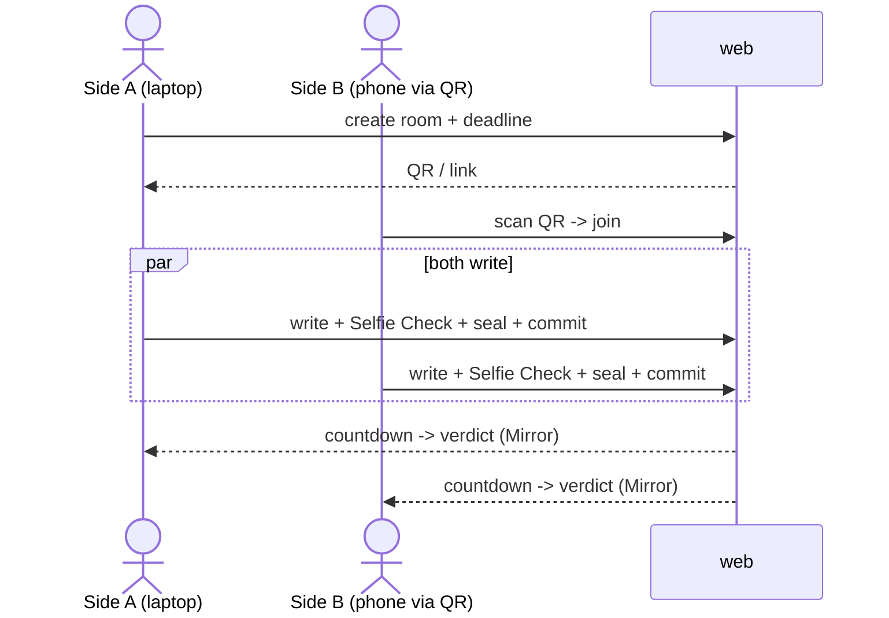

# M8 · `web`

> Three screens and the thing a judge actually touches: create · write+seal · verdict. Two browsers,
> one QR on the table.

| Field | Value |
|-------|-------|
| **ID** | M8 |
| **Status** | 🟧 draft |
| **Backlog** | S3.1 · S3.2 · S3.3 · S3.4 |
| **Sponsor** | web |
| **Depends on** | M1 (create), M2 (seal), M3 (Selfie Check), M4 (Mirror read) |
| **Used by** | the demo (Phase 4) |

## 1. Purpose & scope
The user-facing surface: **three screens** — (1) **create** (open a room, set the deadline, get a
QR/link), (2) **write+seal** (write a position, run Selfie Check, seal in-browser), (3) **verdict**
(countdown, then the one-line verdict read via Mirror Node). Plus a **two-browser end-to-end** flow
with QR to join. Mobile-first — a judge scans on a phone. **Out of scope:** the crypto (M2), the
enclave call (M6), the attestation (M7).

## 2. Actors
Side A / Side B (two browsers) · the module libs behind Server Actions (M1–M4).

## 3. Functional requirements (RF)
| ID | Requirement | Priority |
|----|-------------|:--------:|
| RF-M8-001 | **Create screen:** set a deadline, create the room (M1), show a scannable QR + copyable link | Must |
| RF-M8-002 | **Write+seal screen:** write a position, run Selfie Check (M3), seal in-browser (M2), submit the commitment (M4) | Must |
| RF-M8-003 | **Verdict screen:** show a live countdown to the deadline, then the one-line verdict from Mirror Node (M4) | Must |
| RF-M8-004 | Plaintext **never** leaves the browser (uses M2's client seal) | Must |
| RF-M8-005 | Show the **identical** verdict to both sides | Must |
| RF-M8-006 | **Two-browser E2E** joinable by QR | Must |
| RF-M8-007 | Offer the opt-in **gap disclosure** toggle before sealing (consent recorded for M6) | Should |

## 4. Non-functional requirements (RNF)
| ID | Requirement | Metric / criterion |
|----|-------------|--------------------|
| RNF-M8-001 | **Mobile-first** | Meets the mobile DoD (`transversal/mobile-first.md`); QR scannable, forms full-width, touch targets ≥44px |
| RNF-M8-002 | No plaintext egress | Verified in the E2E: no network request carries the plaintext position |
| RNF-M8-003 | Verdict parity | Both browsers render the same enum verdict |

## 5. Data touched
Reads/writes only through M1–M4 (no DB, D4). The verdict screen reads via Mirror Node (M4). See
`00-overview/02-data-model.md`.

## 6. Architecture / layer fit
`src/web/` (App Router screens) → Server Actions → module libs (M1–M4). The seal (M2) runs in the
browser; the UI never imports a Hedera/0G SDK directly (D-conventions).

## 7. Functionalities

### F-M8-1 · Two-browser end-to-end (QR to join)
| Field | Value |
|-------|-------|
| **ID** | F-M8-1 · **Status** 🟧 |

**Sequence:**

**Acceptance criteria:**
- [ ] Two browsers complete the full flow; both see the same verdict.
- [ ] No request contains the plaintext position (checked in Playwright).

## 8. Endpoints / Server Actions / Integrations / Jobs
| Type | Name | Input | Output | Auth | Notes |
|------|------|-------|--------|------|-------|
| Action | `createRoom` | `{ deadlineIso }` | `{ roomId, joinUrl, qr }` | none | M1 |
| Action | `submitCommitment` | `{ roomId, side, ciphertext, sha256, worldProof, consent }` | ack | World seat | M2/M3/M4 |
| Read | `readVerdict` | `{ roomId }` | `{ verdict }` \| pending | none | Mirror Node (M4) |

## 9. UI components (Definition of Done)
| Component | Story | RTL test | Status |
|-----------|:-----:|:--------:|--------|
| `create-room-form` | ⬜ | ⬜ | 🟧 |
| `room-qr` | ⬜ | ⬜ | 🟧 |
| `seal-position-form` | ⬜ | ⬜ | 🟧 |
| `selfie-check-gate` | ⬜ | ⬜ | 🟧 |
| `countdown` | ⬜ | ⬜ | 🟧 |
| `verdict-panel` | ⬜ | ⬜ | 🟧 |

## 10. Module acceptance criteria
- [ ] The two-browser E2E passes with QR join (S3.4).
- [ ] Plaintext never leaves the browser (RNF-M8-002).
- [ ] Both sides see the identical verdict (RNF-M8-003).
- [ ] Every screen meets the mobile DoD (RNF-M8-001).

## 11. Module closure DoD
_See `_templates/module.md` §11._ Plus: Playwright two-browser E2E; each component has Story + RTL test.

## 12. Risks & open decisions
- Mirror Node lag on the verdict screen — poll with a clear "waiting for the reveal" state.
- Default of the gap-disclosure toggle (opt-in off by default?) — see `00-overview/05-open-decisions.md`.
