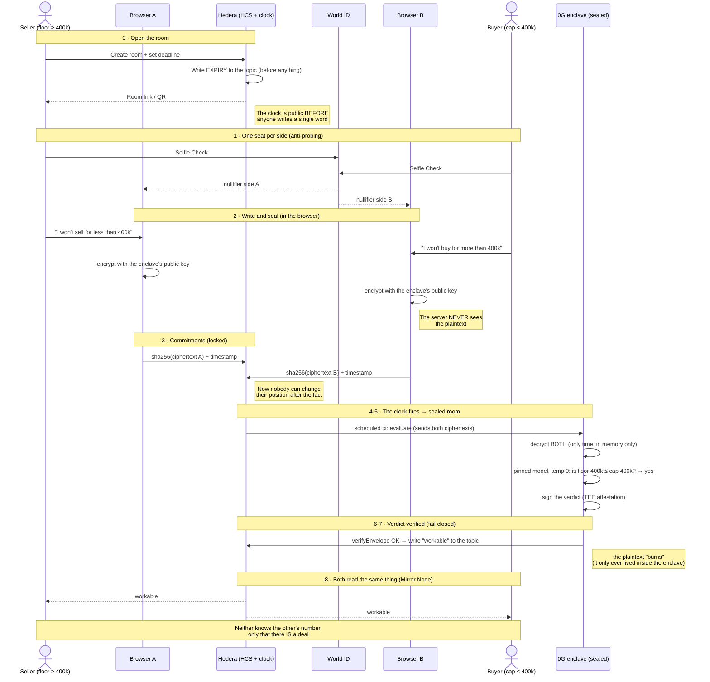

# Seam — worked example (selling a house)

> Case: the **Seller** won't sell for less than **400k**. The **Buyer** won't buy for more than **400k**.
> They overlap exactly at 400k → the verdict is `workable`, but **neither discovers the other's number**.

## Full sequence

## What each side learns

| | What they knew | What they learn |
|---|---|---|
| Seller | Their floor = 400k | That a viable deal exists. They do **not** learn the buyer's cap was exactly 400k. |
| Buyer | Their cap = 400k | That a viable deal exists. They do **not** learn the seller's floor was exactly 400k. |

## The variant that proves the value (second demo run)

If the buyer had entered a **cap of 380k**: floor 400k > cap 380k → verdict `not_workable`.
And here is the magic: **neither discovers by how much they missed** (it does not say "you were 20k
apart"). Only "no deal". That second run, where the judges notice how little they learned about each
other, **is the pitch**.

## Note on the optional gap disclosure

If **both** parties opt in, the enclave can additionally say **how many** things block — never which:
`gap:single` (here: only price blocks — one issue away, worth a call) or `gap:multiple` (several
dimensions block, or they're too entangled to attribute to one). But only if **both** consented
beforehand: if one wants the bare answer, everyone gets the bare answer. The model never emits free
text, only that enum (leak control, D9 as amended — naming the dimension was rejected as ill-defined
when several block at once).
