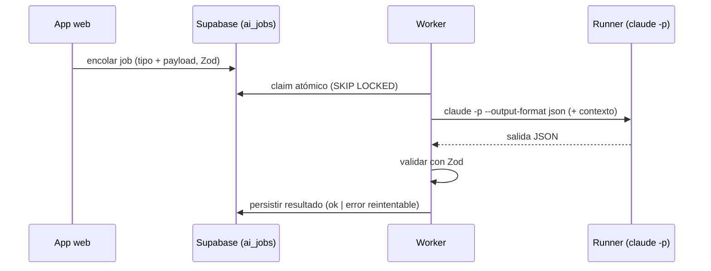

# T · IA de runtime headless

La IA dentro de la app usa **Claude Code headless con la suscripción** (`claude -p`), **sin API key** (D6).
Calca el enfoque de `home-os` (su M6). Es la misma pieza que ya está probada en producción allí; aquí se
apunta a **finanzas cripto**.

## Principio
La app **no llama a la IA en el request**. Encola tareas en **`ai_jobs`** (Supabase); el **worker** las drena
con un **runner** que invoca `claude -p --output-format json`. El sistema es **engine-agnóstico**: migrar a
`ANTHROPIC_API_KEY` sería cambiar **solo el runner** (deps inyectables).

## Contratos de tarea (Zod)
- **Entrada** y **salida** de cada tipo de job están **tipadas con Zod**. Una salida que no valida → `error`
  reintentable (no se persiste basura). Ver el patrón `types/ai-tools.ts` de home-os.
- La IA **propone, no ejecuta**: cualquier escritura la confirma el usuario / la hace una Server Action
  autenticada. En este proyecto, además, **no hay escritura on-chain** (D4), así que la IA solo lee y redacta.

## Contexto que recibe el runner
- **Snapshot financiero** de la wallet (movimientos + métricas de M1/M2).
- Acceso a datos DeFi vía el **Subgraph MCP** (M5 / `integracion-thegraph.md`).
- Nada de private keys ni secretos en el prompt.

## Autenticación
- `CLAUDE_CODE_OAUTH_TOKEN` (o `~/.claude` autenticado) donde corra el worker. **Sin coste de API.**
- **Riesgo**: la auth por suscripción headless 24/7 en servidor puede no ser estable. **Mitigación**: correr
  el runner en **local** durante la hackathon (la app encola, el runner local drena). Ver `infra-devops.md`.

## Reintentos y robustez
- Backoff ante fallos; límite de intentos; el job registra `intentos`/`error`.
- Claim atómico (`SKIP LOCKED`) para no ejecutar el mismo job dos veces.

## Qué NO hace
- No firma ni envía transacciones (no existe esa capacidad; D4).
- No publica reportes por su cuenta: genera **borradores** que el usuario revisa (M3).
