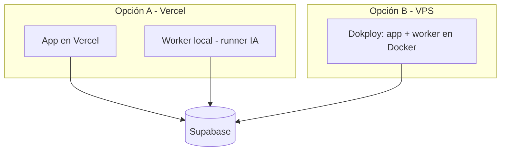

# T · Infra & DevOps

> **🟦 Deploy por decidir (D11 / DA7).** Dos caminos; se elige según el tiempo de la hackathon.

## Opción A — Vercel (rápido para hackathon) · *recomendado tentativo*
- **App web** (Next.js) desplegada en **Vercel**: push → deploy automático, TLS y dominio gratis, cero
  configuración de servidor. Ideal para iterar rápido durante 36h.
- **Worker + runner IA**: Vercel no encaja bien para procesos long-running / cron con `claude -p`. Opción:
  correr el **worker en local** (drena `ai_jobs` de Supabase) durante la demo. La app en Vercel encola; el
  runner local procesa. Esto además esquiva el riesgo de auth headless en servidor.
- **Env** en el panel de Vercel (nunca en el repo).

## Opción B — VPS Hostinger + Dokploy + Docker (como home-os)
- **Hostinger VPS** con **Dokploy** (PaaS sobre Docker) desplegando `docker-compose.yml`:
  - `app` (Next.js standalone, `Dockerfile`) — puerto 3000, healthcheck.
  - `worker` (`worker.Dockerfile`) — cron + runner IA.
- Dominio + TLS por Dokploy (Traefik). Más control, pero más setup para una hackathon.

## Supabase
- Gestionado (cloud) — más simple para hackathon — o self-host. La app/worker se conectan por URL + keys.
- Migraciones versionadas; RLS por `user_id` desde el día uno.

## Variables de entorno
- En el panel del proveedor (Vercel/Dokploy), **no en el repo**. Plantilla: `.env.example`.
- Sensibles solo en el entorno del servidor: `SUPABASE_SERVICE_ROLE`, `THE_GRAPH_API_KEY`, `RPC_URL`,
  `CLAUDE_CODE_OAUTH_TOKEN`.
- **Jamás** private keys / seed phrases en env ni repo (D4). Las direcciones de wallet son públicas y OK.

## IA de runtime headless (lo delicado)
- El runner invoca **Claude Code** (`claude -p --output-format json`) con la **suscripción** (sin API key).
- Debe estar **autenticado** donde corra el worker (`~/.claude` / `CLAUDE_CODE_OAUTH_TOKEN`).
- **Riesgo**: auth headless 24/7 en servidor puede no ser estable. **Mitigación (hackathon)**: correr el
  runner en **local**. El sistema es agnóstico: migrar a `ANTHROPIC_API_KEY` = cambiar solo el runner.

## Observabilidad
- Logs del proveedor (Vercel/Dokploy). Healthcheck de la app. Estado de `ai_jobs` visible en la propia app.

## Recomendación para las 36h
**App en Vercel + worker/runner IA en local + Supabase cloud.** Máxima velocidad de iteración, mínimo setup,
y esquiva el riesgo de la IA headless en servidor. Reevaluar si la demo necesita el worker 24/7.
