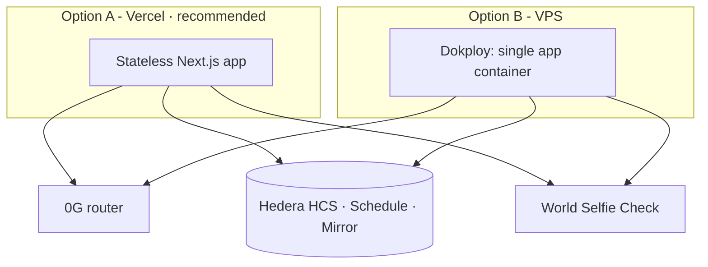

# T · Infra & DevOps

> Status: 🟧 draft · **Deploy TBD (D15).** Two paths; pick based on hackathon time.

**Key difference from home-os:** Overlap has **no worker and no database** (D4). Storage *is* the HCS
topic; there is no `ai_jobs` queue and no headless runner. The app is a **stateless Next.js app** that
calls 0G (sealed inference), Hedera (HCS · Schedule · Mirror) and World. That makes the Vercel path
cleaner than it was for home-os.

## Option A — Vercel (fast for hackathon) · *tentatively recommended*
- **Web app** (Next.js) on **Vercel**: push → automatic deploy, free TLS and domain, zero server config.
  Ideal for iterating fast over 36h.
- **No long-running process to host** — there is no worker and no cron. The three sponsor calls happen
  inside Server Actions / route handlers on demand.
- **Env** in the Vercel panel (never in the repo).

## Option B — Hostinger VPS + Dokploy + Docker (like home-os)
- **Hostinger VPS** with **Dokploy** (PaaS over Docker) deploying a single `app` service
  (Next.js standalone, `Dockerfile`) — port 3000, healthcheck.
- Domain + TLS via Dokploy (Traefik). More control, but more setup for a hackathon, and Overlap gains
  little from it because there is no background process to run.

## State
- **No database.** All session state — expiry, commitments, verdict — lives on the **HCS topic** and is
  read back through the **Mirror Node** (D4). The app holds no decryptable copy of any position (D5/D8).

## Environment variables
- In the provider panel (Vercel/Dokploy), **not in the repo**. Template: `.env.example`.
- Sensitive, server-side only: `OG_KEY`, `HEDERA_PRIVATE_KEY` (**our own testnet account**),
  `WORLD_APP_ID`, plus `OG_ROUTER_URL`, `OG_MODEL`, `OG_ENCLAVE_PUBKEY`, `HEDERA_ACCOUNT_ID`,
  `HEDERA_TOPIC_ID`, `WORLD_ACTION`.
- **Never** any user private key or seed phrase (D8). We hold only our own Hedera testnet account key.

## Observability
- Provider logs (Vercel/Dokploy). App healthcheck. Session state is publicly auditable on the HCS topic
  itself (the "public receipt" of the demo).

## Recommendation for the 36h
**App on Vercel + env in the panel.** The whole app is stateless because state lives on Hedera — maximum
iteration speed, minimum setup. Re-read the sponsor pages before submitting (they changed once mid-event).
