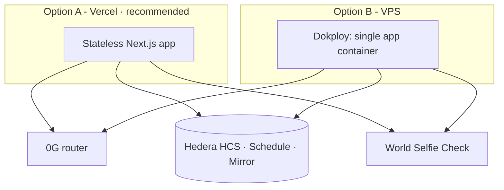

# T · Infra & DevOps

> Status: 🟩 **D15 decided (26 Jul): Dokploy on a VPS** (option B below). The image builds and serves —
> verified locally, see "Verified" at the end of this file.

**Key difference from home-os:** Overlap has **no worker and no database** (D4). Storage *is* the HCS
topic; there is no `ai_jobs` queue and no headless runner. The app is a **stateless Next.js app** that
calls 0G (sealed inference), Hedera (HCS · Schedule · Mirror) and World. That makes the Vercel path
cleaner than it was for home-os.

## Option A — Vercel (fast for hackathon) · *tentatively recommended*
- **Web app** (Next.js) on **Vercel**: push → automatic deploy, free TLS and domain, zero server config.
  Ideal for iterating fast over 36h.
- **No long-running process to host** — there is no worker and no cron. The three sponsor calls happen
  inside Server Actions / route handlers on demand.
- **Env** in the Vercel panel (never in the repo).

## Option B — Hostinger VPS + Dokploy + Docker (like home-os)
- **Hostinger VPS** with **Dokploy** (PaaS over Docker) deploying a single `app` service
  (Next.js standalone, `Dockerfile`) — port 3000, healthcheck.
- Domain + TLS via Dokploy (Traefik). More control, but more setup for a hackathon, and Overlap gains
  little from it because there is no background process to run.

## State
- **No database.** All session state — expiry, commitments, verdict — lives on the **HCS topic** and is
  read back through the **Mirror Node** (D4). The app holds no decryptable copy of any position (D5/D8).

## Environment variables
- In the provider panel (Vercel/Dokploy), **not in the repo**. Template: `.env.example`.
- Sensitive, server-side only: `OG_KEY`, `HEDERA_PRIVATE_KEY` (**our own testnet account**),
  `WORLD_APP_ID`, plus `OG_ROUTER_URL`, `OG_MODEL`, `OG_ENCLAVE_PUBKEY`, `HEDERA_ACCOUNT_ID`,
  `HEDERA_TOPIC_ID`, `WORLD_ACTION`.
- **Never** any user private key or seed phrase (D8). We hold only our own Hedera testnet account key.

## Observability
- Provider logs (Vercel/Dokploy). App healthcheck. Session state is publicly auditable on the HCS topic
  itself (the "public receipt" of the demo).

## Recommendation for the 36h
~~**App on Vercel + env in the panel.**~~ **Superseded (26 Jul): Dokploy.** The owner has the VPS already,
and one container turns out to be worth more than fast deploys — see the concurrency note below.

## Dokploy — the configuration that works
Application type **Dockerfile** (not Compose; the compose file exists for a plain `docker compose up`).

| Field | Value |
|---|---|
| Build Path (base directory) | `/` |
| Docker File | `Dockerfile` |
| Docker Context Path | `.` |
| Docker Build Stage | *empty* — the last stage (`runner`) is the minimal one |
| Port | `3000` |

Three things the image needs that are not obvious, all of them fixed in the `Dockerfile`/`.dockerignore`
and each of which broke the build or the routing when absent:

1. **`.dockerignore` is load-bearing.** Without it `COPY . .` ships the host's `node_modules` into an
   Alpine image — native bindings built for the wrong platform, in a context of hundreds of MB.
2. **`public/` does not exist in this repo**, and the runner stage copies it. The builder creates it
   (`mkdir -p public`) so the `COPY` cannot fail.
3. **`ENV HOSTNAME=0.0.0.0`.** The standalone `server.js` binds whatever `HOSTNAME` says; left unset it
   can listen on localhost *inside* the container, where Traefik can never reach it.

**A build needs ~2 GB of RAM.** On a 1 GB VPS `next build` is OOM-killed — add swap or build elsewhere
and push to a registry.

### Environment (panel only, never the repo)
No variable is needed at **build** time: there is not a single `NEXT_PUBLIC_*` in the codebase, so every
value is read at runtime through `src/config/env.ts` and can be changed without rebuilding.

- `APP_URL` **must be the public HTTPS origin.** Join links and the QR are built from it (`session.ts`);
  left at localhost, a scanning phone looks for the app on itself.
- Do **not** set `NODE_ENV` in the panel. Panel variables override the image's `ENV NODE_ENV=production`,
  and a copied dev `.env` will quietly run the production build in development mode.
- **Strip the quotes.** `.env.local` writes `APP_URL="http://…"`; `docker --env-file` keeps quotes
  literally (dotenv strips them, Docker does not). A quoted value fails `z.string().url()` — **but not at
  boot**: `env.ts` is imported lazily, so the container looks healthy and serves the static pages, and the
  failure surfaces on the first Server Action that creates a room. Verified both ways locally.
- `E2E_FAKE_WORLD` is **never** set in a deploy.

### One container is a feature, not a compromise
S3.21's reveal dedupe (`src/reveal/in-flight.ts`) is a per-process `Map`, and S3.24's seat registry is
per-process too. Both were documented as only partly effective *because Vercel runs many instances*. A
single Dokploy container makes them actually hold — so **keep the app at one replica** for the demo.
Scaling out silently reopens the duplicate-reveal bug (real money per duplicate) without any code change.

## Verified (26 Jul)
`docker build` green from a clean context; container booted with the real env, `/`, `/rooms` and `/create`
all `200`, `NODE_ENV=production` / `HOSTNAME=0.0.0.0` / `PORT=3000` confirmed inside; image **316 MB**.

**Known gap, unrelated to the image:** `OG_DEMO_SEAL_SECRET` is absent from the environment, and
`src/reveal/reveal-service.ts` does `requireEnv` on it — so the reveal throws before reaching the enclave
and **no room can ever produce a verdict** until it is set. The pages serve fine, which is exactly why
this is easy to miss until the demo.
