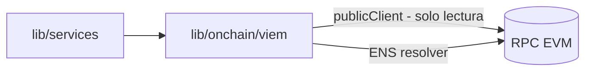

# T · Integración on-chain (viem)

Lecturas on-chain puntuales con **viem** (cliente público EVM), complementando a The Graph (D5). Cubre lo que
un subgraph no da cómodo: **resolución ENS**, **balances** y **lectura de contratos ERC-20** (`view`/`read`).
Modelo **solo lectura, sin private keys** (D4).

> **Regla no negociable:** en el MVP **NO se firma ni se envía ninguna transacción**. `lib/onchain` expone
> únicamente lecturas (`publicClient`). No existe `walletClient`, no se importa ninguna private key ni seed
> phrase. Las **direcciones** de wallet son públicas y OK.

## Qué se hace con viem
| Uso | Detalle | Método viem (orientativo) |
|-----|---------|---------------------------|
| **ENS → dirección** | aceptar `nombre.eth` como entrada y resolverlo | `getEnsAddress` |
| **Dirección → ENS** | mostrar el nombre legible de una wallet | `getEnsName` |
| **Balance nativo** | ETH de una dirección | `getBalance` |
| **Balance ERC-20** | `balanceOf` vía ABI, solo `view` | `readContract` |
| **Metadatos de token** | `symbol` / `decimals` / `name` | `readContract` |



## Cliente (solo público)
```ts
import "server-only";
import { createPublicClient, http } from "viem";
import { mainnet } from "viem/chains";
import { requireEnv } from "@/config/env";

// SOLO publicClient. No hay createWalletClient en ninguna parte del proyecto.
export const publicClient = createPublicClient({
  chain: mainnet,
  transport: http(requireEnv("RPC_URL")), // RPC público o provider; sin claves privadas
});
```

## Reglas duras
- **Solo `view`/`read`**: cualquier ABI que se cargue se usa para leer; jamás para `write`.
- **Validar con Zod** el resultado de cada `readContract` / resolución antes de usarlo (los decimales, el
  símbolo, etc. pueden faltar o venir raros en tokens no estándar).
- **Rate-limit + retry** si el RPC público limita.
- **Nunca** `RPC_URL` con credenciales embebidas en el repo; leer de `src/config/env.ts`.

## Env
- `RPC_URL` — endpoint EVM de solo lectura (público o provider tipo Alchemy/Infura). En el entorno, no en el repo.

## Pendiente / decisiones abiertas
- Red objetivo del MVP (DA3: empezar con Ethereum mainnet).
- Si el throughput del RPC público basta o hace falta un provider con API key.
- Reparto de responsabilidades con The Graph: The Graph = histórico/agregados; viem = lecturas puntuales / ENS.
