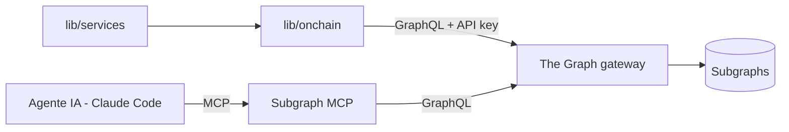

# T · Integración The Graph

Cómo se consultan datos on-chain vía **The Graph**. Es la fuente principal de datos DeFi/histórico del
proyecto (D5). Modelo **solo lectura** (D4): se leen subgraphs, nunca se escribe on-chain.

## Formas de consumo
1. **Gateway / GraphQL directo** — la app/worker (`lib/onchain`) hace queries GraphQL a un subgraph a través
   del **gateway** de The Graph, autenticando con **`THE_GRAPH_API_KEY`**.
2. **Subgraph MCP** (para Claude Code) — un MCP server que deja al **agente IA** consultar subgraphs por sí
   mismo. Se configura en el **`.mcp.json`** del repo (dev).
   > ⚠️ El **nombre exacto del paquete/endpoint del Subgraph MCP debe confirmarse** en la doc oficial o en el
   > **booth de The Graph** durante la hackathon. No dar por fijo el string aquí.



## Reglas duras (calcadas del espíritu de la capa Notion de home-os)
| # | Regla | Por qué |
|---|-------|---------|
| G1 | **Cero `as any`** sobre respuestas GraphQL | El shape viene de un tercero; se tipa y valida |
| G2 | **Validar TODA respuesta con Zod** antes de usarla/persistirla | No confiar en que el subgraph devuelva lo esperado |
| G3 | **Paginar siempre** (`first`/`skip` o cursores) | The Graph limita `first` (~1000); no truncar en silencio |
| G4 | **Rate-limit + retry** con backoff | Límites del gateway; respetar `Retry-After` si lo hay |
| G5 | **Schema/queries en un solo lugar** | Renombrar un campo = un cambio; no strings dispersos |
| G6 | La UI **nunca** ve el shape crudo del subgraph | Solo DTOs de dominio (`lib/services`) |

## Arquitectura de la capa (`src/lib/onchain/`)
```
env / keys      # THE_GRAPH_API_KEY leído desde src/config/env.ts (fail-fast)
graph-client    # cliente GraphQL (fetch nativo), fail-fast si falta la key
queries/        # queries GraphQL parametrizadas por subgraph (fuente única)
paginate        # recorre todas las páginas (first/skip)
rate-limit      # cola + retry/backoff ante límites del gateway
mappers/        # respuesta GraphQL -> DTO de dominio (Zod)
```

### Paginación (no truncar)
```ts
// Recorre first/skip hasta agotar; nunca devuelve una página parcial en silencio.
export async function paginateGraph<T>(
  run: (skip: number) => Promise<T[]>,
  page = 1000,
): Promise<T[]> {
  const all: T[] = [];
  for (let skip = 0; ; skip += page) {
    const rows = await run(skip);
    all.push(...rows);
    if (rows.length < page) return all;
  }
}
```

### Validación (Zod al mapear)
```ts
// El resto de la app SOLO ve `MovimientoOnchain`, nunca el shape del subgraph.
export function toMovimiento(raw: unknown): MovimientoOnchain {
  return MovimientoOnchainSchema.parse(raw); // rechaza shapes inesperados
}
```

## Env
- `THE_GRAPH_API_KEY` — **solo en el entorno del servidor** (nunca en el repo). Leer desde `src/config/env.ts`.

## Pendiente / confirmar en booth
- Nombre/paquete/endpoint exacto del **Subgraph MCP**.
- Qué **subgraphs** cubren mejor swaps/posiciones/precios de la red objetivo (DA3, DA6).
- Límites concretos de `first`/rate del gateway con nuestra API key.
