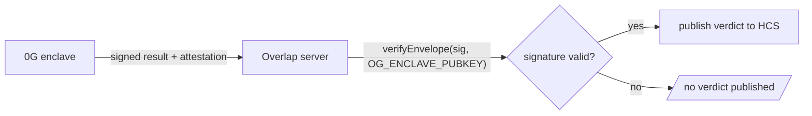

# T · Integration — 0G (sealed inference)

Status: 🟧 draft · Last updated: 2026-07-24

0G is the **referee**: the model that reads both positions runs inside a TEE (TeeML enclave)
that neither party nor the operator can look into. This is the whole reason Overlap is trustable,
not a feature bolted on (D5). Underpins modules **M2** (`seal`), **M6** (`evaluator`) and
**M7** (`attest`).

---

## 1. The call — OpenAI-compatible router

0G Compute exposes an **OpenAI-compatible** inference router. We call it exactly like a normal
chat-completions endpoint, but the provider behind it runs the model inside an enclave.

```
OG_ROUTER_URL=https://router-api.0g.ai/v1
OG_KEY=                # provider/router credential
OG_MODEL=              # pin an EXACT model, record its hash
OG_ENCLAVE_PUBKEY=     # for the independent attestation check (M7)
```

- **Pin the model (`OG_MODEL`) and record its hash.** We evaluate against one fixed model, never
  "latest". The recorded hash is what the attestation is checked against — it is part of the claim
  "this model saw these inputs".
- **Temperature 0.** Reduces run-to-run variance. It does **not** make the model a deterministic
  function (see §4).

## 2. Constrained / enum output — the leak control (D9)

The enclave is **never allowed to emit free text**. A paragraph leaks: "the gap is the start date"
tells the other side something they did not have. The model may only emit one value from a fixed
vocabulary:

- Always: `workable` | `not_workable`
- Only if **both** sides opted in beforehand: `gap:single` | `gap:multiple` — whether **one or
  several** dimensions block, never *which* (D9 as amended; compensation/timing/scope survive only
  inside the enclave as the counting basis)

Emit the **richest verdict both sides consented to**. If one side wants the bare answer, everyone
gets the bare answer. Enforce this two ways, belt-and-braces:

1. **Structured / constrained output** at the router (schema / enum) if the provider supports it —
   confirm at the 0G booth (see §5).
2. **Zod validation** of the returned value against the enum (D11). Anything off-enum is a failure,
   not a verdict.

## 3. Independent attestation verification (`verifyEnvelope`)

The security claim collapses if we merely *receive* an attestation from the SDK; we must **verify
the signature ourselves, outside the SDK** (this is M7, the Friday-night spike).

How 0G makes this possible:

- The provider generates a **signing key inside the TEE**.
- The **CPU and GPU attestations include that key's public key**.
- **Every result is signed** with the in-enclave key.
- The provider exposes **endpoints to download attestations and response signatures**.



- Verify with **`verifyEnvelope`**. seam-updated references the package
  **`@foundryprotocol/0gkit-attestation`** — treat the exact package/endpoint as **unconfirmed
  until checked at the 0G booth** (see §5).
- **Fail closed (D10):** a bad or missing signature ⇒ **no verdict published**. A verdict published
  without a valid attestation looks identical to a good one, which is worse than no verdict.

## 4. What the attestation actually proves (be precise)

The attestation proves: **this pinned model saw these committed inputs and returned this verdict.**

It does **not** prove that *any* future run reproduces the same verdict. A model is a judgement, not
a comparison; pinning the model hash and setting temperature 0 mitigate non-determinism but do not
guarantee reproducibility. **Overstating this is what loses the Q&A.** Honest framing for the demo:
Overlap tells you whether a deal is *worth a conversation*, not what the deal is — nobody signs anything
on this output, and the model can be wrong.

## 5. Workshop questions to confirm (0G — Friday 14:30)

- Can we **constrain what the model emits** (structured output / enum)?
- Is the attestation **verifiable outside your SDK**, and what exactly does the signature cover —
  **does it include the input**?
- The submission form asks for **contract deployment addresses**. What if the product has **no
  contract**? *(If mandatory, we need something on 0G Chain and that is a design decision — track in
  `00-overview/05-open-decisions.md`.)*
- Confirm the exact **attestation package/endpoint** and the shape `verifyEnvelope` expects.
