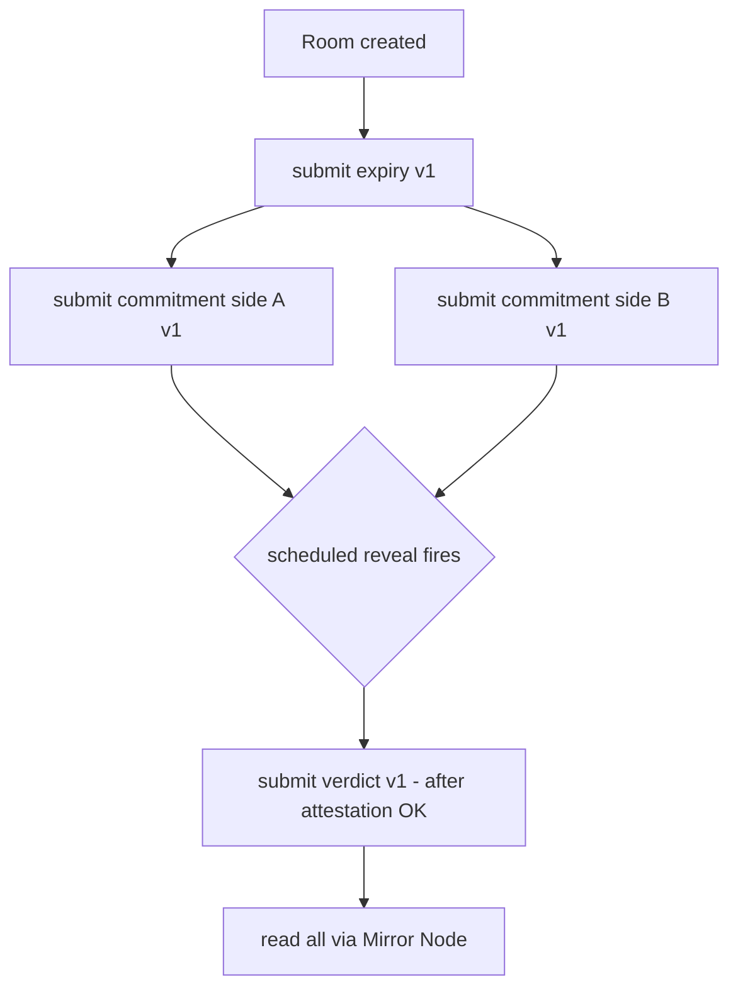

# T · Integration — Hedera (HCS · Schedule · Mirror Node)

Status: 🟧 draft · Last updated: 2026-07-24

Hedera does three things at once: it **locks both commitments** (nobody can claim afterwards they'd
have said something different), it **holds the deadline** (a clock we don't control, so we can't be
pressured to delay it), and it **is the store** (there is no database — D4). We use **three native
services and zero Solidity** — this is exactly the **Hedera "No Solidity Allowed"** track (D3/D6).
Underpins modules **M1** (`session`), **M4** (`registry`), **M5** (`scheduler`).

---

## 1. HCS topic = storage (D4)

Storage **is** the Hedera Consensus Service topic. No DB, no ORM, no server-side store of terms.
One topic carries **three versioned message types** per session:

| Type | When | Payload (essentials) |
|------|------|----------------------|
| `expiry` | at room creation, **before any write** | deadline, room id, `v` |
| `commitment` | one per side, after seal | `sha256(ciphertext)`, side, nullifier ref, `v` |
| `verdict` | after sealed evaluation + attestation | enum verdict, model hash, attestation ref, `v` |

- **Version from commit 1.** Every message carries a `v` field (backlog S2.6). Adding a field later
  without versioning would break the read path silently.
- **Write path:** `TopicMessageSubmitTransaction`.
- **Append-only:** each message gets a consensus sequence number and timestamp; nothing is edited or
  deleted. A **gap in the sequence is a visible tamper signal**.
- **Zod on the way in and out (D11):** validate the message schema before submitting and after reading.



## 2. Schedule Service = the deadline clock

- **`ScheduleCreateTransaction`** arms a transaction that fires at the deadline regardless of who
  wants what. The clock is enforced by Hedera, not by us.
- **Arm before work.** The `expiry` message goes to the topic **before anyone writes a word**, so
  side B sees the terms of the clock before committing. This is what stops the opener from using the
  deadline as leverage.
- When the scheduled reveal fires, it triggers the sealed evaluation (M6). See the open question on
  signature semantics in §5.

## 3. Mirror Node = the read path

- **Mirror Node REST** is how clients read the topic (expiry, commitments, verdict) — no write, no
  key needed to read. Both sides read the **same** verdict here.
- Every Mirror Node response is validated with **Zod** before use (D11); an unexpected shape is a
  failure, not data.

## 4. Account & keys

```
HEDERA_ACCOUNT_ID=
HEDERA_PRIVATE_KEY=
HEDERA_TOPIC_ID=       # created once, printed here
```

- **Testnet** account. The topic is created **once** and its id pinned in config.
- Keys are **ours only** (D8). **Users hold no keys** — there are no wallets in the flow, nobody
  signs anything. The only private key in the system is our own testnet account key, server-side.

## 5. Workshop questions to confirm (Hedera — Friday 17:00)

- Does **HCS + Schedule Service + Mirror Node** count as **three native services** for the No-Solidity
  track?
- **Scheduled-transaction semantics:** what happens if a **required signature never arrives** before
  expiry? (Drives the fallback in `00-overview/05-open-decisions.md`.)
