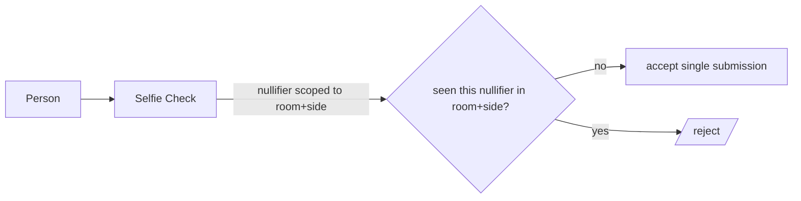

# T · Integration — World (Selfie Check)

Status: 🟧 draft · Last updated: 2026-07-24

World gives us **one seat per side**. It is used as an **abuse signal, not a login** (D7). Underpins
module **M3** (`worldid`).

---

## 1. Why it is load-bearing — the probing attack

The enclave protects each individual answer perfectly. The system still loses without one-seat:

> A probing attacker opens **twenty sessions with slightly varied positions** and, from the pattern of
> `workable` / `not_workable` answers, **reconstructs the other side's number**. One round of probing
> breaks the seal.

Selfie Check issues **one nullifier per room per side**, so each side can submit **once per room**.
Remove World and the enclave is still perfect and the product is still broken. (See
`transversal/security-and-privacy.md` for how enclave + enum output + one-seat close the attack
*together* — no single one is sufficient.)

## 2. Nullifier scope — per room, per side (not app-wide)

```
WORLD_APP_ID=
WORLD_ACTION=          # scoped per room at runtime
```

- **App-wide scope** would mean a person can use Seam **exactly once, ever** — useless.
- **Per-room scope** means a person can negotiate **many rooms** but submit **once per side per room**.
- We scope `WORLD_ACTION` to the room at runtime so the derived nullifier is unique to
  `(room, side)`. A second submission from the same nullifier in the same room+side is **rejected**.
- Confirm at the World booth that a nullifier can be scoped per session/room rather than per app
  (see §4).



## 3. Testing documentation (track requirement)

The World track **requires a testing doc covering developer friction AND user friction**. Start it
**Saturday morning while the friction is fresh** — it is a real deliverable, not an afterthought.

It must contain, at minimum:

- **Developer friction** — integration steps taken; SDK/API friction encountered; what the docs got
  right/wrong; nullifier-scoping setup; anything that cost us time.
- **User friction** — the Selfie Check UX from a real user's perspective; how long it took; where a
  first-time user hesitates or drops off; device/permission prompts.

## 4. Workshop questions to confirm (World — Friday 16:30)

- Can a Selfie Check **nullifier be scoped per session/room rather than per app**?
- What exactly must the **testing documentation** contain to qualify?

## 5. World ID 4.0 migration (S3.6) — Selfie Check is 4.x-only

Verified against docs.world.org (25 Jul): our IDKit v2.2.2 levels (`orb/device/…`) cannot request
Selfie Check. The credential is `selfieCheckLegacy`, requested through the **IDKit 4.x** API, and
every 4.x request carries a server-signed **`rp_context`** (anti-impersonation). Verification moves
to `POST https://developer.world.org/api/v4/verify/{rp_id}` (no auth; accepts legacy `app_…` ids as
the path param). Uniqueness proofs still return a one-time **nullifier per action**, so the
one-seat-per-`(room, side)` design survives unchanged — only the transport changes.

| Component | Change |
|---|---|
| `package.json` ⚠ integrator-only | `@worldcoin/idkit` 2.2.2 → 4.x (+ `@worldcoin/idkit-core` for `signRequest`) |
| `src/config/env.ts` ⚠ integrator-only | + `WORLD_SIGNING_KEY` (secret, server-only) · + `WORLD_RP_ID` (public, if portal issues one) |
| **NEW** `src/worldid/rp-context.ts` | server-side: `signRequest(action)` with the signing key → `{ sig, nonce, createdAt, expiresAt }`; unit-tested with a fixed key |
| **NEW** Server Action (write route) | `getRpContext(roomId, side)` — the action string is per room+side, so the context is minted per request |
| `src/components/web/selfie-check-gate.tsx` | rewrite to the 4.x widget + `selfieCheckLegacy` preset + injected `rp_context`; RTL mocks follow |
| `src/worldid/verify.ts` | proof schema becomes the 4.x `IDKitResult` (forwarded as-is; Zod on the fields we read) |
| `src/worldid/cloud-verifier.ts` | `verifyCloudProof` SDK call → plain `fetch` to `/api/v4/verify/{rp_id}` — the server path **drops the SDK entirely** |
| `src/worldid/claim.ts` · `seats.ts` | logic unchanged; input type follows. Note: v4 nullifiers are decimal strings (`NUMERIC(78,0)`), not `0x…` — our `worldNullifier: z.string().min(1)` already accepts both |
| Unaffected | `seal`, `session`, `registry`, `scheduler`, `evaluator`, create/verdict screens, HCS message schemas |

**Testing** requires the **Sandbox World App build** (portal banner link) — Selfie Check does not run
in the store build against a sandbox app. **Fallback if timeboxed out:** the v2 `device` flow ships
today end-to-end; disclose the substitution honestly in the testing doc (§3).
