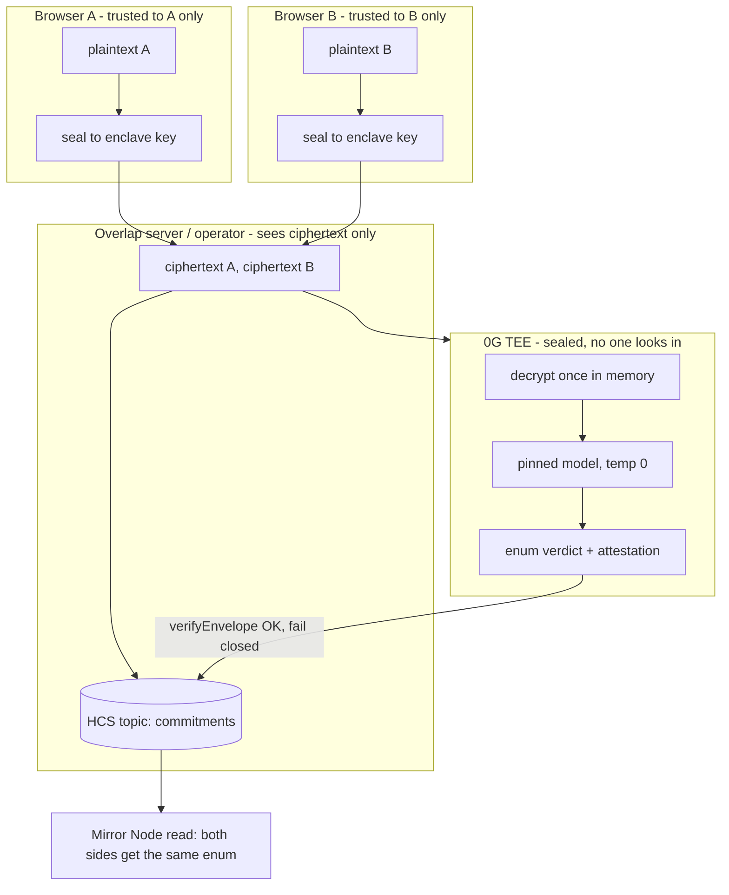

# T · Security & privacy (threat model)

Status: 🟧 draft · Last updated: 2026-07-24

This is the document that wins the technical Q&A. It states, precisely, **what leaks and what does
not**, why the three sponsors close the attack **together**, and what the attestation actually proves
(and does not). Read `integration-0g.md`, `integration-hedera.md` and `integration-worldid.md`
alongside it.

---

## a. What leaks / what doesn't

The image: a referee locked in a windowless room. Both sides slide a paper under the door. The referee
says "workable" or "not workable" through the door. Then the papers burn.

| Party | Can learn | Cannot learn |
|-------|-----------|--------------|
| **Operator (us)** | that a room exists, its deadline, two ciphertexts, two commitments, the enum verdict | either position, who was further off, by how much — we hold **no decryption key** (D5/D8) |
| **Side A** | its own position; the enum verdict | side B's position; whether B was above/below; the margin |
| **Side B** | its own position; the enum verdict | side A's position; whether A was above/below; the margin |

The verdict is **one value from a fixed vocabulary** (D9). Nothing else comes out — not where the
room is, not who was closer, not either position.

## b. The probing attack — closed by three things *together*

The single sharpest question a judge can ask. No one control is sufficient:

- **Enclave alone (0G):** the operator can't peek, but a party can still submit twenty varied
  positions and reconstruct the other's number from the pattern of answers.
- **Enum output alone (0G, D9):** stops a paragraph from leaking the gap, but repeated `workable` /
  `not_workable` answers across many submissions still triangulate the number.
- **One-seat alone (World, D7):** limits submissions, but without the enclave the operator sees the
  plaintext anyway.

Together: the enclave hides the inputs from the operator, the **enum** keeps each answer to a single
bit-ish of signal, and **one nullifier per room per side** removes the ability to *repeat* the probe.
Remove any one and the seal breaks. Reusing a position across rooms is the **same probing attack
wearing a different hat** — say it out loud in the demo (§h).

## c. Fail closed (D10)

A verdict published **without a valid attestation looks identical to a good one** — which is worse
than no verdict. So the attestation signature is verified **independently of the 0G SDK** (M7,
`verifyEnvelope`), and:

> bad or missing signature ⇒ **no verdict published.**

## d. Commitments before reveal (D12)

Each side's `sha256(ciphertext)` plus a consensus timestamp goes to the HCS topic **before** the
scheduled reveal fires. Consequences:

- Nobody can claim afterwards they'd have said something different — the committed bytes are locked
  and timestamped by a clock we don't control.
- The commitment is **reproducible**: deterministic serialisation, hash of the ciphertext, **no clock
  timestamp inside the committed bytes**, so a verifier recomputes the same hash.
- The topic is append-only; a **gap in the sequence is a visible tamper signal**.

## e. No user keys (D8)

Users hold **no private keys** and sign nothing — there are no wallets in the flow. The only private
key in the system is **our own Hedera testnet account key**, held server-side, used only to write to
the topic and arm the schedule.

## f. "The papers burn"

The plaintext position exists **only in enclave memory**: it is decrypted **once**, inside the TEE,
for the single evaluation, and **never persisted**. The server holds only **ciphertext** and hashes.
There is no store to subpoena, leak, or subvert — because there is no store (D4).

## g. What the attestation proves (and the honest framing)

The attestation proves: **this pinned model saw these committed inputs and returned this verdict.**

It does **not** prove that any future run reproduces the same verdict — a model is a judgement, not a
comparison. Pinning the model hash and temperature 0 reduce variance; they do not guarantee
reproducibility. Overstating this loses the Q&A. Honest framing:

- Overlap tells you whether a deal is **worth a conversation**, not what the deal is.
- **Nobody signs anything** on this output.
- **The model can be wrong** — it is making a judgement.

## h. Known residual risks

- **Non-determinism** — see §g. Be precise in the demo about what is attested.
- **Cross-room position reuse** — the probing attack in disguise; one-seat is per room, so reusing a
  position across rooms re-opens it. State this explicitly.
- **Sponsor/API assumptions unconfirmed** — the exact attestation package/endpoint and the World
  nullifier scoping are pending workshop confirmation (`00-overview/05-open-decisions.md`).

## Trust boundary

