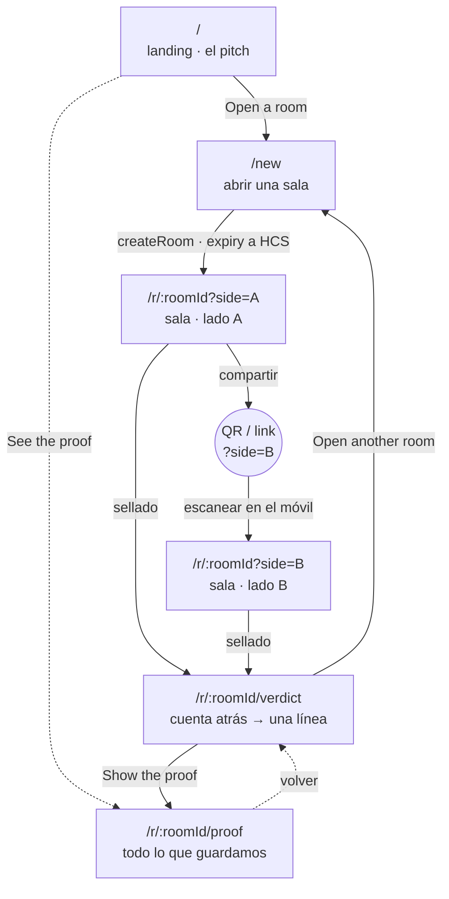
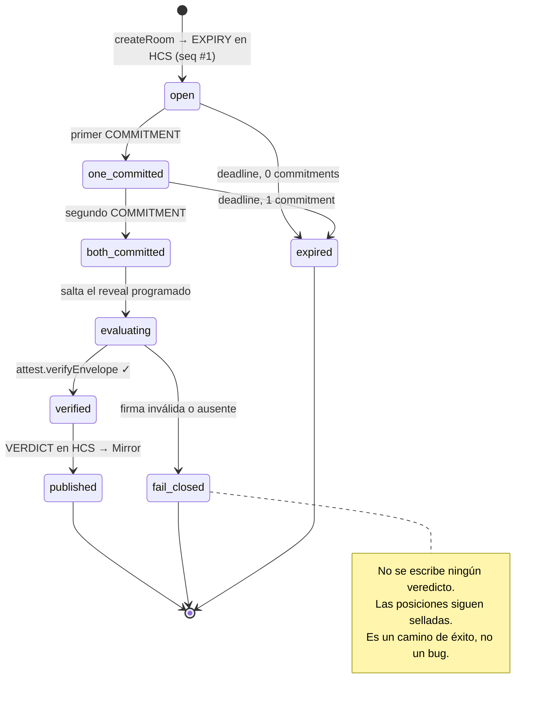
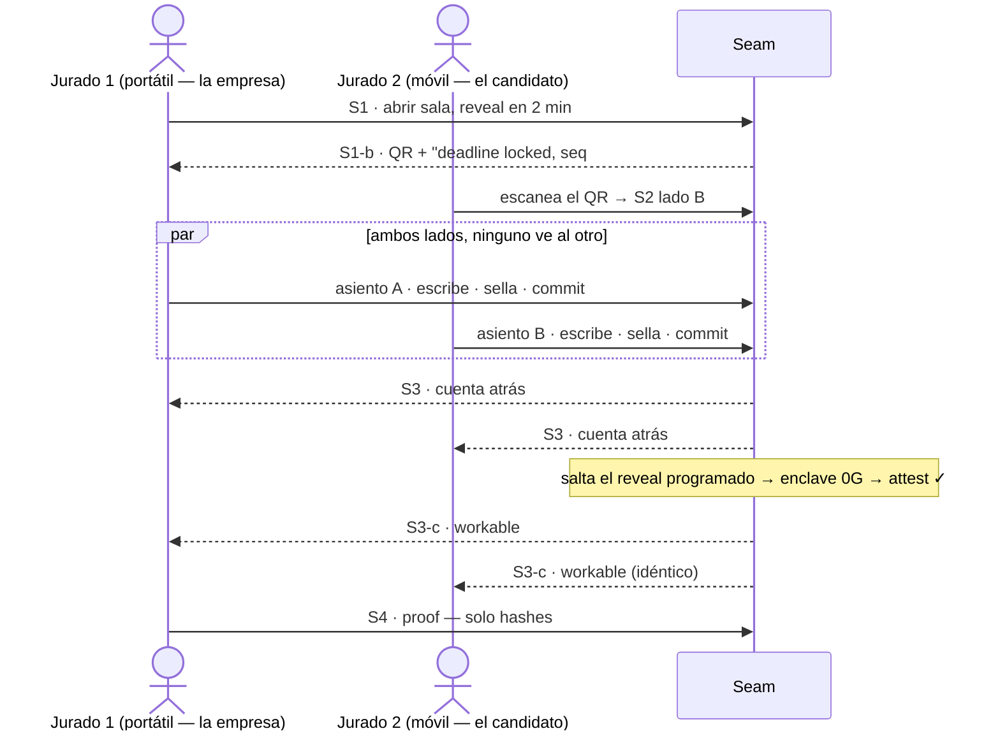

# UX · Pantallas, sitemap y valor por sponsor

Estado: 🟧 borrador · Última actualización: 2026-07-24 · Implementa `modules/M8-web.md`

> **Léelo como una propuesta para discutir, no como una decisión ya tomada.** La §9 lista las
> preguntas abiertas. Original en inglés (fuente de verdad):
> [`screens-and-sitemap.md`](./screens-and-sitemap.md).
>
> **Nota de idioma:** la prosa está traducida, pero **el copy de la UI, las rutas, los nombres de
> componentes y el código se quedan en inglés** (D2). Los wireframes muestran el texto real que verá
> el usuario.

---

## 1. El producto en un párrafo

Dos partes tienen que acordar unos términos y ninguna quiere decir los suyos primero. Seam abre una
**sala sellada**: Hedera publica el deadline *antes de que nadie escriba*, cada parte escribe su
posición en lenguaje natural y **la cifra en su propio navegador** contra la clave pública de un
enclave de 0G, World concede **un asiento por lado** para que nadie pueda correr la sala veinte veces
y triangular, y al llegar el deadline un modelo **dentro del enclave** lee ambas y devuelve **una
sola línea enum a las dos** — `workable` / `not_workable`. El veredicto se publica solo si su
attestation se verifica **de forma independiente al SDK de 0G**. Después, los papeles se queman.

**El trabajo de la UX:** hacer que esas cuatro afirmaciones sean *visibles* en un móvil, en menos de
dos minutos, sin una sola frase de explicación por parte de quien presenta.

---

## 2. Sitemap



### Tabla de rutas

| Ruta | Pantalla | Quién llega aquí | Módulos | Auth |
|------|----------|------------------|---------|------|
| `/` | **S0 · Landing** | cualquiera, en frío | — | ninguna |
| `/new` | **S1 · Crear sala** | quien abre (lado A) | M1 (session), M5 (scheduler) | ninguna |
| `/r/:roomId?side=A\|B` | **S2 · Sala — escribir + sellar** | ambos lados; B llega por QR | M2 (seal), M3 (worldid), M4 (registry) | asiento World |
| `/r/:roomId/verdict` | **S3 · Veredicto** | ambos lados | M4 (lectura Mirror), M7 (attest) | ninguna |
| `/r/:roomId/proof` | **S4 · Prueba** | jurado, escépticos | M4, M7 | ninguna |

**Cuatro rutas sostienen la demo, existen cinco.** `side` es un query param y no un segmento, para
que el link de invitación quepa en un QR legible y para poder corregir un lado equivocado sin cambiar
de ruta. `/proof` es accesible desde la landing sin sala — renderiza un log de ejemplo — para que un
jurado pueda inspeccionar la afirmación antes incluso de abrir una sala.

**Ninguna ruta está detrás de un login.** No hay cuenta, ni wallet, ni firma (D8). La única puerta de
todo el producto es el asiento de World en S2, y bloquea *una acción*, no la app.

---

## 3. Máquina de estados de la sala

Cada pantalla renderiza un estado de esta máquina. No existe nada más.



| Estado | S2 renderiza | S3 renderiza |
|--------|--------------|--------------|
| `open` | gate → escribir → sellar | cuenta atrás, "esperando a ambos lados" |
| `one_committed` | recibo + "esperando al otro lado" | cuenta atrás, un tick |
| `both_committed` | recibo + "ambos sellados" | cuenta atrás, dos ticks |
| `evaluating` | → redirige a S3 | "el árbitro está leyendo" |
| `published` | → redirige a S3 | **el veredicto** |
| `fail_closed` | → redirige a S3 | "sin veredicto — y por qué" |
| `expired` | recibo en solo lectura | "expirada, no se evaluó nada" |

---

## 4. Pantallas

Los wireframes son **mobile-first a 390px** (el dispositivo de la demo), con la diferencia de
escritorio anotada. El texto dentro de las cajas es la **propuesta real de copy de la UI** — discútelo
aquí, no en el JSX.

### S0 · Landing — `/`

**Trabajo:** que un desconocido entienda el producto en una pantalla, y que los tres sponsors se lean
como *tres necesidades*, no como tres logos.

```
MÓVIL 390                                 ESCRITORIO ≥1024
┌────────────────────────────┐   ┌──────────────────────────────────────────┐
│ ◐ Seam                 [☾] │   │ ◐ Seam            How it works · Proof [☾]│
├────────────────────────────┤   ├──────────────────────────────────────────┤
│                            │   │                                          │
│  Both sides name their     │   │   Both sides name their terms.           │
│  terms. /Neither/ sees     │   │   /Neither/ sees the other's.            │
│  the other's.              │   │                                          │
│                            │   │   A model inside a sealed enclave reads  │
│  A model inside a sealed   │   │   both and answers one line. Then the    │
│  enclave reads both and    │   │   papers burn.                           │
│  answers one line.         │   │                                          │
│  Then the papers burn.     │   │   ( Open a room )   [ See the proof ]    │
│                            │   │                                          │
│  ( Open a room )           │   │   ┌──────────┬──────────┬──────────┐     │
│  [ See the proof ]         │   │   │ 0G       │ Hedera   │ World    │     │
│                            │   │   │ the      │ the      │ one seat │     │
│  ┌──────────────────────┐  │   │   │ sealed   │ clock &  │ per side │     │
│  │ 0G · the referee     │  │   │   │ referee  │ the      │          │     │
│  ├──────────────────────┤  │   │   │          │ notary   │          │     │
│  │ Hedera · clock+notary│  │   │   └──────────┴──────────┴──────────┘     │
│  ├──────────────────────┤  │   │   No wallet. No signup. No database.     │
│  │ World · one seat     │  │   └──────────────────────────────────────────┘
│  └──────────────────────┘  │
│  No wallet. No signup.     │   /palabra/ = .serif-accent (Instrument Serif itálica)
│  No database.              │   ( ) = pill primario   [ ] = pill secundario
└────────────────────────────┘
```

- `/Neither/` usa `.serif-accent` — la única palabra en serif itálica por titular (design system).
- La franja de sponsors son **tres afirmaciones, no tres badges.** Cada tarjeta es pulsable → ancla a
  una sección "how it works" que explica qué se rompe sin ella (el test de eliminación, §6).
- **CTA principal por encima del fold a 390px.** Si no lo está, el layout está mal.

**Componentes:** `site-header` · `hero` · `sponsor-strip` · `theme-toggle`

---

### S1 · Crear sala — `/new`

Dos estados en una sola ruta: el formulario y luego el panel para compartir. **Sin navegación entre
ellos** — la sala se crea in situ, así quien abre nunca pierde el QR al pulsar atrás.

#### S1-a · formulario

```
┌────────────────────────────┐
│ ← Seam                 [☾] │
├────────────────────────────┤
│  Open a room               │
│  The deadline is published │
│  to Hedera /before/ anyone │
│  writes a word.            │
│                            │
│  Reveal at                 │
│  ┌──────────────────────┐  │
│  │ in 15 minutes      ▾ │  │  presets: 5 · 15 · 60 min · custom
│  └──────────────────────┘  │
│  → 26 Jul 2026, 08:00 WEST │  resuelto en vivo, date-fns (D14)
│                            │
│  ┌ Gap disclosure ──────┐  │
│  │ off  ◯───            │  │  opt-in, OFF por defecto
│  │ If /both/ sides opt  │  │
│  │ in, the verdict may  │  │
│  │ say whether one      │  │
│  │ issue or several     │  │
│  │ block — never        │  │
│  │ which.               │  │
│  │ Nothing else.        │  │
│  └──────────────────────┘  │
│                            │
│  ┌──────────────────────┐  │
│  │    Open the room     │  │  ancho completo, h-12
│  └──────────────────────┘  │
│  No wallet. No signup.     │
└────────────────────────────┘
```

#### S1-b · creada (compartir)

```
┌────────────────────────────┐
│ ← Room r_9f3a          [☾] │
├────────────────────────────┤
│  ✓ Deadline locked         │
│    Hedera topic 0.0.5121   │
│    seq #1 · 06:00:02.331Z  │
│    [ Mirror Node ↗ ]       │
│                            │
│     ┌──────────────┐       │
│     │ ██ ▄▄ █ ▀█ ██│       │
│     │ ▀█ ██ ▄ ██ ▄▀│       │  ≥240px, centrado, alto contraste
│     │ ██ ▀▄ █ ▄█ ██│       │  en AMBOS temas
│     │ ▄█ ██ ▀ ▄█ █▀│       │
│     └──────────────┘       │
│  seam.app/r/r_9f3a?side=B  │
│  [ Copy link ] [ Share ]   │
│                            │
│  ┌──────────────────────┐  │
│  │  Write my position   │  │
│  └──────────────────────┘  │
│  You are side A.           │
│  Send the QR to side B.    │
└────────────────────────────┘
```

**El bloque del recibo es lo importante.** `topic · seq · consensus timestamp` aparece en el instante
en que la sala existe — eso es Hedera siendo un reloj que nadie posee, mostrado en vez de afirmado.
Reaparece con la misma forma visual en S2 (commitment) y S3 (verdict): **un componente de recibo,
tres usos.**

**Componentes:** `create-room-form` · `deadline-picker` · `gap-disclosure-toggle` · `room-qr` ·
`hcs-receipt` · `copy-link-button`

**Casos límite:** deadline en el pasado → error inline, sin submit · falla la escritura en HCS → la
sala no se crea y lo decimos (nunca una sala sin deadline publicado) · portapapeles no disponible →
el link queda como texto seleccionable.

---

### S2 · Sala — escribir + sellar — `/r/:roomId?side=A|B`

La pantalla más densa. **Cuatro subestados en secuencia**, cada uno a pantalla completa en móvil.

#### S2-a · puerta del asiento (World)

```
┌────────────────────────────┐
│ Room r_9f3a · side B       │
│ Reveal in 14:32            │
├────────────────────────────┤
│                            │
│         ◉                  │
│     Take seat B            │
│                            │
│  One human per side.       │
│                            │
│  Without this, someone can │
│  run the room twenty times │
│  with slightly different   │
│  terms and reconstruct     │
│  your number. The seal     │
│  would hold and you'd      │
│  still lose.               │
│                            │
│  ┌──────────────────────┐  │
│  │  World Selfie Check  │  │
│  └──────────────────────┘  │
│                            │
│  We keep a nullifier tied  │
│  to (this room, side B).   │
│  No identity. No wallet.   │
│  Not a login.              │
└────────────────────────────┘
```

Estado de rechazo — **es un momento de la demo, hay que diseñarlo bien**:

```
│  ⛔ Seat B is taken         │
│  This nullifier already    │
│  holds side B in this room.│
│  Ask the opener for a new  │
│  room, or take side A.     │
```

#### S2-b · escribir

```
┌────────────────────────────┐
│ Room r_9f3a · side B  ✓seat│
│ Reveal in 12:58            │
├────────────────────────────┤
│  Your position             │
│  Plain language. Salary,   │
│  equity, remote days,      │
│  start date, title,        │
│  notice period — and how   │
│  they trade against each   │
│  other.                    │
│  ┌──────────────────────┐  │
│  │ We can go to 85k     │  │
│  │ base, 0.4% equity,   │  │
│  │ 3 remote days. Start │  │
│  │ in September. Title  │  │
│  │ is negotiable, the   │  │
│  │ start date is not.   │  │
│  └──────────────────────┘  │  min-h 40vh, ancho completo
│  🔒 Encrypted in this      │
│     browser to the enclave │
│     key. The plaintext     │
│     never leaves this      │
│     device.                │
│                            │
│  Gap disclosure  ◉───  on  │
├────────────────────────────┤
│  ┌──────────────────────┐  │  sticky, safe-area-inset-bottom
│  │   Seal and commit    │  │
│  └──────────────────────┘  │
└────────────────────────────┘
```

#### S2-c · sellando (3 pasos deliberadamente lentos)

```
│  ● Encrypting in your      │
│    browser              ✓  │
│    AES-256-GCM, key        │
│    wrapped to the enclave  │
│                            │
│  ● Hashing the ciphertext  │
│    sha256 3b1f…c7       ✓  │
│                            │
│  ◌ Writing the commitment  │
│    to Hedera…              │
```

> **No lo optimices.** Estas tres líneas son donde el público *ve* que el texto plano **no** sale del
> navegador. El E2E de Playwright afirma lo mismo (RNF-M8-002); esto es la versión legible por
> humanos de esa aserción.

#### S2-d · comprometido / esperando

```
┌────────────────────────────┐
│ Room r_9f3a            [☾] │
├────────────────────────────┤
│  ✓ Your position is sealed │
│                            │
│  ┌ commitment ──────────┐  │
│  │ 3b1f…c7              │  │
│  │ topic 0.0.5121       │  │
│  │ seq #2 · 06:12:04Z   │  │
│  │ [ Mirror Node ↗ ]    │  │
│  └──────────────────────┘  │
│                            │
│  ┌──────────────────────┐  │  .reflow-cards
│  │ Side A   ✓ committed │  │
│  │ Side B   ✓ committed │  │
│  └──────────────────────┘  │
│                            │
│        Reveal in           │
│         11:04              │
│    ▓▓▓▓▓▓▓▓▓░░░░░░░        │
│                            │
│  Nobody can read either    │
│  position — including us.  │
│                            │
│  [ Go to the verdict ]     │
└────────────────────────────┘
```

**Componentes:** `room-header` (id · lado · asiento · cuenta atrás) · `selfie-check-gate` ·
`seal-position-form` · `seal-progress` · `hcs-receipt` · `room-status` · `countdown`

**Casos límite:** posición vacía o solo espacios → CTA deshabilitado · falla el sellado → el
commitment **no** se escribe y la posición sigue editable · el deadline pasa mientras escribes → el
formulario se bloquea y la pantalla cambia a `expired` · **el texto del otro lado no se renderiza
nunca en esta pantalla, en ningún estado.**

---

### S3 · Veredicto — `/r/:roomId/verdict`

La recompensa. Ambos navegadores tienen que renderizar **lo mismo** (RNF-M8-003).

#### S3-a · pendiente

```
┌────────────────────────────┐
│ Room r_9f3a            [☾] │
├────────────────────────────┤
│         ● pending          │  --pending (ámbar)
│                            │
│          02:14             │  text-6xl, AnimatedNumber
│      until the reveal      │
│                            │
│  ┌──────────────────────┐  │
│  │ Deadline  ✓ Hedera   │  │
│  │ Side A    ✓ committed│  │
│  │ Side B    ✓ committed│  │
│  │ Enclave   ◌ waiting  │  │
│  └──────────────────────┘  │
│                            │
│  The reveal is a scheduled │
│  Hedera transaction. It    │
│  fires whether or not this │
│  tab is open.              │
└────────────────────────────┘
```

#### S3-b · evaluando

```
│    ◌ The referee is reading│
│                            │
│  Sealed inference inside a │
│  0G TEE. Pinned model,     │
│  temperature 0, enum-only  │
│  output.                   │
│  meta-llama/…-instruct     │
```

#### S3-c · resuelto

```
┌────────────────────────────┐
│ Room r_9f3a            [☾] │
├────────────────────────────┤
│                            │
│        workable            │  text-workable, text-5xl
│                            │
│  A deal is likely possible.│
│  Worth a conversation.     │
│                            │
│  ┌──────────────────────┐  │
│  │ ✓ Attestation        │  │
│  │   verified            │  │
│  │   independently of    │  │
│  │   the 0G SDK          │  │
│  │   att_7c2e… [ how? ]  │  │
│  ├──────────────────────┤  │
│  │ ✓ Read from Mirror    │  │
│  │   Node — not from us  │  │
│  │   seq #4 · 08:00:03Z  │  │
│  └──────────────────────┘  │
│                            │
│  This is everything either │
│  side learns. Side A saw   │
│  exactly this line.        │
│                            │
│  [ Show the proof ]        │
│  [ Open another room ]     │
└────────────────────────────┘
```

Variantes:

| Veredicto | Token de color | Subtítulo |
|-----------|----------------|-----------|
| `workable` | `--workable` (verde) | "A deal is likely possible. Worth a conversation." |
| `not_workable` | `--not-workable` (**gris apagado — nunca rojo**) | "Not on these terms. That's information, not a failure." |
| `not_workable · gap:single` | apagado + badge `gap` | "One issue blocks the deal — not which. Both sides asked for this." |
| `not_workable · gap:multiple` | apagado + badge `gap` | "More than one issue blocks the deal. Both sides asked for this." |

> `not_workable` **no es un estado de error.** El rojo le diría a la sala que "no hay trato" es una
> avería. Es el producto funcionando. Es la decisión de color más importante de la app.

#### S3-d · fail closed

```
┌────────────────────────────┐
│         ⛔ no verdict       │
│                            │
│  The enclave attestation   │
│  did not verify.           │
│                            │
│  We publish nothing rather │
│  than publish something we │
│  cannot prove came from    │
│  the sealed enclave.       │
│                            │
│  reason: signature does    │
│  not match the enclave     │
│  public key                │
│                            │
│  Both positions stay       │
│  sealed. Nothing leaked.   │
│                            │
│  [ Show the proof ]        │
└────────────────────────────┘
```

> **Diseña esta pantalla con el mismo cuidado que la de éxito.** Poder *mostrar* el fail-closed es una
> afirmación más fuerte que cualquier tick verde. Si en el Q&A preguntan "¿y si el TEE miente?",
> abrimos esta pantalla.

#### S3-e · expirada

```
│         ○ expired          │
│  Side B never committed    │
│  before the deadline.      │
│  Nothing was evaluated and │
│  side A's position was     │
│  never opened.             │
```

**Componentes:** `countdown` · `verdict-panel` · `attestation-badge` · `mirror-badge` ·
`fail-closed-panel` · `room-status`

---

### S4 · Prueba — `/r/:roomId/proof`

**La pantalla del jurado.** Todo lo que Seam guarda sobre esta sala, renderizado desde el topic de
HCS, con los hashes recalculados en el navegador.

```
┌────────────────────────────┐
│ ← Proof · room r_9f3a      │
├────────────────────────────┤
│ Everything we hold. Read   │
│ from Hedera topic 0.0.5121 │
│ via Mirror Node.           │
│                            │
│ ┌ #1 expiry ────────────┐  │
│ │ 06:00:02.331Z         │  │
│ │ deadline 08:00:00Z    │  │
│ └───────────────────────┘  │
│ ┌ #2 commitment · side A┐  │
│ │ 06:12:04.118Z         │  │
│ │ 3b1f…c7               │  │
│ │ ↳ recomputed here  ✓  │  │
│ └───────────────────────┘  │
│ ┌ #3 commitment · side B┐  │
│ │ 06:13:41.902Z         │  │
│ │ 9a04…1d               │  │
│ │ ↳ recomputed here  ✓  │  │
│ └───────────────────────┘  │
│ ┌ #4 verdict ───────────┐  │
│ │ 08:00:03.007Z         │  │
│ │ workable · att_7c2e…  │  │
│ │ ↳ signature verified ✓│  │
│ └───────────────────────┘  │
│                            │
│ ⓘ No plaintext. No cipher- │
│   text. Only hashes and    │
│   one enum. A gap in the   │
│   sequence would betray    │
│   tampering — there is     │
│   none.                    │
│                            │
│ [ Raw JSON ]  [ Mirror ↗ ] │
└────────────────────────────┘
```

Es el gemelo en UI de `npm run inspect` (S4.1). La misma afirmación, dos superficies: el terminal se
lo demuestra a un ingeniero, esta pantalla se lo demuestra a un jurado con el móvil en la mano.

**Componentes:** `proof-log` · `topic-message-card` · `hash-recompute-badge` · `raw-json-drawer`

---

## 5. Inventario de componentes

Amplía `modules/M8-web.md` §9. **Cada fila necesita implementación + story de Storybook + test RTL**
antes de contar como terminada (DoD del design system).

| Componente | Pantalla | Módulo detrás | Notas |
|------------|----------|---------------|-------|
| `site-header` | todas | — | pill flotante, sticky, backdrop-blur |
| `theme-toggle` | todas | — | reutilizado de home-os |
| `hero` | S0 | — | `.serif-accent` en una palabra |
| `sponsor-strip` | S0 | — | tres *afirmaciones*; pulsables → test de eliminación |
| `create-room-form` | S1-a | M1 | Zod en el borde del Server Action |
| `deadline-picker` | S1-a | M1/M5 | presets + custom; date-fns; rechaza el pasado |
| `gap-disclosure-toggle` | S1-a, S2-b | M6 | opt-in, **off por defecto** (pregunta abierta Q3) |
| `room-qr` | S1-b | M1 | ≥240px, contraste seguro en ambos temas |
| `copy-link-button` | S1-b | — | fallback a texto seleccionable |
| `hcs-receipt` | S1-b, S2-d, S3 | M4 | **un componente, tres usos** — topic · seq · consensus ts |
| `room-header` | S2 | M1/M3 | id de sala · lado · asiento · cuenta atrás |
| `selfie-check-gate` | S2-a | M3 | incluye el estado de rechazo "seat taken" |
| `seal-position-form` | S2-b | M2 | el texto plano no cruza la red |
| `seal-progress` | S2-c | M2/M4 | los 3 pasos cifrar → hashear → comprometer |
| `room-status` | S2-d, S3 | M4 | `.reflow-cards` por debajo de `md` |
| `countdown` | S2, S3 | M5 | AnimatedNumber; legible a 360px |
| `verdict-panel` | S3-c | M4 | tokens de veredicto; **apagado, no rojo**, para `not_workable` |
| `attestation-badge` | S3-c | M7 | "verified independently of the SDK" + `[how?]` |
| `mirror-badge` | S3-c | M4 | "read from Mirror Node, not from us" |
| `fail-closed-panel` | S3-d | M7 | pantalla de primera clase, no un toast |
| `proof-log` | S4 | M4 | lista de mensajes del topic |
| `topic-message-card` | S4 | M4 | un mensaje de HCS |
| `hash-recompute-badge` | S4 | M2/M4 | recalcula `sha256(ciphertext)` en cliente |
| `raw-json-drawer` | S4 | M4 | la salida de emergencia para un jurado escéptico |

**24 componentes. Son muchos para 36 horas.** Orden de prioridad para la demo: `create-room-form` ·
`room-qr` · `selfie-check-gate` · `seal-position-form` · `seal-progress` · `countdown` ·
`verdict-panel` · `attestation-badge`. Todo lo demás es extra — incluida toda la S4, que aporta mucho
pero es recortable si el sábado va mal.

---

## 6. Valor por sponsor — qué compra cada uno y dónde se *ve*

Esta es la sección para memorizar antes del Q&A. Cada sponsor tiene **un trabajo, una pantalla y un
modo de fallo que podemos demostrar.**

### 0G — sealed inference · *Best AI Product* · ~$6.000

| | |
|---|---|
| **Qué nos compra** | Un árbitro que lee dos párrafos desordenados y juzga si pueden encajar — y al que **el operador no puede mirar por dentro**. Juicio, no aritmética: salario, equity, días remotos, fecha de entrada y preaviso se compensan entre sí, así que una desigualdad no puede decidirlo. |
| **Dónde se ve** | La línea del candado en S2-b ("encrypted to the enclave key") → paso 1 de S2-c → S3-b "the referee is reading" (modelo fijado, temp 0, salida enum) → **`attestation-badge` en S3-c** → **fail-closed en S3-d**. |
| **La afirmación demostrable** | `npm run demo:naive` — el mismo producto sin enclave, filtrando texto plano a un log — junto a `npm run inspect`, que enseña que nuestro almacén solo tiene hashes. |
| **Quítalo y…** | **No hay producto.** Un modelo que lee ambos lados es exactamente lo que ninguna de las partes dejaría correr a una empresa cualquiera. |
| **Límite honesto (dilo antes de que te pregunten)** | La attestation prueba que *este modelo vio estos inputs comprometidos y devolvió este veredicto*. **No** prueba que el modelo acierte, ni que una nueva ejecución lo reproduzca. El veredicto es "vale la pena hablar", nunca "aquí está el trato". |

### Hedera — HCS · Schedule · Mirror · *No Solidity Allowed* · ~$3.000

| | |
|---|---|
| **Qué nos compra** | Tres trabajos, tres servicios nativos, **cero Solidity**: el **reloj** que nadie posee (Schedule Service), el **notario** que cierra ambos papeles antes del reveal (commitments en HCS) y el **camino de lectura** por el que ninguna parte tiene que confiar en nosotros (Mirror Node). |
| **Dónde se ve** | El recibo de S1-b en el instante en que la sala existe (deadline publicado **antes** de que nadie escriba) → el recibo del commitment con `seq #` en S2-d → "read from Mirror Node, **not from us**" en S3-c → **S4, el topic entero con los hashes recalculados en el navegador**. |
| **La afirmación demostrable** | S4 + `npm run inspect`. Un log append-only con números de secuencia: un hueco delataría manipulación, y no hay ninguno. |
| **Quítalo y…** | Cualquiera de las partes puede decir después que habría dicho otra cosa, **y** además la apertura vive en un servidor que *nosotros* controlamos — o sea que se nos puede presionar para retenerla. |
| **Encaje con el track** | HCS + Schedule Service + Mirror Node = tres servicios nativos, sin contrato escrito ni desplegado. Esto *es* el track. |

### World — Selfie Check · *Selfie Check Beta* · ~$3.500

| | |
|---|---|
| **Qué nos compra** | **Un asiento por sala y por lado.** No es un login — es una señal antiabuso. Cierra el ataque de sondeo, que es el único ataque que derrota a un enclave perfecto. |
| **Dónde se ve** | **S2-a**, la única puerta del producto — y su estado de rechazo, "seat B is taken". |
| **La afirmación demostrable** | Intenta ocupar el mismo asiento dos veces en el escenario. Lo rechaza. |
| **Quítalo y…** | Veinte sesiones con posiciones ligeramente variadas reconstruyen el número del otro lado. El enclave protege cada respuesta individual a la perfección y el sistema pierde igual. **Es el más sutil de los tres y la mejor historia.** |
| **Entregable que debemos** | El track exige un **documento de testing** (fricción de desarrollo + fricción de usuario). Empezarlo el sábado por la mañana, con la fricción todavía fresca — ver `00-overview/03-sponsors-prizes.md`. |

### El test de eliminación, en una línea

> **0G** hace que la respuesta sea *segura de pedir.* **Hedera** hace que sea *vinculante.* **World**
> hace que no se pueda *farmear.* Quita uno y el producto no empeora — deja de funcionar.

### Lo que los sponsors *no* están haciendo

- **No se mueve dinero.** El track de agentic payments de Hedera tiene un premio mayor pero exige una
  transferencia real. **No** le pegues un pago encima — contradice la historia de "sin wallet" que es
  la que hace que la demo funcione.
- **World no es autenticación.** Si alguien lo describe como login en el pitch, hemos perdido el punto.
- **0G no es "una llamada a un LLM".** Si el enclave y la attestation no están en la frase, hemos
  descrito un chatbot.

---

## 7. El recorrido de la demo (lo que graba el vídeo y lo que corre en el stand)



**Luego córrelo otra vez con posiciones que no encajen**, y deja que se den cuenta de lo poco que han
aprendido el uno del otro. *Esa segunda ejecución es el pitch* (`00-vision-scope.md`). La UI tiene que
hacer barata la segunda vuelta: `[ Open another room ]` en S3 y un preset de deadline de 2 minutos en
S1.

---

## 8. Glosario de conceptos (para la discusión y para el guion del vídeo)

| Término | En una frase que entiende un jurado sin background cripto |
|---------|-----------------------------------------------------------|
| **TEE / enclave** | Una habitación sellada dentro de una máquina que ni el dueño de la máquina puede abrir. |
| **Sealed inference** | El modelo corre *dentro* de esa habitación, así que el operador nunca ve los inputs. |
| **Attestation** | Un recibo firmado por la habitación sellada que dice "corrió exactamente este modelo, sobre exactamente estos inputs, y devolvió esto". |
| **Fail closed** | Si ese recibo no verifica, no publicamos **nada**. El silencio es la respuesta segura. |
| **Clave pública del enclave** | Contra lo que cifra cada navegador, para que solo la habitación sellada pueda descifrar. |
| **Commitment** | `sha256(ciphertext)` — una huella que prueba qué escribiste, sin revelarlo. |
| **Commitment determinista** | Cualquiera puede recalcular el mismo hash: claves ordenadas, sin reloj dentro de los bytes hasheados. |
| **Topic de HCS** | Un log público append-only. **Nuestra base de datos entera** — porque no lo es. |
| **Consensus timestamp / seq #** | La prueba de *cuándo* de Hedera, ordenada e ineditable. |
| **Mirror Node** | El camino de lectura público — ambas partes leen el veredicto de Hedera, no de nuestro servidor. |
| **Transacción programada** | El deadline, armado en Hedera antes de que nadie escriba, que salta esté abierta la pestaña o no. |
| **Nullifier** | Un token por sala y por lado que prueba "un humano, un asiento" — sin identidad asociada. |
| **Ataque de sondeo (probing)** | Correr la sala muchas veces con términos retocados para triangular el número del otro. El ataque que cierra World. |
| **Veredicto enum** | El modelo solo puede emitir `workable` / `not_workable` (+ `gap:*` opcional). El texto libre sería un canal de fuga. |

---

## 9. Preguntas abiertas — llévalas a la discusión

| # | Pregunta | Propuesta | Impacta |
|---|----------|-----------|---------|
| Q1 | ¿Entra `/proof` (S4) en las 36 horas? | **Constrúyela si el sábado va en hora.** Es nuestra mejor evidencia de Hedera pero no está en el camino crítico. | puntuación Hedera, fuerza en el Q&A |
| Q2 | ¿`side` es query param o segmento de ruta? | **Query param** — QR más corto y corregible. | M1, routing de M8 |
| Q3 | Valor por defecto del gap disclosure | **Off.** El opt-in es el default honesto, y "ambas partes tuvieron que pedirlo" es una buena frase. | M6, S1-a, S2-b |
| Q4 | ¿S2 hace polling del estado del otro lado, o solo muestra el tuyo? | **Mostrar los dos ticks** (no filtran nada — el topic es público); hace legible la espera. | M4, S2-d |
| Q5 | ¿Vista anónima de la sala para un tercero? | **No.** Solo los dos lados y el topic público. Se corta. | alcance |
| Q6 | ¿La cuenta atrás vive en S2, en S3 o en las dos? | **En las dos**, un solo componente: en la cabecera en S2 y a tamaño hero en S3. | `countdown` |
| Q7 | ¿Landing o directo a `/new`? | **Mantenerla.** Un jurado que aterriza en frío en un formulario no aprende nada, y la franja de sponsors es donde se cuenta el test de eliminación. | S0 |
| Q8 | ¿Quién construye qué? | Frank: S2-c, S3 (`attestation-badge`, `fail-closed-panel`), S4. Dylan: S1, S2-a, `hcs-receipt`, `room-status`. **Confirmar.** | todo |

Lo que se resuelva aquí se promueve a `00-overview/05-open-decisions.md` y al doc del módulo correspondiente.
