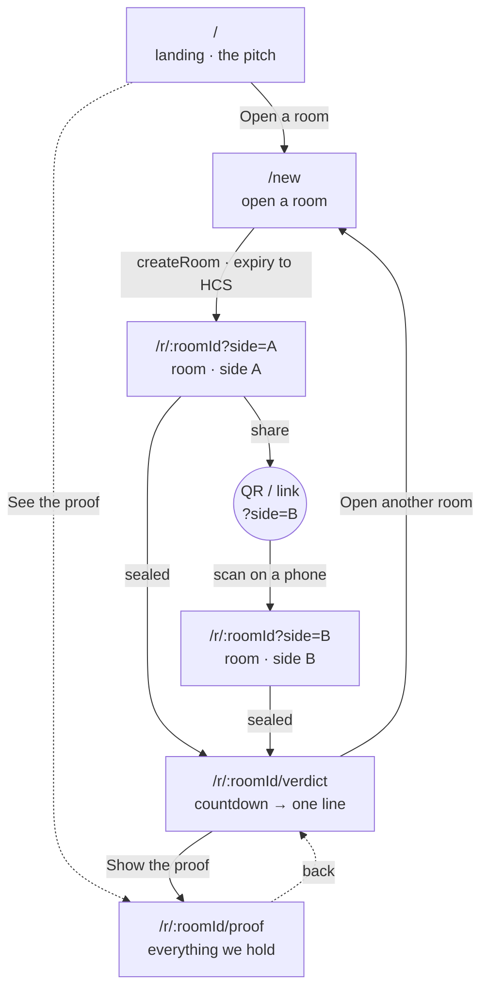
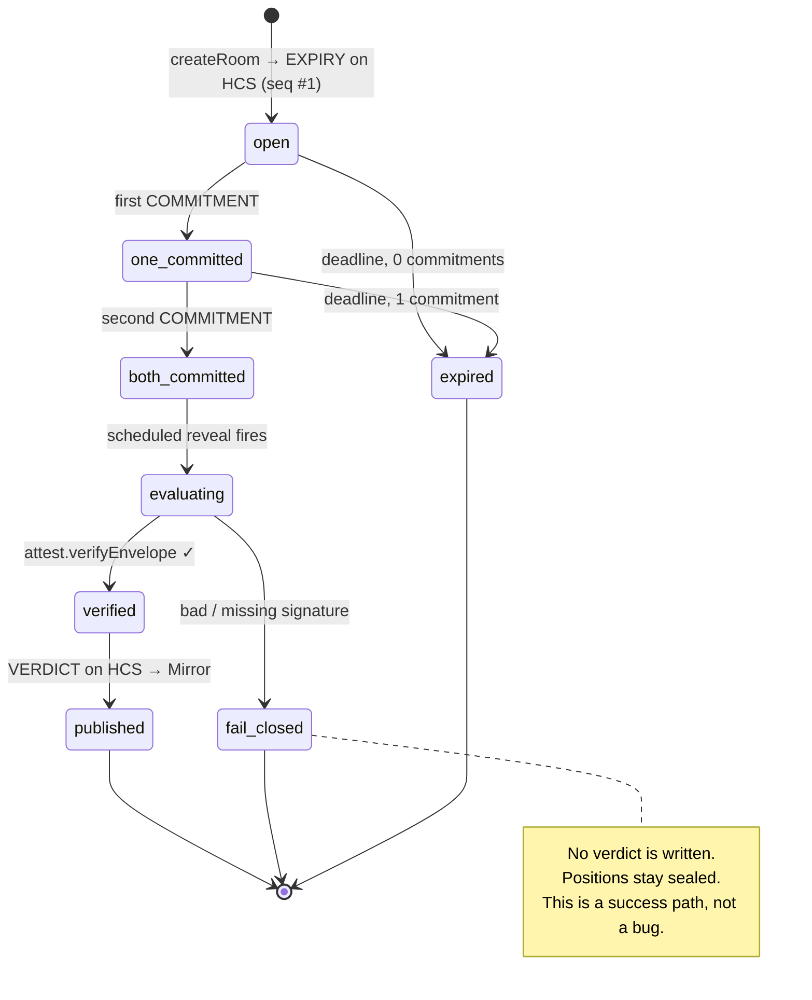
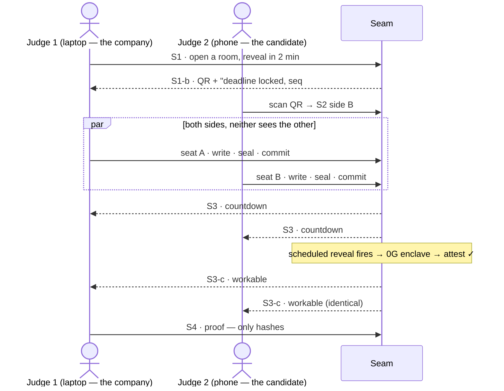

# UX · Screens, sitemap & sponsor value

Status: 🟧 draft · Last updated: 2026-07-24 · Implements `modules/M8-web.md`

> **Read this as a proposal to argue with, not a decision already taken.** §9 lists the open
> questions. Spanish mirror: [`screens-and-sitemap.es.md`](./screens-and-sitemap.es.md).

---

## 1. The one-paragraph product

Two sides need to agree on terms and neither wants to name theirs first. Seam opens a **sealed room**:
Hedera publishes the deadline *before anyone writes*, each side writes a position in plain language
and **encrypts it in their own browser** to a 0G enclave's public key, World grants **one seat per
side** so nobody can run the room twenty times to triangulate, and at the deadline a model **inside
the enclave** reads both and returns **one enum line to both** — `workable` / `not_workable`. The
verdict is published only if its attestation verifies **independently of the 0G SDK**. Then the
papers burn.

**The UX job:** make all four of those claims *visible* on a phone, in under two minutes, without a
single sentence of explanation from the presenter.

---

## 2. Sitemap



### Route table

| Route | Screen | Who lands here | Modules | Auth |
|-------|--------|----------------|---------|------|
| `/` | **S0 · Landing** | anyone, cold | — | none |
| `/new` | **S1 · Create room** | the opener (side A) | M1 (session), M5 (scheduler) | none |
| `/r/:roomId?side=A\|B` | **S2 · Room — write + seal** | both sides; B arrives by QR | M2 (seal), M3 (worldid), M4 (registry) | World seat |
| `/r/:roomId/verdict` | **S3 · Verdict** | both sides | M4 (Mirror read), M7 (attest) | none |
| `/r/:roomId/proof` | **S4 · Proof** | judges, sceptics | M4, M7 | none |

**Four routes carry the demo, five exist.** `side` is a query param, not a segment, so the join link
stays short enough to encode in a legible QR and so a mistyped side can be corrected without a new
route. `/proof` is reachable from the landing with no room — it renders an example log — so a judge
can inspect the claim before ever opening a room.

**No route is behind a login.** There is no account, no wallet, no signature (D8). The only gate in
the whole product is the World seat on S2, and it gates *one action*, not the app.

---

## 3. Room state machine

Every screen renders a state of this machine. Nothing else exists.



| State | S2 renders | S3 renders |
|-------|-----------|------------|
| `open` | gate → write → seal | countdown, "waiting for both sides" |
| `one_committed` | receipt + "waiting for the other side" | countdown, one tick |
| `both_committed` | receipt + "both sealed" | countdown, both ticks |
| `evaluating` | → redirect to S3 | "the referee is reading" |
| `published` | → redirect to S3 | **the verdict** |
| `fail_closed` | → redirect to S3 | "no verdict — and why" |
| `expired` | read-only receipt | "expired, nothing evaluated" |

---

## 4. Screens

Wireframes are **mobile-first at 390px** (the demo device) with the desktop delta noted. Copy in the
boxes is the **real UI copy proposal** — argue with it here, not in the JSX.

### S0 · Landing — `/`

**Job:** make a stranger understand the product in one screen, and make the three sponsors read as
*three necessities*, not three logos.

```
MOBILE 390                                DESKTOP ≥1024
┌────────────────────────────┐   ┌──────────────────────────────────────────┐
│ ◐ Seam                 [☾] │   │ ◐ Seam            How it works · Proof [☾]│
├────────────────────────────┤   ├──────────────────────────────────────────┤
│                            │   │                                          │
│  Both sides name their     │   │   Both sides name their terms.           │
│  terms. /Neither/ sees     │   │   /Neither/ sees the other's.            │
│  the other's.              │   │                                          │
│                            │   │   A model inside a sealed enclave reads  │
│  A model inside a sealed   │   │   both and answers one line. Then the    │
│  enclave reads both and    │   │   papers burn.                           │
│  answers one line.         │   │                                          │
│  Then the papers burn.     │   │   ( Open a room )   [ See the proof ]    │
│                            │   │                                          │
│  ( Open a room )           │   │   ┌──────────┬──────────┬──────────┐     │
│  [ See the proof ]         │   │   │ 0G       │ Hedera   │ World    │     │
│                            │   │   │ the      │ the      │ one seat │     │
│  ┌──────────────────────┐  │   │   │ sealed   │ clock &  │ per side │     │
│  │ 0G · the referee     │  │   │   │ referee  │ the      │          │     │
│  ├──────────────────────┤  │   │   │          │ notary   │          │     │
│  │ Hedera · clock+notary│  │   │   └──────────┴──────────┴──────────┘     │
│  ├──────────────────────┤  │   │   No wallet. No signup. No database.     │
│  │ World · one seat     │  │   └──────────────────────────────────────────┘
│  └──────────────────────┘  │
│  No wallet. No signup.     │   /word/ = .serif-accent (Instrument Serif italic)
│  No database.              │   ( ) = primary pill   [ ] = secondary pill
└────────────────────────────┘
```

- `/Neither/` uses `.serif-accent` — the one italic serif word per heading (design system).
- The sponsor strip is **three claims, not three badges.** Each card is tappable → anchors to a
  "how it works" section explaining what breaks without it (the removal test, §6).
- **Primary CTA above the fold at 390px.** If it isn't, the layout is wrong.

**Components:** `site-header` · `hero` · `sponsor-strip` · `theme-toggle`

---

### S1 · Create room — `/new`

Two states on one route: the form, then the share panel. **No navigation between them** — the room
is created in place, so the opener never loses the QR by pressing back.

#### S1-a · form

```
┌────────────────────────────┐
│ ← Seam                 [☾] │
├────────────────────────────┤
│  Open a room               │
│  The deadline is published │
│  to Hedera /before/ anyone │
│  writes a word.            │
│                            │
│  Reveal at                 │
│  ┌──────────────────────┐  │
│  │ in 15 minutes      ▾ │  │  presets: 5 · 15 · 60 min · custom
│  └──────────────────────┘  │
│  → 26 Jul 2026, 08:00 WEST │  live-resolved, date-fns (D14)
│                            │
│  ┌ Gap disclosure ──────┐  │
│  │ off  ◯───            │  │  opt-in, OFF by default
│  │ If /both/ sides opt  │  │
│  │ in, the verdict may  │  │
│  │ say whether one      │  │
│  │ issue or several     │  │
│  │ block — never        │  │
│  │ which.               │  │
│  │ Nothing else.        │  │
│  └──────────────────────┘  │
│                            │
│  ┌──────────────────────┐  │
│  │    Open the room     │  │  full-width, h-12
│  └──────────────────────┘  │
│  No wallet. No signup.     │
└────────────────────────────┘
```

#### S1-b · created (share)

```
┌────────────────────────────┐
│ ← Room r_9f3a          [☾] │
├────────────────────────────┤
│  ✓ Deadline locked         │
│    Hedera topic 0.0.5121   │
│    seq #1 · 06:00:02.331Z  │
│    [ Mirror Node ↗ ]       │
│                            │
│     ┌──────────────┐       │
│     │ ██ ▄▄ █ ▀█ ██│       │
│     │ ▀█ ██ ▄ ██ ▄▀│       │  ≥240px, centred, high contrast
│     │ ██ ▀▄ █ ▄█ ██│       │  in BOTH themes
│     │ ▄█ ██ ▀ ▄█ █▀│       │
│     └──────────────┘       │
│  seam.app/r/r_9f3a?side=B  │
│  [ Copy link ] [ Share ]   │
│                            │
│  ┌──────────────────────┐  │
│  │  Write my position   │  │
│  └──────────────────────┘  │
│  You are side A.           │
│  Send the QR to side B.    │
└────────────────────────────┘
```

**The receipt block is the point.** `topic · seq · consensus timestamp` appears the instant the room
exists — that is Hedera being a clock nobody owns, shown rather than claimed. It reappears in the
same visual shape on S2 (commitment) and S3 (verdict): **one receipt component, three uses.**

**Components:** `create-room-form` · `deadline-picker` · `gap-disclosure-toggle` · `room-qr` ·
`hcs-receipt` · `copy-link-button`

**Edge cases:** deadline in the past → inline error, no submit · HCS write fails → the room is not
created and we say so (never a room without a published deadline) · clipboard unavailable → the
link stays selectable text.

---

### S2 · Room — write + seal — `/r/:roomId?side=A|B`

The densest screen. **Four sub-states in sequence**, each a full screen on mobile.

#### S2-a · seat gate (World)

```
┌────────────────────────────┐
│ Room r_9f3a · side B       │
│ Reveal in 14:32            │
├────────────────────────────┤
│                            │
│         ◉                  │
│     Take seat B            │
│                            │
│  One human per side.       │
│                            │
│  Without this, someone can │
│  run the room twenty times │
│  with slightly different   │
│  terms and reconstruct     │
│  your number. The seal     │
│  would hold and you'd      │
│  still lose.               │
│                            │
│  ┌──────────────────────┐  │
│  │  World Selfie Check  │  │
│  └──────────────────────┘  │
│                            │
│  We keep a nullifier tied  │
│  to (this room, side B).   │
│  No identity. No wallet.   │
│  Not a login.              │
└────────────────────────────┘
```

Refusal state — **this is a demo beat, design it properly**:

```
│  ⛔ Seat B is taken         │
│  This nullifier already    │
│  holds side B in this room.│
│  Ask the opener for a new  │
│  room, or take side A.     │
```

#### S2-b · write

```
┌────────────────────────────┐
│ Room r_9f3a · side B  ✓seat│
│ Reveal in 12:58            │
├────────────────────────────┤
│  Your position             │
│  Plain language. Salary,   │
│  equity, remote days,      │
│  start date, title,        │
│  notice period — and how   │
│  they trade against each   │
│  other.                    │
│  ┌──────────────────────┐  │
│  │ We can go to 85k     │  │
│  │ base, 0.4% equity,   │  │
│  │ 3 remote days. Start │  │
│  │ in September. Title  │  │
│  │ is negotiable, the   │  │
│  │ start date is not.   │  │
│  └──────────────────────┘  │  min-h 40vh, full-width
│  🔒 Encrypted in this      │
│     browser to the enclave │
│     key. The plaintext     │
│     never leaves this      │
│     device.                │
│                            │
│  Gap disclosure  ◉───  on  │
├────────────────────────────┤
│  ┌──────────────────────┐  │  sticky, safe-area-inset-bottom
│  │   Seal and commit    │  │
│  └──────────────────────┘  │
└────────────────────────────┘
```

#### S2-c · sealing (a deliberately slow 3-step)

```
│  ● Encrypting in your      │
│    browser              ✓  │
│    AES-256-GCM, key        │
│    wrapped to the enclave  │
│                            │
│  ● Hashing the ciphertext  │
│    sha256 3b1f…c7       ✓  │
│                            │
│  ◌ Writing the commitment  │
│    to Hedera…              │
```

> **Do not optimise this away.** These three lines are where the audience watches the plaintext
> *not* leave. The Playwright E2E asserts the same fact (RNF-M8-002); this is the human-readable
> version of that assertion.

#### S2-d · committed / waiting

```
┌────────────────────────────┐
│ Room r_9f3a            [☾] │
├────────────────────────────┤
│  ✓ Your position is sealed │
│                            │
│  ┌ commitment ──────────┐  │
│  │ 3b1f…c7              │  │
│  │ topic 0.0.5121       │  │
│  │ seq #2 · 06:12:04Z   │  │
│  │ [ Mirror Node ↗ ]    │  │
│  └──────────────────────┘  │
│                            │
│  ┌──────────────────────┐  │  .reflow-cards
│  │ Side A   ✓ committed │  │
│  │ Side B   ✓ committed │  │
│  └──────────────────────┘  │
│                            │
│        Reveal in           │
│         11:04              │
│    ▓▓▓▓▓▓▓▓▓░░░░░░░        │
│                            │
│  Nobody can read either    │
│  position — including us.  │
│                            │
│  [ Go to the verdict ]     │
└────────────────────────────┘
```

**Components:** `room-header` (id · side · seat · countdown) · `selfie-check-gate` ·
`seal-position-form` · `seal-progress` · `hcs-receipt` · `room-status` · `countdown`

**Edge cases:** empty/whitespace position → disabled CTA · seal fails → the commitment is *not*
written and the position stays editable · deadline passes mid-write → the form locks and the screen
switches to `expired` · **the other side's text is never rendered on this screen in any state.**

---

### S3 · Verdict — `/r/:roomId/verdict`

The payoff. Both browsers must render the **same** thing (RNF-M8-003).

#### S3-a · pending

```
┌────────────────────────────┐
│ Room r_9f3a            [☾] │
├────────────────────────────┤
│         ● pending          │  --pending (amber)
│                            │
│          02:14             │  text-6xl, AnimatedNumber
│      until the reveal      │
│                            │
│  ┌──────────────────────┐  │
│  │ Deadline  ✓ Hedera   │  │
│  │ Side A    ✓ committed│  │
│  │ Side B    ✓ committed│  │
│  │ Enclave   ◌ waiting  │  │
│  └──────────────────────┘  │
│                            │
│  The reveal is a scheduled │
│  Hedera transaction. It    │
│  fires whether or not this │
│  tab is open.              │
└────────────────────────────┘
```

#### S3-b · evaluating

```
│    ◌ The referee is reading│
│                            │
│  Sealed inference inside a │
│  0G TEE. Pinned model,     │
│  temperature 0, enum-only  │
│  output.                   │
│  meta-llama/…-instruct     │
```

#### S3-c · resolved

```
┌────────────────────────────┐
│ Room r_9f3a            [☾] │
├────────────────────────────┤
│                            │
│        workable            │  text-workable, text-5xl
│                            │
│  A deal is likely possible.│
│  Worth a conversation.     │
│                            │
│  ┌──────────────────────┐  │
│  │ ✓ Attestation        │  │
│  │   verified            │  │
│  │   independently of    │  │
│  │   the 0G SDK          │  │
│  │   att_7c2e… [ how? ]  │  │
│  ├──────────────────────┤  │
│  │ ✓ Read from Mirror    │  │
│  │   Node — not from us  │  │
│  │   seq #4 · 08:00:03Z  │  │
│  └──────────────────────┘  │
│                            │
│  This is everything either │
│  side learns. Side A saw   │
│  exactly this line.        │
│                            │
│  [ Show the proof ]        │
│  [ Open another room ]     │
└────────────────────────────┘
```

Variants:

| Verdict | Colour token | Sub-line |
|---------|--------------|----------|
| `workable` | `--workable` (green) | "A deal is likely possible. Worth a conversation." |
| `not_workable` | `--not-workable` (**muted grey — never red**) | "Not on these terms. That's information, not a failure." |
| `not_workable · gap:single` | muted + `gap` badge | "One issue blocks the deal — not which. Both sides asked for this." |
| `not_workable · gap:multiple` | muted + `gap` badge | "More than one issue blocks the deal. Both sides asked for this." |

> `not_workable` is **not an error state.** Red would tell the room that "no deal" is a malfunction.
> It is the product working. This is the single most important colour decision in the app.

#### S3-d · fail closed

```
┌────────────────────────────┐
│         ⛔ no verdict       │
│                            │
│  The enclave attestation   │
│  did not verify.           │
│                            │
│  We publish nothing rather │
│  than publish something we │
│  cannot prove came from    │
│  the sealed enclave.       │
│                            │
│  reason: signature does    │
│  not match the enclave     │
│  public key                │
│                            │
│  Both positions stay       │
│  sealed. Nothing leaked.   │
│                            │
│  [ Show the proof ]        │
└────────────────────────────┘
```

> **Design this screen as carefully as the success screen.** Being able to *show* fail-closed is a
> stronger claim than any green tick. If Q&A asks "what if the TEE lies?", we open this screen.

#### S3-e · expired

```
│         ○ expired          │
│  Side B never committed    │
│  before the deadline.      │
│  Nothing was evaluated and │
│  side A's position was     │
│  never opened.             │
```

**Components:** `countdown` · `verdict-panel` · `attestation-badge` · `mirror-badge` ·
`fail-closed-panel` · `room-status`

---

### S4 · Proof — `/r/:roomId/proof`

**The judge screen.** Everything Seam holds about this room, rendered from the HCS topic, with the
hashes recomputed in the browser.

```
┌────────────────────────────┐
│ ← Proof · room r_9f3a      │
├────────────────────────────┤
│ Everything we hold. Read   │
│ from Hedera topic 0.0.5121 │
│ via Mirror Node.           │
│                            │
│ ┌ #1 expiry ────────────┐  │
│ │ 06:00:02.331Z         │  │
│ │ deadline 08:00:00Z    │  │
│ └───────────────────────┘  │
│ ┌ #2 commitment · side A┐  │
│ │ 06:12:04.118Z         │  │
│ │ 3b1f…c7               │  │
│ │ ↳ recomputed here  ✓  │  │
│ └───────────────────────┘  │
│ ┌ #3 commitment · side B┐  │
│ │ 06:13:41.902Z         │  │
│ │ 9a04…1d               │  │
│ │ ↳ recomputed here  ✓  │  │
│ └───────────────────────┘  │
│ ┌ #4 verdict ───────────┐  │
│ │ 08:00:03.007Z         │  │
│ │ workable · att_7c2e…  │  │
│ │ ↳ signature verified ✓│  │
│ └───────────────────────┘  │
│                            │
│ ⓘ No plaintext. No cipher- │
│   text. Only hashes and    │
│   one enum. A gap in the   │
│   sequence would betray    │
│   tampering — there is     │
│   none.                    │
│                            │
│ [ Raw JSON ]  [ Mirror ↗ ] │
└────────────────────────────┘
```

This is the UI twin of `npm run inspect` (S4.1). Same claim, two surfaces: the terminal proves it to
an engineer, this screen proves it to a judge holding a phone.

**Components:** `proof-log` · `topic-message-card` · `hash-recompute-badge` · `raw-json-drawer`

---

## 5. Component inventory

Extends `modules/M8-web.md` §9. **Every row needs implementation + Storybook story + RTL test**
before it counts as done (design-system DoD).

| Component | Screen | Module behind it | Notes |
|-----------|--------|------------------|-------|
| `site-header` | all | — | floating pill, sticky, backdrop-blur |
| `theme-toggle` | all | — | reused from home-os |
| `hero` | S0 | — | `.serif-accent` on one word |
| `sponsor-strip` | S0 | — | three *claims*; tappable → removal test |
| `create-room-form` | S1-a | M1 | Zod at the Server Action boundary |
| `deadline-picker` | S1-a | M1/M5 | presets + custom; date-fns; rejects the past |
| `gap-disclosure-toggle` | S1-a, S2-b | M6 | opt-in, **off by default** (open question Q3) |
| `room-qr` | S1-b | M1 | ≥240px, contrast-safe in both themes |
| `copy-link-button` | S1-b | — | fallback to selectable text |
| `hcs-receipt` | S1-b, S2-d, S3 | M4 | **one component, three uses** — topic · seq · consensus ts |
| `room-header` | S2 | M1/M3 | room id · side · seat · countdown |
| `selfie-check-gate` | S2-a | M3 | includes the "seat taken" refusal state |
| `seal-position-form` | S2-b | M2 | plaintext never crosses the network |
| `seal-progress` | S2-c | M2/M4 | the 3-step encrypt → hash → commit |
| `room-status` | S2-d, S3 | M4 | `.reflow-cards` below `md` |
| `countdown` | S2, S3 | M5 | AnimatedNumber; legible at 360px |
| `verdict-panel` | S3-c | M4 | verdict tokens; **muted, not red**, for `not_workable` |
| `attestation-badge` | S3-c | M7 | "verified independently of the SDK" + `[how?]` |
| `mirror-badge` | S3-c | M4 | "read from Mirror Node, not from us" |
| `fail-closed-panel` | S3-d | M7 | first-class screen, not a toast |
| `proof-log` | S4 | M4 | list of topic messages |
| `topic-message-card` | S4 | M4 | one HCS message |
| `hash-recompute-badge` | S4 | M2/M4 | recomputes `sha256(ciphertext)` client-side |
| `raw-json-drawer` | S4 | M4 | the escape hatch for a sceptical judge |

**24 components. That is a lot for 36 hours.** Priority order for the demo: `create-room-form` ·
`room-qr` · `selfie-check-gate` · `seal-position-form` · `seal-progress` · `countdown` ·
`verdict-panel` · `attestation-badge`. Everything else is upside — including all of S4, which is
high-value but cuttable if Saturday goes badly.

---

## 6. Sponsor value — what each one buys, and where you can *see* it

This is the section to memorise before the Q&A. Each sponsor gets **a job, a screen, and a failure
mode we can demonstrate.**

### 0G — sealed inference · *Best AI Product* · ~$6,000

| | |
|---|---|
| **What it buys us** | A referee that reads two messy paragraphs and judges whether they can fit — and that **the operator cannot look inside**. Judgement, not arithmetic: salary, equity, remote days, start date and notice trade against each other, so an inequality can't decide it. |
| **Where you see it** | S2-b lock line ("encrypted to the enclave key") → S2-c step 1 → S3-b "the referee is reading" (pinned model, temp 0, enum out) → **S3-c `attestation-badge`** → **S3-d fail-closed**. |
| **The demonstrable claim** | `npm run demo:naive` — the same product without the enclave, leaking plaintext into a log — next to `npm run inspect`, which shows our store holds only hashes. |
| **Remove it and…** | **There is no product.** A model that reads both sides is exactly what neither party will let an ordinary company run. |
| **Honest limit (say it before you're asked)** | The attestation proves *this model saw these committed inputs and returned this verdict*. It does **not** prove the model is right, and it does not prove a re-run reproduces it. The verdict is "worth a conversation", never "here is the deal". |

### Hedera — HCS · Schedule · Mirror · *No Solidity Allowed* · ~$3,000

| | |
|---|---|
| **What it buys us** | Three jobs, three native services, **zero Solidity**: the **clock** nobody owns (Schedule Service), the **notary** that locks both papers before the reveal (HCS commitments), and the **read path** neither side has to trust us for (Mirror Node). |
| **Where you see it** | S1-b receipt the instant the room exists (deadline published **before** anyone writes) → S2-d commitment receipt with `seq #` → S3-c "read from Mirror Node, **not from us**" → **S4 the whole topic, hashes recomputed in the browser**. |
| **The demonstrable claim** | S4 + `npm run inspect`. An append-only log with sequence numbers: a gap would betray tampering, and there is none. |
| **Remove it and…** | Either side can claim afterwards they'd have said something different, **and** the opening lives on a server *we* control — so we can be pressured to hold it. |
| **Track fit** | HCS + Schedule Service + Mirror Node = three native services, no contract written or deployed. This *is* the track. |

### World — Selfie Check · *Selfie Check Beta* · ~$3,500

| | |
|---|---|
| **What it buys us** | **One seat per room per side.** Not a login — an abuse signal. It closes the probing attack, which is the only attack that beats a perfect enclave. |
| **Where you see it** | **S2-a**, the only gate in the product — and its refusal state, "seat B is taken". |
| **The demonstrable claim** | Try to take the same seat twice on stage. It refuses. |
| **Remove it and…** | Twenty sessions with slightly varied positions reconstruct the other side's number. The enclave protects every single answer perfectly and the system still loses. **This is the subtlest of the three and the best story.** |
| **Owed deliverable** | The track requires a **testing document** (developer friction + user friction). Start it Saturday morning while the friction is fresh — see `00-overview/03-sponsors-prizes.md`. |

### The removal test, in one line

> **0G** makes the answer *safe to ask for.* **Hedera** makes it *binding.* **World** makes it
> *un-farmable.* Take one out and the product doesn't get worse — it stops working.

### What the sponsors are *not* doing

- **No money moves.** Hedera's agentic-payments track is a bigger pool and requires a real transfer.
  Do **not** bolt a payment on — it contradicts the no-wallet story that makes the demo land.
- **World is not authentication.** If anyone describes it as login in the pitch, we've lost the point.
- **0G is not "an LLM call."** If the enclave and the attestation aren't in the sentence, we've
  described a chatbot.

---

## 7. The demo path (what the video and the booth run)



**Then run it again with positions that don't fit**, and let them notice how little they learned
about each other. *That second run is the pitch* (`00-vision-scope.md`). The UI must make the second
run cheap: `[ Open another room ]` on S3, a 2-minute deadline preset on S1.

---

## 8. Concepts glossary (for the discussion, and for the video script)

| Term | In one sentence a non-crypto judge understands |
|------|-----------------------------------------------|
| **TEE / enclave** | A sealed room inside a machine that even the machine's owner cannot open. |
| **Sealed inference** | The model runs *inside* that room, so the operator never sees the inputs. |
| **Attestation** | A signed receipt from the sealed room saying "this exact model ran, on these exact inputs, and returned this". |
| **Fail closed** | If that receipt doesn't verify, we publish **nothing**. Silence is the safe answer. |
| **Enclave public key** | What each browser encrypts to, so only the sealed room can decrypt. |
| **Commitment** | `sha256(ciphertext)` — a fingerprint that proves what you wrote, without revealing it. |
| **Deterministic commitment** | Anyone can recompute the same hash: keys sorted, no clock inside the hashed bytes. |
| **HCS topic** | An append-only public log. **Our entire database** — because it isn't one. |
| **Consensus timestamp / seq #** | Hedera's proof of *when*, ordered and un-editable. |
| **Mirror Node** | The public read path — both sides read the verdict from Hedera, not from our server. |
| **Scheduled transaction** | The deadline, armed on Hedera before anyone writes, that fires whether or not a tab is open. |
| **Nullifier** | A per-room, per-side token proving "one human, one seat" — with no identity attached. |
| **Probing attack** | Running the room many times with tweaked terms to triangulate the other number. The attack World closes. |
| **Enum verdict** | The model may emit only `workable` / `not_workable` (+ opt-in `gap:*`). Free text would be a leak channel. |

---

## 9. Open questions — bring these to the discussion

| # | Question | Proposal | Impacts |
|---|----------|----------|---------|
| Q1 | Is `/proof` (S4) in scope for the 36 hours? | **Build it if Saturday is on schedule.** It is our best Hedera evidence but it is not on the critical path. | Hedera score, Q&A strength |
| Q2 | Is `side` a query param or a route segment? | **Query param** — shorter QR, correctable. | M1, M8 routing |
| Q3 | Default for gap disclosure | **Off.** Opt-in is the honest default, and "both sides had to ask for it" is a good line. | M6, S1-a, S2-b |
| Q4 | Does S2 poll for the other side's status, or only show your own? | **Show both ticks** (they leak nothing — the topic is public) — it makes the wait legible. | M4, S2-d |
| Q5 | Anonymous room hub for a third viewer? | **No.** Only the two sides and the public topic. Cut it. | scope |
| Q6 | Does the countdown live on S2, S3, or both? | **Both**, one component, in the header on S2 and hero-sized on S3. | `countdown` |
| Q7 | Landing page at all, or straight to `/new`? | **Keep it.** A judge arriving cold at a form learns nothing, and the sponsor strip is where the removal test gets told. | S0 |
| Q8 | Who builds what? | Frank: S2-c, S3 (`attestation-badge`, `fail-closed-panel`), S4. Dylan: S1, S2-a, `hcs-receipt`, `room-status`. **Confirm this.** | everything |

Anything resolved here gets promoted to `00-overview/05-open-decisions.md` and the relevant module doc.
